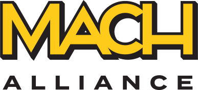

# MACH Alliance Interoperability Standards

> **Transform your architecture to composable with MACH principles** - practical standards, data models, and integration patterns for modern enterprise systems

## 🚀 Quick Start

### What you'll find here:
- 📊 **[Open Data Model (ODM)](#-open-data-model-odm)** - Standardized data structures and real-world integration recipes
- 🏗️ **[Reference Architectures](#-reference-architectures)** - MACH architecture patterns and blueprints
- 📚 **[Implementation Guides](#-implementation-guides)** - Step-by-step guidance for your composable journey
- 🤝 **[Platform Definitions](#-platform-definitions)** - Understanding the MACH ecosystem components

## 🎯 Who is this for?

| You are...                             | Start here                                                                                            |
| -------------------------------------- | ----------------------------------------------------------------------------------------------------- |
| **New to MACH** (MACH-curious) 🌱       | Learn the [core principles](#what-are-mach-principles) and explore [simple recipes](/models/recipes/) |
| **Building with MACH** (MACH-active) 🛠️ | Implement [ODM patterns](/models/) and use [reference architectures](#-reference-architectures)       |
| **MACH Expert** (MACH-pro) 🚀           | [Contribute](#contributing) advanced patterns and shape future standards                              |

## 📊 Open Data Model (ODM)

### Stop reinventing the integration wheel

Every MACH implementation faces the same challenge: **how do you make 20+ best-of-breed services work together seamlessly?**

The Open Data Model (ODM) solves this with:
- ✅ **Pre-built integration patterns** that work across all major MACH vendors
- ✅ **Standardized data structures** eliminating custom mappings between every service
- ✅ **Real-world recipes** you can implement in less than a day
- ✅ **AI-ready foundations** supporting the next generation of agent-to-agent communication

Whether you're syncing inventory across channels, orchestrating payments, or building unified customer profiles, ODM provides the proven patterns that have already been battle-tested in production.

**[→ Explore the Open Data Model](/models/README.md)**

## 🏗️ Reference Architectures

Visual blueprints and patterns for building composable systems:

- 📐 **[MACH Reference Architecture PDF](/src/diagrams/MACH-Alliance-Reference-Architecture-Diagrams-rev1.4.pdf)** - Three levels of detail from domains to platform responsibilities
- 🛠️ **[Architecture Diagram Generator](https://mach-diagrams.netlify.app/)** - Create your own MACH architecture diagrams
- 📖 **[Architecture Guide](./reference/architecture-explained.md)** - Detailed explanation of MACH ecosystem design

## 📚 Implementation Guides

Step-by-step guidance for your MACH journey:

| Guide                                                                                                       | Description                                      | Format   |
| ----------------------------------------------------------------------------------------------------------- | ------------------------------------------------ | -------- |
| [MACH Architecture Introduction](./reference/architecture-intro.md)                                         | Path to composable ecosystems                    | Markdown |
| [How to evaluate composable solutions](/whitepapers/How-to-evaluate-and-integrate-composable-solutions.pdf) | Evaluation criteria and legacy system strategies | PDF      |
| [Understanding composable architectures](/whitepapers/Understanding-composable-architectures.pdf)           | Technical patterns and integration concepts      | PDF      |

## 🤝 Platform Definitions

Understanding the building blocks of MACH architectures:

- **[Platform Glossary](./reference/platforms.md)** - Decode three-letter acronyms (PIM, OMS, CMS, etc.)
- **[Platform Responsibilities](/src/diagrams/MACH-Alliance-Reference-Architecture-Diagrams-rev1.4.pdf)** - What each platform type handles in the ecosystem

## 🌟 What are MACH principles?

The MACH approach promotes modern, intelligent, and scalable digital architecture. Below are the core principles we champion—and the legacy approaches we reject.

<table>
<tr>
<td width="50%" valign="top">

### 🧩 Composable

> **✅ What We Champion**
> Composable architecture empowers teams to select and assemble best-of-breed solutions tailored to specific business needs. It also allows for seamless AI integration without being tied to monolithic limitations or unnecessary features.

> **❌ What We Reject**
> We reject all-in-one platforms that limit choice, enforce rigid feature sets, and lock innovation to a vendor's roadmap.

</td>
<td width="50%" valign="top">

### 🔗 Connected

> **✅ What We Champion**
> A connected ecosystem uses API-first integrations to unify applications and data, creating a seamless foundation for AI, automation, and rapid experimentation. Real-time intelligence becomes possible when systems communicate natively and data flows freely.

> **❌ What We Reject**
> We reject siloed systems and architectures that hinder data sharing, delay AI adoption, and create costly integration barriers.

</td>
</tr>
<tr>
<td width="50%" valign="top">

### 🔄 Incremental

> **✅ What We Champion**
> Incremental approaches foster safe experimentation, faster iteration, and real-world validation of intelligent features. This reduces risk and accelerates innovation without disrupting your current systems.

> **❌ What We Reject**
> We reject "big bang" projects that introduce risk, stall agility, and often fail to deliver real intelligent value.

</td>
<td width="50%" valign="top">

### 🌐 Open

> **✅ What We Champion**
> Open systems support transparency, interoperability, and shared innovation—enabling teams to adapt quickly and integrate AI wherever it delivers value. Standardized APIs and open architectures create ecosystems where collaboration thrives.

> **❌ What We Reject**
> We reject proprietary lock-in and closed systems that isolate data, restrict innovation, and inhibit cross-functional insight.

</td>
</tr>
<tr>
<td colspan="2" align="center">

### 🤖 Autonomous

> **✅ What We Champion**
> Autonomous systems empower organizations with self-optimizing, AI-enhanced infrastructure that adapts in real time. Intelligent automation reduces manual toil and drives strategic transformation at scale.

> **❌ What We Reject**
> We reject manual dependencies and rigid control structures that prevent agility, innovation, and intelligent response to change.

</td>
</tr>
</table>

[Learn more at machalliance.org →](https://machalliance.org/mach-principles/)

## 🤝 Contributing

We welcome contributions from the entire MACH community!

- 📋 **[General Contribution Guide](./CONTRIBUTING.md)** - For all standards and materials
- 📊 **[ODM Contribution Guide](/models/CONTRIBUTING.md)** - Specific to data models and recipes
- 💬 **[Join the Discussion](https://community.machalliance.org/home/forum/boards/special-programs-ous?topicId=684876b4b4047405d2cd909e&topicName=Open%20Data%20Model)** - Share ideas and feedback

### Ways to contribute:
- 🐛 Report issues or suggest improvements
- 📝 Submit new integration recipes or patterns
- 🔍 Review and validate existing models
- 📚 Improve documentation
- 🌍 Translate materials

## 👥 Brought to you by the MACH Alliance Interoperability Task Force

The Interoperability Task Force is a collaborative effort of technical leaders from across the MACH ecosystem.

| Person                                                              | Role                                                                                       |
| ------------------------------------------------------------------- | ------------------------------------------------------------------------------------------ |
| [Adam Peter Nielsen](https://www.linkedin.com/in/adampeternielsen/) | CTO, Novicell & Technology Council Member, Interoperability Task Force Lead, MACH Alliance |
| [Mark Demeny](https://www.linkedin.com/in/mark-demeny/)             | Tech Analyst, MACH Alliance                                                                |
Interoperability Task Force co-leads: [Adam Peter Nielsen](https://www.linkedin.com/in/adampeternielsen/) & [Ramon Snir](https://www.linkedin.com/in/ramonsnir/)
