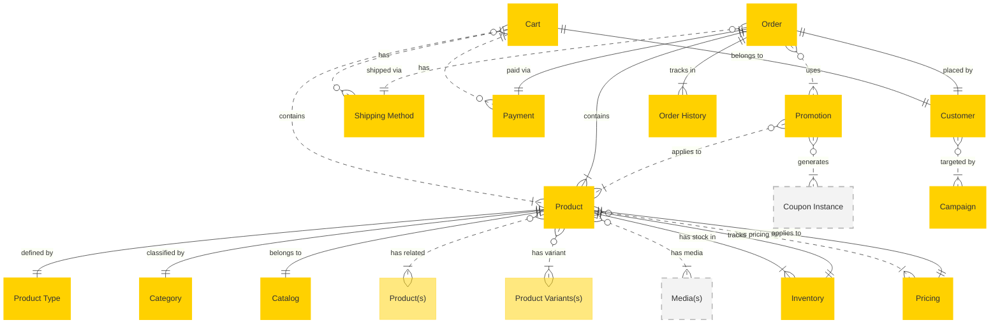

# MACH Alliance, Open Data Model Entity list

> [!NOTE]
> Unlinked entities are in progress.

## Product
- [Product](product/product.md)
- [Product Type](product/product-type.md)
- Catalog *(coming soon)*
- [Category](product/category.md)

## Cart
- Cart *(coming soon)*

## Order
- Order *(coming soon)*
- Order History *(coming soon)*
  
## Payment
- Payment

## Pricing
- [Pricing](pricing/pricing.md)

## Promotion
- [Promotion](promotion/promotion.md)
- [Coupon Instance](promotion/coupon-instance.md)

## Inventory
- [Inventory](inventory/inventory.md)

## Shipping
- Shipping Method

## Identity
- [Customer](identity/customer.md)

## Campaign
- Campaign

### Utility functions
- [Address](utilities/address.md)
- Channel *(coming soon)*
- Contact *(coming soon)*
- Identifier *(coming soon)*
- [Language](utilities/language.md)
- [Media](utilities/media.md)
- Money *(coming soon)*
- Store *(coming soon)*
