# MACH Alliance, Open Data Model Entity: `Customer`

## Table of contents

- [MACH Alliance, Open Data Model Entity: `Customer`](#mach-alliance-open-data-model-entity-customer)
  - [Table of contents](#table-of-contents)
  - [Entity purpose](#entity-purpose)
  - [Object: Customer](#object-customer)
  - [YAML Schema Definition](#yaml-schema-definition)
    - [Customer Schema](#customer-schema)
    - [Supporting Type Definitions](#supporting-type-definitions)
  - [Sample Object: Minimal Customer](#sample-object-minimal-customer)
  - [Sample Object: B2C Customer](#sample-object-b2c-customer)
  - [Sample Object: B2B Customer](#sample-object-b2b-customer)
  - [Sample Object: Complex B2B Customer with Multiple Contacts](#sample-object-complex-b2b-customer-with-multiple-contacts)
  - [Sample Object: Multi-Region Customer](#sample-object-multi-region-customer)
  - [Sample Object: GDPR-Compliant Customer](#sample-object-gdpr-compliant-customer)
  - [Localization Pattern](#localization-pattern)
    - [Fields Supporting Localization](#fields-supporting-localization)
    - [Example with Localized Extensions](#example-with-localized-extensions)
    - [Language Code Standards](#language-code-standards)
  - [Core Components \& Relationships](#core-components--relationships)
    - [Components](#components)
    - [Typical Relationships](#typical-relationships)
  - [Typical pitfalls](#typical-pitfalls)
    - [Data Structure Issues](#data-structure-issues)
    - [Identifier Management](#identifier-management)
    - [Address and Location Issues](#address-and-location-issues)
    - [Contact Information Problems](#contact-information-problems)
    - [B2B-Specific Challenges](#b2b-specific-challenges)
    - [Privacy and Compliance Gaps](#privacy-and-compliance-gaps)
    - [Performance and Scalability](#performance-and-scalability)
    - [Integration Challenges](#integration-challenges)
    - [Security and Authentication](#security-and-authentication)
    - [Common Implementation Mistakes](#common-implementation-mistakes)

---

## Entity purpose

A unified customer model that supports both B2B (company/organization) and B2C (individual/person) commerce scenarios across all channels. It resides within Customer Data Platforms (CDP), Customer Relationship Management (CRM) systems, Commerce Engines, and Master Data Management (MDM) systems. The customer entity serves as the central identity record that unifies customer data across touchpoints, enables personalization, and supports complex B2B hierarchies and B2C individual relationships.

The Entity describes:
- Customer identity and classification (person vs company)
- Multi-channel contact information and communication preferences
- Hierarchical address management for billing, shipping, and service locations
- Cross-system integration with external reference management
- Customer lifecycle tracking with status and segmentation
- Compliance and consent management (GDPR, CCPA, etc.)
- B2B-specific features (contacts, credit limits, payment terms)
- Extensible metadata for business-specific attributes
- Loyalty and preference tracking
- Authentication and security attributes

**Identity Separation Patterns:**
When implementing customer data architecture, consider these separation of concerns:
- **Who is it?** → Party, Identity, Customer Profile
- **How do we reach them?** → Contact Methods, Communication Channels
- **Where are they?** → Address, Location, Jurisdiction
- **What do they do?** → Account, Transactions, Orders, Interactions
- **What describes them?** → Demographics, Preferences, Segments
- **What permissions do we have?** → Consent, Privacy Settings, Data Rights
- **How do we authenticate them?** → Credentials, Security Settings, MFA

---

## Object: Customer

| Field                       | Description                                                      | Practice    |
| --------------------------- | ---------------------------------------------------------------- | ----------- |
| `id`                        | Unique identifier for the customer                               | MUST        |
| `type`                      | Customer type (`person` or `company`)                            | MUST        |
| `status`                    | Lifecycle status (`active`, `inactive`, `suspended`, `archived`) | SHOULD      |
| `external_references`       | Dictionary of cross-system IDs (e.g., CRM, ERP, CDP)             | SHOULD      |
| `created_at`                | ISO 8601 creation timestamp                                      | SHOULD      |
| `updated_at`                | ISO 8601 update timestamp                                        | SHOULD      |
| `person`                    | Person-specific data (when type=person)                          | COULD       |
| `company`                   | Company-specific data (when type=company)                        | COULD       |
| `contacts`                  | List of contact persons (B2B scenarios)                          | RECOMMENDED |
| `addresses`                 | List of addresses (billing, shipping, etc.)                      | RECOMMENDED |
| `communication_preferences` | Channel preferences and opt-in/out status                        | RECOMMENDED |
| `segments`                  | Customer segment assignments                                     | COULD       |
| `tags`                      | Flexible tagging for categorization                              | COULD       |
| `loyalty`                   | Loyalty program information                                      | COULD       |
| `authentication`            | Authentication and security settings                             | COULD       |
| `extensions`                | Namespaced dictionary for extension data                         | RECOMMENDED |

---

## YAML Schema Definition

### Customer Schema

```yaml
Customer:
  type: object
  required:
    - id
    - type
  properties:
    # Core identification
    id:
      type: string
      description: Unique identifier for the customer
      # example: "CUST-001" or "550e8400-e29b-41d4-a716-446655440000"

    # Customer classification
    type:
      type: string
      enum: ["person", "company"]
      description: Indicates whether this is an individual or business customer

    # Status and lifecycle
    status:
      type: string
      enum: ["active", "inactive", "suspended", "archived", "pending_verification"]
      description: Current lifecycle status of the customer
      default: "active"

    # External system references
    external_references:
      type: object
      description: Dictionary of identifiers from external systems
      additionalProperties:
        type: string
      # example:
      #   crm_id: "CRM-12345"
      #   erp_id: "ERP-67890"
      #   cdp_id: "CDP-ABCDEF"
      #   legacy_id: "OLD-SYSTEM-123"

    # Timestamps
    created_at:
      type: string
      format: date-time
      description: ISO 8601 creation timestamp

    updated_at:
      type: string
      format: date-time
      description: ISO 8601 last update timestamp

    # Person-specific data (B2C)
    person:
      $ref: "#/components/schemas/PersonData"
      description: Individual customer information (only when type=person)

    # Company-specific data (B2B)
    company:
      $ref: "#/components/schemas/CompanyData"
      description: Business customer information (only when type=company)

    # Contact persons (primarily for B2B)
    contacts:
      type: array
      items:
        $ref: "#/components/schemas/ContactPerson"
      description: List of contact persons associated with the customer

    # Addresses
    addresses:
      type: array
      items:
        $ref: "#/components/schemas/CustomerAddress"
      description: List of customer addresses

    # Communication preferences
    communication_preferences:
      $ref: "#/components/schemas/CommunicationPreferences"
      description: Channel preferences and consent status

    # Segmentation
    segments:
      type: array
      items:
        type: string
      description: Customer segment assignments
      # example: ["vip", "high_value", "early_adopter"]

    # Flexible tagging
    tags:
      type: array
      items:
        type: string
      description: Flexible tags for categorization
      # example: ["influencer", "employee", "partner"]

    # Loyalty information
    loyalty:
      $ref: "#/components/schemas/LoyaltyInfo"
      description: Loyalty program membership and status

    # Authentication settings
    authentication:
      $ref: "#/components/schemas/AuthenticationSettings"
      description: Security and authentication configuration

    # Extensibility
    extensions:
      type: object
      description: Namespaced dictionary for extension data
      additionalProperties: true
      # example:
      #   demographics:
      #     age_group: "25-34"
      #     income_bracket: "50k-75k"
      #   preferences:
      #     preferred_brands: ["brand1", "brand2"]
      #     shopping_frequency: "monthly"
```

### Supporting Type Definitions

```yaml
PersonData:
  type: object
  required:
    - email
  properties:
    first_name:
      type: string
      description: Given name
      maxLength: 100

    last_name:
      type: string
      description: Family name
      maxLength: 100

    middle_name:
      type: string
      description: Middle name or initial
      maxLength: 100

    full_name:
      type: string
      description: Complete formatted name
      maxLength: 200

    email:
      type: string
      format: email
      description: Primary email address

    phone:
      type: string
      description: Primary phone number (E.164 format recommended)
      pattern: "^\\+?[1-9]\\d{1,14}$"
      # example: "+4512345678"

    mobile:
      type: string
      description: Mobile phone number (E.164 format)
      pattern: "^\\+?[1-9]\\d{1,14}$"

    date_of_birth:
      type: string
      format: date
      description: Birth date (YYYY-MM-DD)

    gender:
      type: string
      enum: ["male", "female", "other", "prefer_not_to_say"]
      description: Gender identity

    job_title:
      type: string
      description: Professional title or position
      maxLength: 100

    company_name:
      type: string
      description: Employer or associated company
      maxLength: 200

    preferred_language:
      type: string
      pattern: "^[a-z]{2}(-[A-Z]{2})?$"
      description: Preferred language code (BCP 47)
      # example: "en-US", "da-DK"

    nationality:
      type: string
      pattern: "^[A-Z]{2}$"
      description: Nationality (ISO 3166-1 alpha-2)

CompanyData:
  type: object
  required:
    - name
  properties:
    name:
      type: string
      description: Legal company name
      maxLength: 200

    display_name:
      type: string
      description: Customer-facing company name
      maxLength: 200

    legal_form:
      type: string
      description: Legal structure (LLC, Inc, Ltd, GmbH, etc.)
      # example: "LLC", "Inc", "Ltd", "GmbH", "S.A."

    registration_number:
      type: string
      description: Business registration number
      # example: "DK12345678"

    vat_number:
      type: string
      description: VAT/Tax identification number
      # example: "DK98765432"

    duns_number:
      type: string
      pattern: "^\\d{9}$"
      description: D&B D-U-N-S Number

    industry:
      type: string
      description: Industry classification or sector
      # example: "Technology", "Retail", "Manufacturing"

    sic_code:
      type: string
      pattern: "^\\d{4}$"
      description: Standard Industrial Classification code

    employee_count:
      type: string
      enum: ["1-10", "11-50", "51-200", "201-500", "501-1000", "1000+"]
      description: Company size by employee count

    annual_revenue:
      type: string
      enum: ["<1M", "1M-10M", "10M-50M", "50M-100M", "100M-500M", "500M-1B", ">1B"]
      description: Annual revenue range

    website:
      type: string
      format: uri
      description: Company website URL

    parent_company_id:
      type: string
      description: Reference to parent company (for subsidiaries)

ContactPerson:
  type: object
  required:
    - id
    - email
  properties:
    id:
      type: string
      description: Unique identifier for the contact

    first_name:
      type: string
      description: Contact's given name
      maxLength: 100

    last_name:
      type: string
      description: Contact's family name
      maxLength: 100

    email:
      type: string
      format: email
      description: Contact's email address

    phone:
      type: string
      description: Contact's phone number (E.164 format)
      pattern: "^\\+?[1-9]\\d{1,14}$"

    mobile:
      type: string
      description: Contact's mobile number (E.164 format)
      pattern: "^\\+?[1-9]\\d{1,14}$"

    job_title:
      type: string
      description: Contact's position in the company
      maxLength: 100

    department:
      type: string
      description: Department or division
      maxLength: 100

    role:
      type: string
      enum: ["primary", "billing", "technical", "purchasing", "executive", "other"]
      description: Contact's role in customer relationship

    is_primary:
      type: boolean
      description: Whether this is the primary contact
      default: false

    preferred_language:
      type: string
      pattern: "^[a-z]{2}(-[A-Z]{2})?$"
      description: Contact's preferred language

    source:
      type: string
      description: System that manages this contact
      # example: "CRM", "ERP", "Commerce"

CustomerAddress:
  type: object
  required:
    - type
    - address
  properties:
    id:
      type: string
      description: Unique identifier for this address

    type:
      type: string
      enum: ["billing", "shipping", "service", "registered", "other"]
      description: Address type/purpose

    label:
      type: string
      description: Custom label for the address
      # example: "Main Office", "Warehouse #2"

    is_default:
      type: boolean
      description: Whether this is the default address for its type
      default: false

    address:
      $ref: "../utilities/address.yaml#/Address"
      description: Address details using standard utility

    valid_from:
      type: string
      format: date-time
      description: Start date for address validity

    valid_to:
      type: string
      format: date-time
      description: End date for address validity

    verification_status:
      type: string
      enum: ["unverified", "verified", "invalid", "needs_update"]
      description: Address verification status
      default: "unverified"

CommunicationPreferences:
  type: object
  properties:
    email:
      $ref: "#/components/schemas/ChannelPreference"

    sms:
      $ref: "#/components/schemas/ChannelPreference"

    push:
      $ref: "#/components/schemas/ChannelPreference"

    postal:
      $ref: "#/components/schemas/ChannelPreference"

    phone:
      $ref: "#/components/schemas/ChannelPreference"

    preferred_channel:
      type: string
      enum: ["email", "sms", "push", "postal", "phone"]
      description: Customer's preferred communication channel

    preferred_time:
      type: string
      pattern: "^([01]\\d|2[0-3]):[0-5]\\d-([01]\\d|2[0-3]):[0-5]\\d$"
      description: Preferred contact time range (HH:MM-HH:MM)
      # example: "09:00-17:00"

    preferred_timezone:
      type: string
      description: Preferred timezone for communications
      # example: "Europe/Copenhagen", "America/New_York"

    language:
      type: string
      pattern: "^[a-z]{2}(-[A-Z]{2})?$"
      description: Preferred communication language

    do_not_disturb:
      type: boolean
      description: Global do-not-disturb flag
      default: false

ChannelPreference:
  type: object
  properties:
    opted_in:
      type: boolean
      description: Whether customer has opted in to this channel
      default: false

    opted_in_date:
      type: string
      format: date-time
      description: When consent was given

    opted_out_date:
      type: string
      format: date-time
      description: When consent was withdrawn

    frequency:
      type: string
      enum: ["realtime", "daily", "weekly", "monthly", "never"]
      description: Preferred frequency for this channel

    categories:
      type: array
      items:
        type: string
      description: Opted-in message categories
      # example: ["promotional", "transactional", "newsletter"]

    verified:
      type: boolean
      description: Whether the channel endpoint is verified
      default: false

    consent_version:
      type: string
      description: Version of consent terms accepted

LoyaltyInfo:
  type: object
  properties:
    program_id:
      type: string
      description: Loyalty program identifier

    member_id:
      type: string
      description: Customer's membership ID

    tier:
      type: string
      description: Current loyalty tier
      # example: "bronze", "silver", "gold", "platinum"

    points_balance:
      type: integer
      description: Current points balance
      minimum: 0

    lifetime_points:
      type: integer
      description: Total points earned lifetime
      minimum: 0

    tier_expiry_date:
      type: string
      format: date-time
      description: When current tier status expires

    member_since:
      type: string
      format: date-time
      description: Membership start date

    next_tier_points:
      type: integer
      description: Points needed for next tier

    benefits:
      type: array
      items:
        type: string
      description: Active benefits
      # example: ["free_shipping", "early_access", "birthday_discount"]

AuthenticationSettings:
  type: object
  properties:
    username:
      type: string
      description: Login username (if different from email)
      maxLength: 100

    email_verified:
      type: boolean
      description: Whether email is verified
      default: false

    phone_verified:
      type: boolean
      description: Whether phone is verified
      default: false

    two_factor_enabled:
      type: boolean
      description: Whether 2FA is enabled
      default: false

    two_factor_methods:
      type: array
      items:
        type: string
        enum: ["sms", "authenticator", "email", "backup_codes"]
      description: Available 2FA methods

    password_last_changed:
      type: string
      format: date-time
      description: Last password change timestamp

    force_password_change:
      type: boolean
      description: Whether password change is required
      default: false

    last_login:
      type: string
      format: date-time
      description: Last successful login timestamp

    failed_login_attempts:
      type: integer
      description: Current failed login count
      minimum: 0
      default: 0

    account_locked:
      type: boolean
      description: Whether account is locked
      default: false

    locked_until:
      type: string
      format: date-time
      description: Lock expiration timestamp

# References to utility objects
Address:
  $ref: "../utilities/address.yaml#/Address"

Money:
  $ref: "../utilities/money.yaml#/Money"
```

---

## Sample Object: Minimal Customer

A minimal customer with only required fields.

```json
{
  "id": "CUST-MIN-001",
  "type": "person"
}
```

## Sample Object: B2C Customer

Standard B2C customer with common attributes.

```json
{
  "id": "CUST-B2C-001",
  "type": "person",
  "status": "active",
  "external_references": {
    "crm_contact_id": "CRM-123456",
    "commerce_engine": "CE-98765",
    "loyalty_system": "LOY-123456"
  },
  "created_at": "2024-01-15T10:00:00Z",
  "updated_at": "2024-07-20T14:30:00Z",
  "person": {
    "first_name": "Emma",
    "last_name": "Larsen",
    "email": "emma.larsen@example.com",
    "phone": "+4512345678",
    "mobile": "+4587654321",
    "date_of_birth": "1985-03-15",
    "gender": "female",
    "preferred_language": "da-DK"
  },
  "addresses": [
    {
      "id": "ADDR-001",
      "type": "billing",
      "is_default": true,
      "address": {
        "line1": "Strandvejen 100",
        "line2": "2. sal",
        "city": "Aarhus",
        "region": "Midtjylland",
        "postal_code": "8000",
        "country": "DK"
      },
      "verification_status": "verified"
    },
    {
      "id": "ADDR-002",
      "type": "shipping",
      "is_default": true,
      "address": {
        "line1": "Strandvejen 100",
        "line2": "2. sal",
        "city": "Aarhus",
        "region": "Midtjylland",
        "postal_code": "8000",
        "country": "DK"
      }
    }
  ],
  "communication_preferences": {
    "email": {
      "opted_in": true,
      "opted_in_date": "2024-01-15T10:00:00Z",
      "frequency": "weekly",
      "categories": ["promotional", "newsletter"],
      "verified": true,
      "consent_version": "v2.1"
    },
    "sms": {
      "opted_in": true,
      "opted_in_date": "2024-02-01T09:00:00Z",
      "frequency": "monthly",
      "categories": ["transactional"],
      "verified": true
    },
    "preferred_channel": "email",
    "preferred_timezone": "Europe/Copenhagen",
    "language": "da-DK"
  },
  "segments": ["frequent_buyer", "danish_market", "premium_customer"],
  "tags": ["early_adopter", "sustainability_focused"],
  "loyalty": {
    "program_id": "LOYALTY-GOLD",
    "member_id": "GOLD-123456",
    "tier": "gold",
    "points_balance": 2500,
    "lifetime_points": 15000,
    "tier_expiry_date": "2025-12-31T23:59:59Z",
    "member_since": "2020-06-15T00:00:00Z",
    "benefits": ["free_shipping", "early_access", "birthday_discount"]
  },
  "authentication": {
    "email_verified": true,
    "phone_verified": true,
    "two_factor_enabled": true,
    "two_factor_methods": ["authenticator", "sms"],
    "password_last_changed": "2024-06-01T10:00:00Z",
    "last_login": "2024-07-20T09:15:00Z"
  },
  "extensions": {
    "preferences": {
      "product_interests": ["sustainable_fashion", "outdoor_gear"],
      "size_preferences": {
        "clothing": "M",
        "shoes": "EU40"
      },
      "source": "preference_center"
    },
    "demographics": {
      "household_size": 3,
      "has_children": true,
      "pet_owner": true,
      "source": "survey_2024"
    }
  }
}
```

## Sample Object: B2B Customer

Basic B2B customer with company information.

```json
{
  "id": "CUST-B2B-001",
  "type": "company",
  "status": "active",
  "external_references": {
    "crm_account_id": "CRM-ACCT-9012",
    "erp_customer_id": "ERP-443322",
    "commerce_engine": "CE-COMPANY-654321"
  },
  "created_at": "2023-05-10T08:00:00Z",
  "updated_at": "2024-07-15T16:45:00Z",
  "company": {
    "name": "Nordic Tech Solutions A/S",
    "display_name": "Nordic Tech",
    "legal_form": "A/S",
    "registration_number": "DK12345678",
    "vat_number": "DK98765432",
    "industry": "Technology",
    "sic_code": "7372",
    "employee_count": "51-200",
    "annual_revenue": "10M-50M",
    "website": "https://www.nordictech.dk"
  },
  "contacts": [
    {
      "id": "CONTACT-001",
      "first_name": "Lars",
      "last_name": "Jensen",
      "email": "lars.jensen@nordictech.dk",
      "phone": "+4533445566",
      "job_title": "Purchasing Manager",
      "role": "purchasing",
      "is_primary": true,
      "preferred_language": "da-DK",
      "source": "CRM"
    }
  ],
  "addresses": [
    {
      "id": "ADDR-B2B-001",
      "type": "billing",
      "label": "Headquarters",
      "is_default": true,
      "address": {
        "line1": "Østergade 15",
        "city": "Copenhagen",
        "region": "Hovedstaden",
        "postal_code": "1100",
        "country": "DK"
      },
      "verification_status": "verified"
    }
  ],
  "extensions": {
    "b2b": {
      "payment_terms": "net30",
      "credit_limit": {
        "amount": 250000.00,
        "currency": "DKK"
      },
      "tax_exempt": false,
      "purchase_order_required": true,
      "account_manager": "AM-005",
      "source": "ERP"
    }
  }
}
```

## Sample Object: Complex B2B Customer with Multiple Contacts

Enterprise B2B customer with hierarchy and multiple contacts.

```json
{
  "id": "CUST-ENT-001",
  "type": "company",
  "status": "active",
  "external_references": {
    "crm_account_id": "CRM-GLOBAL-5000",
    "erp_customer_id": "ERP-ENT-12345",
    "commerce_engine": "CE-ENTERPRISE-789",
    "salesforce_id": "SF-001A000001ABC",
    "sap_customer": "SAP-1000567"
  },
  "created_at": "2020-01-15T00:00:00Z",
  "updated_at": "2024-07-25T10:30:00Z",
  "company": {
    "name": "Global Manufacturing Group AB",
    "display_name": "GMG",
    "legal_form": "AB",
    "registration_number": "SE556677889900",
    "vat_number": "SE123456789001",
    "duns_number": "123456789",
    "industry": "Manufacturing",
    "sic_code": "3599",
    "employee_count": "1000+",
    "annual_revenue": ">1B",
    "website": "https://www.gmg-group.com",
    "parent_company_id": "CUST-PARENT-001"
  },
  "contacts": [
    {
      "id": "CONTACT-ENT-001",
      "first_name": "Johan",
      "last_name": "Andersson",
      "email": "johan.andersson@gmg-group.com",
      "phone": "+46812345678",
      "mobile": "+46701234567",
      "job_title": "Chief Procurement Officer",
      "department": "Procurement",
      "role": "executive",
      "is_primary": true,
      "preferred_language": "sv-SE",
      "source": "CRM"
    },
    {
      "id": "CONTACT-ENT-002",
      "first_name": "Maria",
      "last_name": "Nilsson",
      "email": "maria.nilsson@gmg-group.com",
      "phone": "+46812345679",
      "job_title": "Senior Buyer - Electronics",
      "department": "Procurement",
      "role": "purchasing",
      "is_primary": false,
      "preferred_language": "sv-SE",
      "source": "CRM"
    },
    {
      "id": "CONTACT-ENT-003",
      "first_name": "Erik",
      "last_name": "Svensson",
      "email": "erik.svensson@gmg-group.com",
      "phone": "+46812345680",
      "job_title": "Finance Controller",
      "department": "Finance",
      "role": "billing",
      "is_primary": false,
      "preferred_language": "en-US",
      "source": "ERP"
    },
    {
      "id": "CONTACT-ENT-004",
      "first_name": "Anna",
      "last_name": "Lindberg",
      "email": "anna.lindberg@gmg-group.com",
      "phone": "+46812345681",
      "job_title": "IT Integration Manager",
      "department": "Information Technology",
      "role": "technical",
      "is_primary": false,
      "preferred_language": "en-US",
      "source": "ServiceDesk"
    }
  ],
  "addresses": [
    {
      "id": "ADDR-ENT-001",
      "type": "registered",
      "label": "Global Headquarters",
      "is_default": true,
      "address": {
        "line1": "Industrivägen 100",
        "city": "Stockholm",
        "region": "Stockholm",
        "postal_code": "11428",
        "country": "SE"
      },
      "verification_status": "verified"
    },
    {
      "id": "ADDR-ENT-002",
      "type": "billing",
      "label": "Finance Department",
      "is_default": true,
      "address": {
        "line1": "Ekonomivägen 50",
        "line2": "Building B, Floor 3",
        "city": "Stockholm",
        "region": "Stockholm",
        "postal_code": "11429",
        "country": "SE"
      },
      "verification_status": "verified"
    },
    {
      "id": "ADDR-ENT-003",
      "type": "shipping",
      "label": "Central Warehouse",
      "is_default": true,
      "address": {
        "line1": "Logistikgatan 200",
        "line2": "Gate 5",
        "city": "Göteborg",
        "region": "Västra Götaland",
        "postal_code": "42147",
        "country": "SE"
      },
      "verification_status": "verified"
    },
    {
      "id": "ADDR-ENT-004",
      "type": "shipping",
      "label": "Copenhagen Distribution",
      "is_default": false,
      "address": {
        "line1": "Havnegade 75",
        "city": "Copenhagen",
        "region": "Hovedstaden",
        "postal_code": "1058",
        "country": "DK"
      },
      "verification_status": "verified"
    }
  ],
  "communication_preferences": {
    "email": {
      "opted_in": true,
      "opted_in_date": "2020-01-15T00:00:00Z",
      "frequency": "realtime",
      "categories": ["transactional", "service_updates", "product_announcements"],
      "verified": true
    },
    "preferred_channel": "email",
    "preferred_timezone": "Europe/Stockholm",
    "language": "en-US"
  },
  "segments": ["enterprise", "strategic_account", "nordic_region", "manufacturing_sector"],
  "tags": ["key_account", "custom_pricing", "dedicated_support"],
  "extensions": {
    "b2b": {
      "account_type": "enterprise",
      "payment_terms": "net45",
      "credit_limit": {
        "amount": 5000000.00,
        "currency": "EUR"
      },
      "credit_rating": "AAA",
      "tax_exempt": false,
      "tax_certificates": ["EU-VAT-EXEMPT-2024"],
      "purchase_order_required": true,
      "minimum_order_value": {
        "amount": 5000.00,
        "currency": "EUR"
      },
      "account_manager": "AM-ENT-001",
      "sales_team": "TEAM-NORDICS",
      "contract_id": "CONTRACT-2024-GMG",
      "preferred_payment_method": "wire_transfer",
      "invoicing_email": "invoices@gmg-group.com",
      "source": "ERP"
    },
    "hierarchy": {
      "parent_account": "CUST-PARENT-001",
      "subsidiary_accounts": ["CUST-SUB-001", "CUST-SUB-002", "CUST-SUB-003"],
      "buying_group": "NORDIC-MANUFACTURING-ALLIANCE",
      "source": "CRM"
    },
    "integration": {
      "edi_enabled": true,
      "edi_protocol": "AS2",
      "edi_identifier": "GLN:7340093201234",
      "api_access": true,
      "api_rate_limit": "10000/hour",
      "punchout_enabled": true,
      "punchout_url": "https://procurement.gmg-group.com/punchout",
      "source": "IntegrationPlatform"
    },
    "compliance": {
      "vendor_code": "VENDOR-GMG-001",
      "compliance_certifications": ["ISO9001", "ISO14001", "ISO27001"],
      "sustainability_rating": "A+",
      "diversity_supplier": false,
      "insurance_on_file": true,
      "insurance_expiry": "2025-12-31",
      "nda_on_file": true,
      "nda_expiry": "2026-06-30",
      "source": "VendorManagement"
    }
  }
}
```

## Sample Object: Multi-Region Customer

Customer with presence in multiple regions and currencies.

```json
{
  "id": "CUST-MULTI-001",
  "type": "company",
  "status": "active",
  "external_references": {
    "crm_global_id": "CRM-GLOBAL-789",
    "mdm_id": "MDM-MASTER-456"
  },
  "created_at": "2022-03-01T00:00:00Z",
  "updated_at": "2024-07-28T08:15:00Z",
  "company": {
    "name": "International Retail Corporation",
    "display_name": "IRC Stores",
    "legal_form": "Corporation",
    "registration_number": "US87654321",
    "vat_number": "EU826010755",
    "industry": "Retail",
    "employee_count": "501-1000",
    "annual_revenue": "100M-500M",
    "website": "https://www.ircstores.com"
  },
  "addresses": [
    {
      "id": "ADDR-US-001",
      "type": "billing",
      "label": "US Headquarters",
      "is_default": false,
      "address": {
        "line1": "123 Commerce Street",
        "line2": "Suite 500",
        "city": "New York",
        "region": "NY",
        "postal_code": "10013",
        "country": "US"
      },
      "verification_status": "verified"
    },
    {
      "id": "ADDR-EU-001",
      "type": "billing",
      "label": "EU Operations",
      "is_default": false,
      "address": {
        "line1": "Berliner Allee 45",
        "city": "Berlin",
        "region": "Berlin",
        "postal_code": "10117",
        "country": "DE"
      },
      "verification_status": "verified"
    },
    {
      "id": "ADDR-APAC-001",
      "type": "billing",
      "label": "APAC Regional Office",
      "is_default": false,
      "address": {
        "line1": "1 Raffles Place",
        "line2": "Tower 2, Level 20",
        "city": "Singapore",
        "postal_code": "048616",
        "country": "SG"
      },
      "verification_status": "verified"
    }
  ],
  "extensions": {
    "regional_settings": {
      "US": {
        "currency": "USD",
        "tax_id": "87-6543210",
        "entity_name": "IRC USA Inc.",
        "payment_terms": "net30"
      },
      "EU": {
        "currency": "EUR",
        "vat_number": "DE826010755",
        "entity_name": "IRC Europe GmbH",
        "payment_terms": "net45",
        "intrastat_required": true
      },
      "APAC": {
        "currency": "SGD",
        "gst_number": "SG90123456",
        "entity_name": "IRC Asia Pacific Pte Ltd",
        "payment_terms": "net60"
      },
      "source": "RegionalMDM"
    },
    "preferred_currencies": {
      "primary": "USD",
      "accepted": ["USD", "EUR", "GBP", "SGD", "JPY"],
      "source": "FinanceSystem"
    }
  }
}
```

## Sample Object: GDPR-Compliant Customer

Customer with comprehensive privacy and consent management.

```json
{
  "id": "CUST-GDPR-001",
  "type": "person",
  "status": "active",
  "external_references": {
    "crm_id": "CRM-EU-123456",
    "cdp_id": "CDP-PROFILE-789"
  },
  "created_at": "2023-09-15T14:30:00Z",
  "updated_at": "2024-07-30T09:45:00Z",
  "person": {
    "first_name": "Sophie",
    "last_name": "Müller",
    "email": "sophie.mueller@example.de",
    "phone": "+49301234567",
    "date_of_birth": "1990-07-20",
    "gender": "female",
    "preferred_language": "de-DE",
    "nationality": "DE"
  },
  "addresses": [
    {
      "id": "ADDR-GDPR-001",
      "type": "billing",
      "is_default": true,
      "address": {
        "line1": "Hauptstraße 42",
        "city": "Berlin",
        "region": "Berlin",
        "postal_code": "10827",
        "country": "DE"
      },
      "verification_status": "verified"
    }
  ],
  "communication_preferences": {
    "email": {
      "opted_in": true,
      "opted_in_date": "2023-09-15T14:35:00Z",
      "frequency": "weekly",
      "categories": ["transactional", "service_updates"],
      "verified": true,
      "consent_version": "GDPR-v3.2"
    },
    "sms": {
      "opted_in": false,
      "opted_out_date": "2024-03-01T10:00:00Z"
    },
    "postal": {
      "opted_in": false
    },
    "preferred_channel": "email",
    "language": "de-DE"
  },
  "extensions": {
    "privacy": {
      "gdpr_consent": {
        "version": "v3.2",
        "accepted_date": "2023-09-15T14:35:00Z",
        "ip_address": "192.168.1.1",
        "user_agent": "Mozilla/5.0...",
        "consent_text_hash": "a3f5d8e9b2c1",
        "purposes": {
          "marketing": true,
          "analytics": true,
          "personalization": true,
          "third_party_sharing": false
        }
      },
      "data_retention": {
        "transaction_history": "7years",
        "marketing_data": "3years",
        "analytics_data": "2years"
      },
      "data_portability_requests": [
        {
          "request_date": "2024-05-15T10:00:00Z",
          "fulfilled_date": "2024-05-16T14:30:00Z",
          "format": "json"
        }
      ],
      "deletion_requests": [],
      "lawful_basis": "consent",
      "special_categories": {
        "health_data": false,
        "biometric_data": false,
        "political_opinions": false
      },
      "automated_decision_making": {
        "profiling": true,
        "credit_scoring": false,
        "opted_out": false
      },
      "source": "PrivacyManagementPlatform"
    },
    "consent_history": [
      {
        "version": "v3.2",
        "action": "accepted",
        "timestamp": "2023-09-15T14:35:00Z",
        "channel": "website",
        "ip_address": "192.168.1.1"
      },
      {
        "version": "v3.1",
        "action": "modified",
        "timestamp": "2024-03-01T10:00:00Z",
        "channel": "preference_center",
        "changes": ["sms_opt_out"]
      }
    ],
    "data_subject_rights": {
      "access_requests": 1,
      "rectification_requests": 0,
      "erasure_requests": 0,
      "restriction_requests": 0,
      "portability_requests": 1,
      "objection_requests": 0,
      "last_request_date": "2024-05-15T10:00:00Z"
    }
  }
}
```

---

## Localization Pattern

Customer data often requires localization for display purposes, particularly in multi-language environments.

### Fields Supporting Localization

While most customer fields are data (not display) oriented, some extension fields may benefit from localization:

- Communication preference labels
- Segment descriptions
- Custom field labels in extensions
- Address labels

### Example with Localized Extensions

```json
{
  "extensions": {
    "custom_fields": {
      "favorite_product_category": {
        "value": "outdoor_gear",
        "label": {
          "en-US": "Outdoor Gear",
          "da-DK": "Udendørsudstyr",
          "de-DE": "Outdoor-Ausrüstung"
        }
      },
      "customer_since_label": {
        "en-US": "Customer Since",
        "da-DK": "Kunde Siden",
        "de-DE": "Kunde Seit"
      }
    }
  }
}
```

### Language Code Standards

Use BCP 47 language tags (e.g., `en-US`, `da-DK`, `de-DE`) for consistency across systems.

---

## Core Components & Relationships

### Components

| Concept               | Description                                       | Typical Source of Truth          |
| --------------------- | ------------------------------------------------- | -------------------------------- |
| Customer Identity     | Core customer identification and classification   | MDM / CDP / CRM                  |
| Contact Information   | Email, phone, and other communication endpoints   | CRM / Commerce Engine            |
| Physical Addresses    | Billing, shipping, and service locations          | Commerce Engine / ERP            |
| Communication Consent | Opt-in/out status and channel preferences         | Consent Management Platform      |
| Segmentation          | Customer grouping for targeting and analysis      | CDP / Marketing Platform         |
| Loyalty Status        | Points, tiers, and program membership             | Loyalty Management System        |
| Authentication        | Security settings and verification status         | Identity Provider / Auth Service |
| B2B Relationships     | Contacts, hierarchies, and commercial terms       | CRM / ERP                        |
| Privacy & Compliance  | GDPR consent, data rights, and retention policies | Privacy Management Platform      |
| External References   | Cross-system identifiers for integration          | Integration Layer / MDM          |

`Customer` typically resides in many systems, including:

- Customer Data Platform (CDP)
- Customer Relationship Management (CRM)
- Master Data Management (MDM)
- Commerce Engine
- Enterprise Resource Planning (ERP)
- Identity and Access Management (IAM)
- Consent Management Platform
- Loyalty Management System

### Typical Relationships

```mermaid
erDiagram
    Customer:::entity 1 to 0+ Address:::internalRel : "has"
    Customer 1 to 0+ ContactPerson:::internalRel : "has contacts"
    Customer 1 to 0+ Order:::entity : "placed"
    Customer 1 to 0+ Cart:::entity : "owns"
    Customer 1 to 0+ PaymentMethod:::entity : "saved"
    Customer 1 to 0+ Subscription:::entity : "subscribes to"
    Customer 1 optionally to 0+ LoyaltyAccount:::optionalRel : "member of"
    Customer 1 optionally to 0+ CustomerSegment:::optionalRel : "belongs to"
    Customer 1 optionally to 0+ Company:::optionalRel : "subsidiary of"
    Customer 1 to 0+ ConsentRecord:::internalRel : "provided"
    Customer 1 optionally to 0+ SupportTicket:::optionalRel : "created"
    Customer 1 optionally to 0+ Review:::optionalRel : "wrote"

    classDef entity fill:#ffd100, stroke:#ffd100,stroke-width:2px
    classDef internalRel fill:#ffd10080, stroke:#ffd10080,stroke-width:1px
    classDef optionalRel stroke:#b5b5b5, stroke-dasharray: 1 1, fill:#f3f3f3, stroke-width:2px
```



---

## Typical pitfalls

### Data Structure Issues

- **Not distinguishing between B2B and B2C structures** - Use separate `person` and `company` objects with appropriate fields for each type.
- **Mixing contact and company data** - Keep company information separate from individual contact persons, especially in B2B scenarios.
- **Using unstructured metadata fields** - Replace generic `meta` or `customFields` with properly namespaced `extensions`.
- **Storing PII in unexpected places** - Keep personally identifiable information in designated fields with appropriate security controls.

### Identifier Management

- **No cross-system reference strategy** - Always include `external_references` to maintain identity across systems.
- **Using email as primary key** - Emails change; use stable UUIDs or system-generated IDs instead.
- **Case-sensitive email matching** - Normalize emails to lowercase for consistent matching.
- **Missing system source tracking** - Include `source` fields in extensions to identify data ownership.

### Address and Location Issues

- **Using zip/zipcode instead of postal_code** - Standardize on `postal_code` for international compatibility.
- **Not supporting multiple addresses** - Customers need billing, shipping, and service addresses.
- **Missing address verification status** - Track whether addresses have been validated.
- **Poor international address support** - Use flexible address schema that works globally.

### Contact Information Problems

- **Invalid phone number formats** - Use E.164 format (+[country][number]) for consistency.
- **Not distinguishing phone types** - Separate mobile, work, and home phone numbers.
- **Missing email verification flags** - Track whether emails and phones are verified.
- **No preferred contact method** - Let customers specify their preferred communication channel.

### B2B-Specific Challenges

- **Flat contact structure** - B2B needs multiple contacts with roles and departments.
- **Missing commercial terms** - B2B requires payment terms, credit limits, and tax information.
- **No company hierarchy support** - Track parent/subsidiary relationships for enterprise customers.
- **Ignoring purchasing workflows** - B2B often needs PO requirements and approval chains.

### Privacy and Compliance Gaps

- **No consent management** - GDPR/CCPA require detailed consent tracking with timestamps.
- **Missing data retention policies** - Different data types have different retention requirements.
- **No audit trail for changes** - Compliance requires tracking who changed what and when.
- **Ignoring data portability** - Customers have the right to export their data.
- **No right-to-erasure support** - Must be able to handle deletion requests properly.

### Performance and Scalability

- **Loading full customer object always** - Implement field selection for efficient queries.
- **No pagination for contacts/addresses** - Large B2B customers may have hundreds of contacts.
- **Missing caching strategy** - Customer data is read frequently but changes infrequently.
- **Synchronous external system calls** - Use async patterns for cross-system updates.

### Integration Challenges

- **Tight coupling to specific CRM/ERP** - Design for multi-system scenarios from the start.
- **No event streaming** - Customer changes should trigger events for dependent systems.
- **Missing data lineage** - Can't track which system owns which data elements.
- **Inconsistent update patterns** - Some systems own certain fields; respect boundaries.

### Security and Authentication

- **Storing sensitive data unencrypted** - PII and authentication data need encryption.
- **No password policy enforcement** - Track password age and enforce changes.
- **Missing 2FA configuration** - Modern security requires multi-factor options.
- **Not tracking failed login attempts** - Essential for detecting account attacks.

### Common Implementation Mistakes

- **Customer data on orders is mutable** - Always snapshot customer info at order time.
- **No customer lifecycle management** - Track status transitions and important dates.
- **Missing timezone information** - Critical for communication timing and analytics.
- **Assuming single currency** - Global customers work with multiple currencies.
- **No duplicate detection** - Implement fuzzy matching to prevent duplicate accounts.

---

>  This MACH Alliance Canonical Data Model is intentionally __vendor-neutral__ and serves as a foundation for interoperability across composable architectures. It is __continually evolving__ through community contributions, which are reviewed and approved collaboratively.
>
>  All contributions are made under the __Creative Commons Attribution 4.0 International License (CC BY 4.0)__. By submitting a contribution, you agree to license your content under <a href="https://creativecommons.org/licenses/by/4.0/deed.en">CC BY 4.0</a>, allowing others to share and adapt the material with proper attribution.
>
>  We welcome and encourage continued improvements through community input. For more information and guidance on how to contribute, please refer to the <a href="https://github.com/machalliance/common-data-model/blob/main/contributing.md">Contributor Guide</a>.
>
