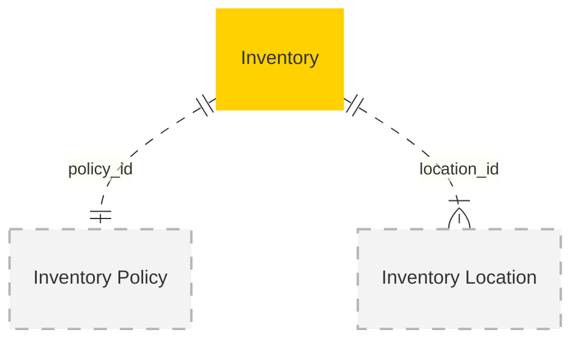

# MACH Alliance, Open Data Model Entity: `Inventory`

## Table of contents

- [MACH Alliance, Open Data Model Entity: `Inventory`](#mach-alliance-open-data-model-entity-inventory)
  - [Table of contents](#table-of-contents)
  - [Entity purpose](#entity-purpose)
  - [Object: Inventory](#object-inventory)
  - [YAML Schema Definition](#yaml-schema-definition)
    - [Inventory Schema](#inventory-schema)
    - [Supporting Type Definitions](#supporting-type-definitions)
  - [Sample Object: Minimal Inventory](#sample-object-minimal-inventory)
  - [Sample Object: Full Inventory](#sample-object-full-inventory)
  - [Sample Object: Multi-Location Inventory](#sample-object-multi-location-inventory)
  - [Sample Object: Backorder Scenario](#sample-object-backorder-scenario)
  - [Core Components \& Relationships](#core-components--relationships)
    - [Components](#components)
    - [Typical Relationships](#typical-relationships)
  - [Typical pitfalls](#typical-pitfalls)
    - [Caching and Consistency](#caching-and-consistency)
    - [Concurrency and Race Conditions](#concurrency-and-race-conditions)
    - [Business Logic Errors](#business-logic-errors)
    - [Architecture Issues](#architecture-issues)
    - [Data Quality Problems](#data-quality-problems)


---

## Entity purpose

Holds the real-time, location-level stock picture for a single SKU so every channel can make consistent availability, reservation, and fulfillment decisions. The Inventory entity resides within Inventory Management Systems (IMS), Warehouse Management Systems (WMS), and Order Management Systems (OMS). It serves as the single source of truth for stock levels, enabling accurate availability calculations, reservation management, and multi-location fulfillment strategies.

The model supports:
- **Location-based inventory**: Track stock at warehouses, stores, and 3PL facilities
- **Real-time quantities**: Maintain on-hand, reserved, available, and incoming stock
- **Flexible policies**: Support backorders, pre-orders, and safety stock buffers
- **Multi-channel consistency**: Ensure accurate availability across all sales channels
- **Optimistic concurrency**: Version control for high-frequency updates

---

## Object: Inventory

| Field                 | Description                                                                         | Practice    |
| --------------------- | ----------------------------------------------------------------------------------- | ----------- |
| `id`                  | Unique identifier for the inventory record                                          | MUST        |
| `sku_id`              | Reference to the SKU/product variant                                                | MUST        |
| `location_id`         | Reference to the inventory location                                                 | MUST        |
| `quantities`          | Stock quantities (on_hand, reserved, available, incoming)                           | MUST        |
| `status`              | Lifecycle state (`draft`, `active`, `inactive`)                                     | SHOULD      |
| `stock_status`        | Calculated availability state (`in_stock`, `out_of_stock`, `backorder`, `preorder`) | SHOULD      |
| `external_references` | Dictionary of cross-system IDs (e.g., WMS, ERP, 3PL)                                | SHOULD      |
| `created_at`          | ISO 8601 creation timestamp                                                         | SHOULD      |
| `updated_at`          | ISO 8601 update timestamp                                                           | SHOULD      |
| `policy_id`           | Reference to the inventory policy ruleset                                           | RECOMMENDED |
| `backorderable`       | Whether overselling is allowed under policy limits                                  | RECOMMENDED |
| `backorder_eta`       | Expected date for stock replenishment                                               | COULD       |
| `safety_stock`        | Buffer quantity removed from available calculation                                  | COULD       |
| `version`             | Integer for optimistic concurrency control                                          | RECOMMENDED |
| `extensions`          | Namespaced dictionary for extension data                                            | RECOMMENDED |

---

## YAML Schema Definition

### Inventory Schema

```yaml
Inventory:
  type: object
  required:
    - id
    - sku_id
    - location_id
    - quantities
  properties:
    # Core identification
    id:
      type: string
      description: Unique identifier for the inventory record
      # example: "INV-SKU123-LOC456"

    sku_id:
      type: string
      description: Reference to the SKU/product variant
      # example: "SKU-123" or "VAR-001"

    location_id:
      type: string
      description: Reference to the inventory location
      # example: "LOC-DC-TOR" or "STORE-001"

    # Stock quantities
    quantities:
      $ref: "#/components/schemas/InventoryQuantities"
      description: Stock quantities breakdown

    # Status and state
    status:
      type: string
      enum: ["draft", "active", "inactive"]
      description: Lifecycle state of the inventory record
      default: "active"

    stock_status:
      type: string
      enum: ["in_stock", "out_of_stock", "backorder", "preorder"]
      description: Calculated availability state
      # example: "in_stock"

    # External references
    external_references:
      type: object
      description: Dictionary of cross-system IDs
      additionalProperties:
        type: string
      # example:
      #   wms_id: "WMS-INV-12345"
      #   erp_id: "SAP-100045"
      #   3pl_id: "3PL-INV-789"

    # Timestamps
    created_at:
      type: string
      format: date-time
      description: ISO 8601 creation timestamp

    updated_at:
      type: string
      format: date-time
      description: ISO 8601 update timestamp

    # Policy and rules
    policy_id:
      type: string
      description: Reference to the inventory policy ruleset
      # example: "POLICY-STD" or "POLICY-DROPSHIP"

    backorderable:
      type: boolean
      description: Whether overselling is allowed under policy limits
      default: false

    backorder_eta:
      type: string
      format: date-time
      description: Expected date for stock replenishment

    safety_stock:
      type: integer
      description: Buffer quantity removed from available calculation
      minimum: 0
      default: 0

    # Concurrency control
    version:
      type: integer
      description: Version number for optimistic concurrency control
      minimum: 0
      default: 0

    # Extensibility
    extensions:
      type: object
      description: Namespaced dictionary for extension data
      additionalProperties: true
      # example:
      #   forecast:
      #     next_30_days_demand: 150
      #     confidence: 0.85
      #   warehouse:
      #     zone: "A-12"
      #     bin: "A-12-03"
```

### Supporting Type Definitions

```yaml
InventoryQuantities:
  type: object
  required:
    - on_hand
    - reserved
    - available
  properties:
    on_hand:
      type: integer
      description: Physical stock currently in the location
      minimum: 0
      # example: 120

    reserved:
      type: integer
      description: Quantity allocated to orders but not yet fulfilled
      minimum: 0
      # example: 15

    available:
      type: integer
      description: Quantity available for new orders (on_hand - reserved - safety_stock)
      # example: 95

    incoming:
      type: integer
      description: Quantity expected from purchase orders or transfers
      minimum: 0
      default: 0
      # example: 40

    allocated:
      type: integer
      description: Quantity soft-reserved in carts or quotes
      minimum: 0
      default: 0
      # example: 5

    damaged:
      type: integer
      description: Quantity marked as damaged/unsellable
      minimum: 0
      default: 0
      # example: 2

# References to other entities
InventoryLocation:
  type: object
  properties:
    id:
      type: string
      description: Location identifier
    type:
      type: string
      enum: ["warehouse", "store", "3pl", "dropship", "virtual"]
    name:
      type: string
    address:
      $ref: "../utilities/address.yaml#/Address"

InventoryPolicy:
  type: object
  properties:
    id:
      type: string
    name:
      type: string
    allow_backorder:
      type: boolean
    max_backorder_quantity:
      type: integer
    safety_stock_percentage:
      type: number
      minimum: 0
      maximum: 100
```

---

## Sample Object: Minimal Inventory

Basic inventory record with essential fields only.

```json
{
  "id": "INV-001",
  "sku_id": "SKU-BASIC-TEE",
  "location_id": "LOC-MAIN",
  "quantities": {
    "on_hand": 50,
    "reserved": 5,
    "available": 45
  },
  "stock_status": "in_stock"
}
```

## Sample Object: Full Inventory

Complete inventory record with all fields populated.

```json
{
  "id": "INV-SKU-123-LOC-DC-TOR",
  "sku_id": "SKU-123",
  "location_id": "LOC-DC-TOR",
  "status": "active",
  "stock_status": "in_stock",
  "external_references": {
    "wms_id": "WMS-INV-77812",
    "erp_id": "SAP-100045-TOR"
  },
  "created_at": "2024-03-12T09:00:00Z",
  "updated_at": "2024-06-22T16:30:00Z",
  "quantities": {
    "on_hand": 120,
    "reserved": 15,
    "available": 95,
    "incoming": 40,
    "allocated": 3,
    "damaged": 2
  },
  "policy_id": "POLICY-STD",
  "backorderable": true,
  "backorder_eta": "2024-07-10T00:00:00Z",
  "safety_stock": 10,
  "version": 4,
  "extensions": {
    "forecast": {
      "next_30_days_demand": 90,
      "confidence": 0.85
    },
    "warehouse": {
      "zone": "A-12",
      "bin": "A-12-03",
      "last_cycle_count": "2024-06-15T08:00:00Z"
    },
    "demand_signals": {
      "last_24h_add_to_carts": 12,
      "velocity_trend": "increasing"
    }
  }
}
```

## Sample Object: Multi-Location Inventory

Example showing inventory distributed across multiple locations for the same SKU.

```json
[
  {
    "id": "INV-TSHIRT-001-DC-EAST",
    "sku_id": "TSHIRT-001",
    "location_id": "DC-EAST",
    "quantities": {
      "on_hand": 500,
      "reserved": 125,
      "available": 375
    },
    "stock_status": "in_stock",
    "policy_id": "POLICY-DC"
  },
  {
    "id": "INV-TSHIRT-001-DC-WEST",
    "sku_id": "TSHIRT-001",
    "location_id": "DC-WEST",
    "quantities": {
      "on_hand": 300,
      "reserved": 200,
      "available": 100
    },
    "stock_status": "in_stock",
    "policy_id": "POLICY-DC"
  },
  {
    "id": "INV-TSHIRT-001-STORE-NYC",
    "sku_id": "TSHIRT-001",
    "location_id": "STORE-NYC",
    "quantities": {
      "on_hand": 25,
      "reserved": 0,
      "available": 20
    },
    "stock_status": "in_stock",
    "safety_stock": 5,
    "policy_id": "POLICY-STORE"
  }
]
```

## Sample Object: Backorder Scenario

Inventory record showing out-of-stock item with backorder capability.

```json
{
  "id": "INV-POPULAR-ITEM-MAIN",
  "sku_id": "POPULAR-ITEM-001",
  "location_id": "LOC-MAIN",
  "status": "active",
  "stock_status": "backorder",
  "quantities": {
    "on_hand": 0,
    "reserved": 45,
    "available": -45,
    "incoming": 200,
    "allocated": 12
  },
  "backorderable": true,
  "backorder_eta": "2024-07-15T00:00:00Z",
  "external_references": {
    "po_number": "PO-2024-789",
    "supplier_id": "SUPP-123"
  },
  "extensions": {
    "backorder": {
      "max_backorder_quantity": 100,
      "current_backorders": 45,
      "estimated_ship_date": "2024-07-17T00:00:00Z"
    },
    "alerts": {
      "low_stock_triggered": "2024-06-20T14:30:00Z",
      "out_of_stock_triggered": "2024-06-22T09:15:00Z"
    }
  }
}
```

---

## Core Components & Relationships

### Components

| Concept                  | Description                                  | Typical Source |
| ------------------------ | -------------------------------------------- | -------------- |
| **Inventory**            | Stock per SKU-location record.               | IMS / WMS      |
| **Inventory Location**   | Physical or virtual node (DC, store, 3PL).   | WMS / OMS      |
| **Inventory Policy**     | Oversell & safety-stock ruleset.             | OMS / IMS      |
| **Inventory Adjustment** | Immutable ledger of stock deltas.            | IMS / ERP      |
| **Availability Feed**    | Denormalised edge projection for fast reads. | CDN / API Edge |

### Typical Relationships



---

## Typical pitfalls

### Caching and Consistency
- **Stale edge caches** - Show in-stock when units are gone, leading to overselling and customer disappointment
- **Eventual consistency delays** - Inventory updates not propagating fast enough across channels
- **Missing cache invalidation** - Changes in one system not triggering updates in dependent systems

### Concurrency and Race Conditions
- **Race conditions without soft-reserve tokens** - Multiple customers buying the last item simultaneously
- **Missing optimistic locking** - Concurrent updates overwriting each other without version control
- **No distributed locking** - Multiple systems updating the same inventory without coordination

### Business Logic Errors
- **Ignoring safety stock** - Erodes fulfillment SLAs and causes stockouts of popular items
- **Not tracking allocated quantity** - Items in carts appear available, leading to abandonment
- **Missing location priorities** - Not optimizing which location fulfills orders

### Architecture Issues
- **No immutable adjustment ledger** - Hinders audit trails and shrinkage analysis
- **Single global inventory pool** - Breaks location-based features like click-and-collect
- **Blocking WMS calls at checkout** - Synchronous inventory checks slow checkout under load
- **No inventory reservation system** - Can't guarantee stock between add-to-cart and payment

### Data Quality Problems
- **Mismatched SKU identifiers** - Different systems using different product IDs
- **Missing incoming inventory tracking** - Can't show "back in stock" dates to customers
- **No damaged/quality hold tracking** - Overselling when some inventory isn't sellable

---

>  This MACH Alliance Canonical Data Model is intentionally __vendor-neutral__ and serves as a foundation for interoperability across composable architectures. It is __continually evolving__ through community contributions, which are reviewed and approved collaboratively.
>
>  All contributions are made under the __Creative Commons Attribution 4.0 International License (CC BY 4.0)__. By submitting a contribution, you agree to license your content under <a href="https://creativecommons.org/licenses/by/4.0/deed.en">CC BY 4.0</a>, allowing others to share and adapt the material with proper attribution.
>
>  We welcome and encourage continued improvements through community input. For more information and guidance on how to contribute, please refer to the <a href="https://github.com/machalliance/common-data-model/blob/main/contributing.md">Contributor Guide</a>.
