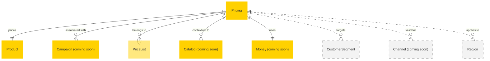

# MACH Alliance, Open Data Model Entity: `Pricing`

## Table of contents

- [MACH Alliance, Open Data Model Entity: `Pricing`](#mach-alliance-open-data-model-entity-pricing)
  - [Table of contents](#table-of-contents)
  - [Entity purpose](#entity-purpose)
  - [Object: Pricing](#object-pricing)
  - [YAML Schema Definition](#yaml-schema-definition)
    - [Pricing Schema](#pricing-schema)
    - [Supporting Type Definitions](#supporting-type-definitions)
  - [Sample Object: Minimal Pricing](#sample-object-minimal-pricing)
  - [Sample Object: Simple Retail Pricing](#sample-object-simple-retail-pricing)
  - [Sample Object: Campaign-Based Pricing](#sample-object-campaign-based-pricing)
  - [Sample Object: Tiered Pricing](#sample-object-tiered-pricing)
  - [Sample Object: Bulk Pricing](#sample-object-bulk-pricing)
  - [Sample Object: Multi-Currency Pricing](#sample-object-multi-currency-pricing)
  - [Sample Object: Pricing as a precomputed matrix for Wholesale/B2B](#sample-object-pricing-as-a-precomputed-matrix-for-wholesaleb2b)
  - [Localization Pattern](#localization-pattern)
    - [Fields Supporting Localization](#fields-supporting-localization)
  - [Core Components \& Relationships](#core-components-relationships)
    - [Components](#components)
    - [Typical Relationships](#typical-relationships)
  - [Typical pitfalls](#typical-pitfalls)
    - [Data Structure Issues](#data-structure-issues)
    - [Schema Design Problems](#schema-design-problems)
    - [Temporal and Validity Issues](#temporal-and-validity-issues)
    - [B2B/Wholesale Challenges](#b2bwholesale-challenges)
    - [Tax and Compliance](#tax-and-compliance)
    - [Performance and Scaling](#performance-and-scaling)


---

## Entity purpose

A unified pricing model that supports flexible, multi-currency pricing across both B2B and B2C commerce scenarios. It resides within Commerce Engines, Pricing Management Systems, and ERP systems. The pricing model supports base pricing, tiered pricing, bulk pricing, dynamic pricing, and promotional adjustments. It serves as the foundational data structure driving pricing strategies, customer segmentation, and revenue optimization.

The Entity describes:
- List price (MSRP) and sale price distinction
- Cost price for internal calculations
- Price list and catalog context associations
- Campaign context for promotional and marketing initiatives
- Tiered pricing for different customer segments
- Bulk pricing for quantity-based discounts
- Dynamic pricing strategies and AI-driven adjustments
- Multi-currency support with conversion rates
- Promotional pricing and business rule adjustments
- Scope-based pricing overrides (region, channel, customer group)
- Tax inclusion and calculation
- Price history and audit trails
- Scheduling and phasing for price changes

---

## Object: Pricing

| Field                 | Description                                                     | Practice    |
| --------------------- | --------------------------------------------------------------- | ----------- |
| `id`                  | Unique identifier for the pricing record                        | MUST        |
| `product_id`          | Reference to the product/SKU this pricing applies to            | MUST        |
| `list_price`          | Manufacturer's suggested retail price (MSRP)                    | MUST        |
| `sale_price`          | Actual selling price to customer                                | MUST        |
| `type`                | Pricing type (`retail`, `wholesale`, `bulk`)                    | SHOULD      |
| `status`              | Lifecycle status (`active`, `inactive`, `archived`, `scheduled`, `expired`) | SHOULD      |
| `external_references` | Dictionary of cross-system IDs (e.g., ERP, PMS)                 | SHOULD      |
| `created_at`          | ISO 8601 creation timestamp                                     | SHOULD      |
| `updated_at`          | ISO 8601 update timestamp                                       | SHOULD      |
| `valid_from`          | ISO 8601 start timestamp for price validity                     | RECOMMENDED |
| `valid_to`            | ISO 8601 end timestamp for price validity                       | RECOMMENDED |
| `campaign_id`         | Associated campaign identifier                                  | COULD       |
| `pricelist_id`        | Associated price list or catalog identifier                     | COULD       |
| `catalog_id`          | Associated catalog context identifier                           | COULD       |
| `tax`                 | Tax inclusion, rate, and type information                       | RECOMMENDED |
| `currency_code`       | ISO 4217 currency code override (if different from Money)       | COULD       |
| `minimum_quantity`    | Minimum quantity for this price to apply                        | COULD       |
| `customer_segment_id` | Specific customer segment this price applies to                 | COULD       |
| `channel_id`          | Sales channel this price is valid for                           | COULD       |
| `region_id`           | Geographic region this price applies to                         | COULD       |
| `extensions`          | Namespaced dictionary for extension data                        | RECOMMENDED |

---

## YAML Schema Definition

### Pricing Schema

```yaml
Pricing:
  type: object
  required:
    - id
    - product_id
    - list_price
    - sale_price
  properties:
    # Core identification
    id:
      type: string
      description: Unique identifier for the pricing record
      # example: "PRICE-001"

    product_id:
      type: string
      description: Reference to the product/SKU this pricing applies to
      # example: "PROD-001" or "SKU-123"

    # Price values
    list_price:
      $ref: "#/components/schemas/Money"
      description: Manufacturer's suggested retail price (MSRP)

    sale_price:
      $ref: "#/components/schemas/Money"
      description: Actual selling price to customer

    # Classification and status
    type:
      type: string
      enum: ["retail", "wholesale", "bulk", "contract", "dynamic"]
      description: Pricing type
      default: "retail"

    status:
      type: string
      enum: ["active", "inactive", "scheduled", "expired", "draft"]
      description: Lifecycle status of the pricing
      default: "active"

    # External references
    external_references:
      type: object
      description: Dictionary of cross-system IDs
      additionalProperties:
        type: string
      # example:
      #   pms_id: "price-123"
      #   erp_id: "price-456"
      #   promotion_id: "promo-789"

    # Timestamps
    created_at:
      type: string
      format: date-time
      description: ISO 8601 creation timestamp

    updated_at:
      type: string
      format: date-time
      description: ISO 8601 update timestamp

    valid_from:
      type: string
      format: date-time
      description: ISO 8601 start timestamp for price validity

    valid_to:
      type: string
      format: date-time
      description: ISO 8601 end timestamp for price validity

    # Associations
    campaign_id:
      type: string
      description: Associated campaign identifier
      # example: "CAMPAIGN-BLACK-FRIDAY-2024"

    pricelist_id:
      type: string
      description: Associated price list identifier
      # example: "PRICELIST-B2B-2024"

    catalog_id:
      type: string
      description: Associated catalog context identifier
      # example: "CATALOG-EU-ENGLISH"

    # Tax information
    tax:
      $ref: "#/components/schemas/TaxInfo"
      description: Tax inclusion, rate, and type information

    # Additional pricing context
    currency_code:
      type: string
      pattern: "^[A-Z]{3}$"
      description: ISO 4217 currency code override
      # example: "EUR"

    minimum_quantity:
      type: integer
      description: Minimum quantity for this price to apply
      minimum: 1
      default: 1

    customer_segment_id:
      type: string
      description: Specific customer segment this price applies to
      # example: "SEGMENT-VIP"

    channel_id:
      type: string
      description: Sales channel this price is valid for
      # example: "CHANNEL-ONLINE"

    region_id:
      type: string
      description: Geographic region this price applies to
      # example: "REGION-EU"

    # Extensibility
    extensions:
      type: object
      description: Namespaced dictionary for extension data
      additionalProperties: true
      # example:
      #   internal:
      #     cost_price:
      #       amount: 25.00
      #       currency: "EUR"
      #     margin_percentage: 39.8
      #   dynamic_pricing:
      #     algorithm: "competitive"
      #     last_adjusted: "2024-06-15T10:30:00Z"
```

### Supporting Type Definitions

```yaml
TaxInfo:
  type: object
  properties:
    included:
      type: boolean
      description: Whether tax is included in the price
      default: false

    rate:
      type: number
      description: Tax rate as decimal (e.g., 0.21 for 21%)
      minimum: 0
      maximum: 1

    type:
      type: string
      enum: ["VAT", "GST", "PST", "HST", "sales_tax", "none"]
      description: Type of tax

    amount:
      $ref: "#/components/schemas/Money"
      description: Calculated tax amount

# Bulk pricing tier definition
BulkPricingTier:
  type: object
  required:
    - minimum_quantity
    - price
  properties:
    minimum_quantity:
      type: integer
      description: Minimum quantity for this tier
      minimum: 1

    maximum_quantity:
      type: integer
      description: Maximum quantity for this tier (null for unlimited)
      minimum: 1

    price:
      $ref: "#/components/schemas/Money"
      description: Price for this quantity tier

# Customer segment pricing
SegmentPricing:
  type: object
  properties:
    segment_id:
      type: string
      description: Customer segment identifier

    segment_name:
      type: string
      description: Display name for the segment

    price:
      $ref: "#/components/schemas/Money"
      description: Price for this segment

    minimum_quantity:
      type: integer
      description: Minimum quantity for segment price
      minimum: 1

# References to utility objects
Money:
  $ref: "../utilities/money.yaml#/Money"
```

---

## Sample Object: Minimal Pricing

Basic pricing with only required fields.

```json
{
  "id": "PRICE-MIN-001",
  "product_id": "PROD-001",
  "list_price": {
    "amount": 49.99,
    "currency": "USD"
  },
  "sale_price": {
    "amount": 49.99,
    "currency": "USD"
  }
}
```

## Sample Object: Simple Retail Pricing

Basic pricing for a standard retail product with list and sale price distinction.

```json
{
  "id": "PRICE-001",
  "product_id": "PROD-001",
  "type": "retail",
  "status": "active",
  "list_price": {
    "amount": 39.95,
    "currency": "EUR"
  },
  "sale_price": {
    "amount": 34.95,
    "currency": "EUR"
  },
  "external_references": {
    "pms_id": "price-123",
    "erp_id": "price-456"
  },
  "created_at": "2024-01-01T00:00:00Z",
  "updated_at": "2024-01-01T00:00:00Z",
  "pricelist_id": "RETAIL-2024",
  "catalog_id": "EU-ENGLISH",
  "tax": {
    "included": true,
    "rate": 0.21,
    "type": "VAT"
  },
  "extensions": {
    "internal": {
      "cost_price": {
        "amount": 25.00,
        "currency": "EUR"
      },
      "margin_percentage": 39.8,
      "source": "erp"
    }
  }
}
```

## Sample Object: Campaign-Based Pricing

Pricing associated with a specific marketing campaign.

```json
{
  "id": "PRICE-CAMPAIGN-001",
  "product_id": "PROD-001",
  "type": "retail",
  "status": "active",
  "list_price": {
    "amount": 39.95,
    "currency": "EUR"
  },
  "sale_price": {
    "amount": 31.96,
    "currency": "EUR"
  },
  "campaign_id": "CAMPAIGN-BLACK-FRIDAY-2024",
  "pricelist_id": "BLACK-FRIDAY-2024",
  "catalog_id": "EU-ENGLISH",
  "external_references": {
    "pms_id": "price-campaign-123",
    "erp_id": "price-campaign-456"
  },
  "created_at": "2024-10-01T00:00:00Z",
  "updated_at": "2024-11-20T00:00:00Z",
  "valid_from": "2024-11-29T00:00:00Z",
  "valid_to": "2024-12-02T23:59:59Z",
  "tax": {
    "included": true,
    "rate": 0.21,
    "type": "VAT"
  },
  "extensions": {
    "campaign": {
      "campaign_name": "Black Friday Sale 2024",
      "discount_percentage": 20,
      "source": "marketing_platform"
    },
    "internal": {
      "cost_price": {
        "amount": 25.00,
        "currency": "EUR"
      },
      "source": "erp"
    }
  }
}
```

## Sample Object: Tiered Pricing

Pricing with different tiers for customer segments using extensions.

```json
{
  "id": "PRICE-TIER-001",
  "product_id": "PROD-001",
  "type": "wholesale",
  "status": "active",
  "list_price": {
    "amount": 39.95,
    "currency": "EUR"
  },
  "sale_price": {
    "amount": 34.95,
    "currency": "EUR"
  },
  "campaign_id": "CAMPAIGN-B2B-Q1",
  "pricelist_id": "B2B-2024-Q1",
  "catalog_id": "EU-ENGLISH",
  "external_references": {
    "pms_id": "price-tier-123",
    "erp_id": "price-tier-456"
  },
  "created_at": "2024-01-01T00:00:00Z",
  "updated_at": "2024-01-01T00:00:00Z",
  "tax": {
    "included": true,
    "rate": 0.21,
    "type": "VAT"
  },
  "extensions": {
    "tiered_pricing": {
      "tiers": [
        {
          "segment_name": "Premium",
          "segment_id": "SEGMENT-PREMIUM",
          "price": {
            "amount": 31.95,
            "currency": "EUR"
          },
          "minimum_quantity": 10,
          "maximum_quantity": 99
        },
        {
          "segment_name": "Enterprise",
          "segment_id": "SEGMENT-ENTERPRISE",
          "price": {
            "amount": 29.95,
            "currency": "EUR"
          },
          "minimum_quantity": 100
        }
      ]
    },
    "campaign": {
      "campaign_name": "Q1 B2B Pricing",
      "season": "Q1-2024",
      "target_audience": ["b2b", "enterprise"]
    },
    "internal": {
      "cost_price": {
        "amount": 25.00,
        "currency": "EUR"
      }
    }
  }
}
```

## Sample Object: Bulk Pricing

Bulk pricing for quantity-based discounts.

```json
{
  "id": "PRICE-BULK-001",
  "product_id": "PROD-001",
  "type": "bulk",
  "status": "active",
  "list_price": {
    "amount": 39.95,
    "currency": "EUR"
  },
  "sale_price": {
    "amount": 39.95,
    "currency": "EUR"
  },
  "pricelist_id": "BULK-2024",
  "catalog_id": "EU-ENGLISH",
  "external_references": {
    "pms_id": "price-bulk-123",
    "erp_id": "price-bulk-456"
  },
  "created_at": "2024-01-01T00:00:00Z",
  "updated_at": "2024-01-01T00:00:00Z",
  "tax": {
    "included": true,
    "rate": 0.21,
    "type": "VAT"
  },
  "extensions": {
    "bulk_pricing": {
      "tiers": [
        {
          "minimum_quantity": 10,
          "maximum_quantity": 49,
          "price": {
            "amount": 35.95,
            "currency": "EUR"
          }
        },
        {
          "minimum_quantity": 50,
          "maximum_quantity": 99,
          "price": {
            "amount": 32.95,
            "currency": "EUR"
          }
        },
        {
          "minimum_quantity": 100,
          "price": {
            "amount": 29.95,
            "currency": "EUR"
          }
        }
      ]
    },
    "internal": {
      "cost_price": {
        "amount": 25.00,
        "currency": "EUR"
      }
    }
  }
}
```

## Sample Object: Multi-Currency Pricing

Pricing with currency conversion support using extensions.

```json
{
  "id": "PRICE-MULTI-001",
  "product_id": "PROD-001",
  "type": "retail",
  "status": "active",
  "list_price": {
    "amount": 39.95,
    "currency": "EUR"
  },
  "sale_price": {
    "amount": 34.95,
    "currency": "EUR"
  },
  "pricelist_id": "INTERNATIONAL-2024",
  "catalog_id": "GLOBAL-ENGLISH",
  "external_references": {
    "pms_id": "price-multi-123",
    "currency_service_id": "conv-456"
  },
  "created_at": "2024-01-01T00:00:00Z",
  "updated_at": "2024-01-01T00:00:00Z",
  "tax": {
    "included": true,
    "rate": 0.21,
    "type": "VAT"
  },
  "extensions": {
    "multi_currency": {
      "conversions": [
        {
          "target_currency": "USD",
          "exchange_rate": 1.1,
          "converted_list_price": {
            "amount": 43.95,
            "currency": "USD"
          },
          "converted_sale_price": {
            "amount": 38.45,
            "currency": "USD"
          },
          "rate_source": "ECB",
          "rate_timestamp": "2024-01-01T00:00:00Z"
        },
        {
          "target_currency": "GBP",
          "exchange_rate": 0.86,
          "converted_list_price": {
            "amount": 34.36,
            "currency": "GBP"
          },
          "converted_sale_price": {
            "amount": 30.06,
            "currency": "GBP"
          },
          "rate_source": "ECB",
          "rate_timestamp": "2024-01-01T00:00:00Z"
        }
      ]
    },
    "promotional": {
      "applied_promotions": [
        {
          "promotion_id": "PROMO-2024-01",
          "discount_type": "percentage",
          "discount_value": 10,
          "valid_from": "2024-03-01T00:00:00Z",
          "valid_to": "2024-03-31T23:59:59Z"
        }
      ]
    },
    "business_rules": {
      "contract_pricing": {
        "rule_type": "customer_segment",
        "condition": "segment == 'enterprise'",
        "adjustment_type": "percentage",
        "adjustment_value": 5
      }
    },
    "internal": {
      "cost_price": {
        "amount": 25.00,
        "currency": "EUR"
      }
    }
  }
}
```
## Sample Object: Pricing as a precomputed matrix for Wholesale/B2B

Efficient customer specific prices PRODUCT or CATALOGUE + CUSTOMER SEGMENT or CUSTOMER + CHANNEL and maybe CURRENCY → PRICE

Requires Indexed prices by product/category ID + customer group ID. can be stored in orchestration layer to gain sub 10ms performance.

```json
{
  "id": "PRICE-MATRIX-B2B-001",
  "type": "wholesale",
  "status": "active",
  "customer_segment_id": "SEGMENT-CUST-042",
  "pricelist_id": "B2B-JUNE-2025",
  "catalog_id": "B2B-CATALOG",
  "category_id": "CAT-TSHIRTS",
  "channel_id": "CHANNEL-B2B",
  "created_at": "2024-01-01T00:00:00Z",
  "updated_at": "2024-01-01T00:00:00Z",
  "valid_from": "2024-01-01T00:00:00Z",
  "valid_to": "2027-01-01T00:00:00Z",
  "external_references": {
    "pms_id": "matrix-b2b-042",
    "cache_key": "price:b2b:segment-042:cat-tshirts"
  },
  "extensions": {
    "matrix_pricing": {
      "prices": [
        {
          "product_id": "PROD-001",
          "sku": "TSHIRT-001",
          "list_price": {
            "amount": 39.95,
            "currency": "EUR"
          },
          "sale_price": {
            "amount": 28.95,
            "currency": "EUR"
          },
          "unit_of_measure": "colli",
          "price_tier": "default"
        },
        {
          "product_id": "PROD-002",
          "sku": "TSHIRT-002",
          "list_price": {
            "amount": 35.00,
            "currency": "EUR"
          },
          "sale_price": {
            "amount": 25.50,
            "currency": "EUR"
          },
          "unit_of_measure": "colli",
          "price_tier": "bulk",
          "minimum_quantity": 10
        }
      ],
      "performance_optimized": true,
      "cache_ttl_seconds": 3600
    }
  }
}
```

---

## Localization Pattern

While prices themselves are numerical values with currency, some pricing-related fields may need localization support:

### Fields Supporting Localization
- Price list names (in extensions)
- Campaign names (in extensions)
- Tax type descriptions (in extensions)
- Unit of measure labels (in extensions)

Example:
```json
{
  "extensions": {
    "display": {
      "pricelist_name": {
        "en-US": "Summer Sale Prices",
        "es-ES": "Precios de Venta de Verano",
        "fr-FR": "Prix Soldes d'Été"
      },
      "unit_label": {
        "en-US": "per unit",
        "es-ES": "por unidad",
        "fr-FR": "par unité"
      }
    }
  }
}
```

---

## Core Components & Relationships

### Components

| Concept       | Description                                  | Typical Source of Truth    |
| ------------- | -------------------------------------------- | -------------------------- |
| List Price    | Manufacturer's suggested retail price (MSRP) | Price Management System    |
| Sale Price    | Actual selling price to customer             | Price Management System    |
| Cost Price    | Internal cost price (in extensions.internal) | ERP System                 |
| Campaign      | Associated campaign context                  | Campaign Management System |
| Price List    | Associated price list or catalog context     | Price Management System    |
| Currency      | Price currency and conversion rates          | Currency Management System |
| Tax           | Tax inclusion, rate, and type                | Tax Engine                 |
| Extensions    | Optional and scoped extensions               | Various domain systems     |
| Reference Ids | Cross-system identifiers                     | Integration Layer          |

`Pricing` typically resides in many systems, including:

- Commerce Engine
- Price Management System (PMS)
- Campaign Management System
- Promotion Management System
- ERP systems
- Pricing Engine
- Tax Engine

### Typical Relationships



---

## Typical pitfalls

### Data Structure Issues
- **Not using Money utility object** - Leads to inconsistent price representations and currency handling errors
- **Mixing price and currency in single field** - Creates parsing complexity and prevents proper money calculations
- **Using floats for monetary values** - Results in rounding errors; always use decimal-safe representations

### Schema Design Problems
- **Overloading core schema with business logic** - Use extensions for domain-specific rules instead of core fields
- **Missing external_references** - Creates integration challenges when syncing prices across systems
- **Not distinguishing list vs sale price** - Essential for showing discounts and calculating margins

### Temporal and Validity Issues
- **Missing valid_from/valid_to fields** - Can't schedule price changes or run time-based campaigns
- **No version control for prices** - Can't track price history or audit changes
- **Ignoring timezone in validity dates** - Causes confusion in global operations

### B2B/Wholesale Challenges
- **No support for tiered/bulk pricing** - B2B customers expect volume discounts
- **Missing customer segment pricing** - Can't offer negotiated rates to specific customers
- **No price list concept** - Makes it hard to manage different pricing strategies

### Tax and Compliance
- **Ambiguous tax inclusion** - Must clearly indicate if prices include tax
- **Missing tax calculation details** - Need tax rate and type for proper invoicing
- **No audit trail** - Regulatory compliance requires price change history

### Performance and Scaling
- **Loading all price tiers always** - Use extensions to lazy-load complex pricing rules
- **No caching strategy for matrix pricing** - B2B price matrices need performance optimization
- **Missing channel/region filtering** - Retrieving all prices when only one is needed

---

>  This MACH Alliance Canonical Data Model is intentionally __vendor-neutral__ and serves as a foundation for interoperability across composable architectures. It is __continually evolving__ through community contributions, which are reviewed and approved collaboratively.
>
>  All contributions are made under the __Creative Commons Attribution 4.0 International License (CC BY 4.0)__. By submitting a contribution, you agree to license your content under <a href="https://creativecommons.org/licenses/by/4.0/deed.en">CC BY 4.0</a>, allowing others to share and adapt the material with proper attribution.
>
>  We welcome and encourage continued improvements through community input. For more information and guidance on how to contribute, please refer to the <a href="../CONTRIBUTING.md">Contributor Guide</a>.
