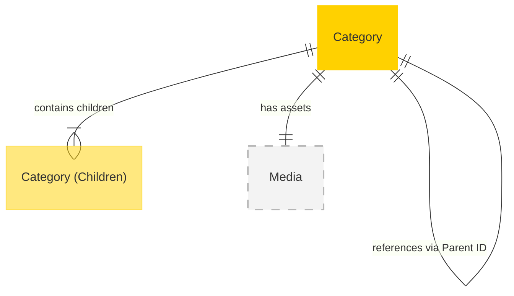

# MACH Alliance, Open Data Model Entity: `Category`

## Table of contents

- [MACH Alliance, Open Data Model Entity: `Category`](#mach-alliance-open-data-model-entity-category)
  - [Table of contents](#table-of-contents)
  - [Entity purpose](#entity-purpose)
  - [Object: Category](#object-category)
  - [YAML Schema Definition](#yaml-schema-definition)
    - [Category Schema](#category-schema)
    - [Supporting Type Definitions](#supporting-type-definitions)
  - [Sample Object: Category - Minimal](#sample-object-category-minimal)
  - [Sample Object: Category - Extended](#sample-object-category-extended)
  - [Localization Pattern](#localization-pattern)
    - [Single Language (Simple String)](#single-language-simple-string)
    - [Multi-Language (Localized Object)](#multi-language-localized-object)
  - [Core Components \& Relationships](#core-components-relationships)
    - [Components](#components)
    - [Typical Relationships](#typical-relationships)
  - [Typical Pitfalls](#typical-pitfalls)
    - [Hierarchy and Structure](#hierarchy-and-structure)
    - [Localization and Content](#localization-and-content)
    - [Product Assignment and Discovery](#product-assignment-and-discovery)
    - [Data Management](#data-management)
    - [Performance and Implementation](#performance-and-implementation)

---

## Entity purpose

The Category entity defines the hierarchical and navigational structure used to group and organize products. It is central to product discovery, navigation, and merchandising strategies across both B2B and B2C environments. Categories are typically managed in Commerce Engines, PIM systems, and DXP solutions, supporting multi-level hierarchies, localization, and business-specific taxonomies.

- Groups products into logical structures
- Enables product discovery through navigation and search
- Supports merchandising and campaign strategies
- Drives SEO and channel-specific taxonomies
- Localizes the product experience by region or language
- Organizes catalog hierarchies for both internal and customer-facing use

---

## Object: Category

| Field                 | Description                                                        | Practice    |
| --------------------- | ------------------------------------------------------------------ | ----------- |
| `id`                  | Unique identifier in given context (e.g., UUID, slug)              | MUST        |
| `name`                | Display name of the category (string or localized object)          | MUST        |
| `description`         | Detailed description of the category (string or localized object)  | SHOULD      |
| `slug`                | URL-friendly identifier fragment (string or localized object)      | RECOMMENDED |
| `status`              | Lifecycle status (`active`, `inactive`, `archived`)                | SHOULD      |
| `external_references` | Dictionary of cross-system IDs (e.g., PIM, ERP, Commerce Engine)   | SHOULD      |
| `created_at`          | ISO 8601 creation timestamp                                        | SHOULD      |
| `updated_at`          | ISO 8601 update timestamp                                          | SHOULD      |
| `parent_id`           | Parent category identifier for hierarchy                           | SHOULD      |
| `position`            | Sort order within parent category                                  | SHOULD      |
| `path`                | Full category path for breadcrumbs (e.g., `/clothing/mens/shirts`) | COULD       |
| `children`            | Array of child category references or objects                      | COULD       |
| `attributes`          | Additional metadata schemas or search filters                      | COULD       |
| `tags`                | Array of tags for filtering and search                             | COULD       |
| `product_count`       | Number of products in this category                                | COULD       |
| `primary_image`       | Primary category image                                             | SHOULD      |
| `media`               | Additional images and assets                                       | COULD       |
| `seo`                 | Metadata for search engine optimization                            | SHOULD      |
| `extensions`          | Namespaced dictionary for extension data                           | RECOMMENDED |

---

## YAML Schema Definition

### Category Schema

```yaml
Category:
  type: object
  required:
    - id
    - name
  properties:
    # Core identification
    id:
      type: string
      description: Unique identifier for the category
      # example: "CAT-SHORTS-001"

    # Display information (localizable)
    name:
      oneOf:
        - type: string  # Single language
        - type: object  # Multi-language
          additionalProperties:
            type: string
      description: Display name of the category
      # example:
      #   en-US: "Shorts"
      #   de-DE: "Shorts"

    description:
      oneOf:
        - type: string  # Single language
        - type: object  # Multi-language
          additionalProperties:
            type: string
      description: Detailed description of the category

    slug:
      oneOf:
        - type: string  # Single language
        - type: object  # Multi-language
          additionalProperties:
            type: string
      description: URL-friendly identifier fragment
      pattern: "^[a-z0-9]+(?:-[a-z0-9]+)*$"
      # example: "shorts"

    # Status and hierarchy
    status:
      type: string
      enum: ["active", "inactive", "archived"]
      description: Lifecycle status of the category
      default: "active"

    parent_id:
      type: string
      description: Parent category identifier for hierarchy
      # example: "CAT-CLOTHING-001"

    position:
      type: integer
      description: Sort order within parent category
      minimum: 1
      # example: 3

    path:
      type: string
      description: Full category path for breadcrumbs
      # example: "/clothing/shorts"

    # External references
    external_references:
      type: object
      description: Dictionary of cross-system IDs
      additionalProperties:
        type: string
      # example:
      #   pim_id: "cat_shorts_001"
      #   commerce_id: "shorts-category"

    # Timestamps
    created_at:
      type: string
      format: date-time
      description: ISO 8601 creation timestamp

    updated_at:
      type: string
      format: date-time
      description: ISO 8601 update timestamp

    # Hierarchy and products
    children:
      type: array
      items:
        $ref: "#/components/schemas/CategoryReference"
      description: Array of child category references or objects

    product_count:
      type: integer
      description: Number of products in this category
      minimum: 0
      # example: 42

    # Metadata and classification
    attributes:
      type: object
      additionalProperties: true
      description: Additional metadata schemas or search filters
      # example:
      #   style: "Modern"
      #   season: "Summer"

    tags:
      type: array
      items:
        type: string
      description: Array of tags for filtering and search
      # example: ["clothing", "casual", "summer"]

    # Media assets
    primary_image:
      $ref: "#/components/schemas/Media"
      description: Primary category image

    media:
      type: array
      items:
        $ref: "#/components/schemas/Media"
      description: Additional images and assets

    # SEO
    seo:
      $ref: "#/components/schemas/SEO"
      description: Metadata for search engine optimization

    # Extensibility
    extensions:
      type: object
      description: Namespaced dictionary for extension data
      additionalProperties: true
      # example:
      #   merchandising:
      #     featured: true
      #     display_priority: 5
```

### Supporting Type Definitions

```yaml
CategoryReference:
  type: object
  required:
    - id
    - name
    - slug
  properties:
    id:
      type: string
      description: Category identifier
    name:
      oneOf:
        - type: string
        - type: object
          additionalProperties:
            type: string
      description: Category name
    slug:
      type: string
      description: URL-friendly identifier
    parent_id:
      type: string
      description: Parent category identifier
    position:
      type: integer
      description: Sort order
    product_count:
      type: integer
      description: Number of products

# References to utility objects defined in other files
Media:
  $ref: "../utilities/media.yaml#/Media"

SEO:
  $ref: "../utilities/seo.yaml#/SEO"
```

---

## Sample Object: Category - Minimal

Minimal category object for simple implementations or category references.

```json
{
  "id": "CAT-SHORTS-001",
  "name": "Shorts",
  "slug": "shorts",
  "parent_id": "CAT-CLOTHING-001",
  "position": 3,
  "status": "active"
}
```

---

## Sample Object: Category - Extended

Extended category object with extensions and additional fields for comprehensive category management.

```json
{
  "id": "CAT-SHORTS-001",
  "name": {
    "en-US": "Shorts",
    "de-DE": "Shorts"
  },
  "description": {
    "en-US": "Comfortable shorts for all occasions",
    "de-DE": "Bequeme Shorts für alle Gelegenheiten"
  },
  "slug": {
    "en-US": "shorts",
    "de-DE": "shorts"
  },
  "status": "active",
  "external_references": {
    "pim_id": "cat_shorts_001",
    "commerce_id": "shorts-category",
    "erp_id": "CAT-789"
  },
  "created_at": "2025-06-01T12:00:00Z",
  "updated_at": "2025-06-10T12:30:00Z",
  "parent_id": "CAT-CLOTHING-001",
  "position": 3,
  "path": "/clothing/shorts",
  "product_count": 42,
  "children": [
    {
      "id": "CAT-RUNNING-SHORTS-001",
      "name": {
        "en-US": "Running Shorts",
        "de-DE": "Laufshorts"
      },
      "slug": "running-shorts",
      "parent_id": "CAT-SHORTS-001",
      "position": 1,
      "product_count": 15
    }
  ],
  "attributes": {
    "style": "Modern",
    "season": "Summer"
  },
  "tags": ["trousers", "clothing", "casual"],
  "primary_image": {
    "url": "https://cdn.example.com/categories/shorts-hero.webp",
    "alt_text": {
      "en-US": "Shorts Category",
      "de-DE": "Shorts Kategorie"
    }
  },
  "media": [
    {
      "url": "https://cdn.example.com/categories/shorts-banner.webp",
      "alt_text": "Summer Shorts Collection",
      "type": "banner"
    }
  ],
  "seo": {
    "meta_title": {
      "en-US": "Premium Shorts Collection | MACH Store",
      "de-DE": "Premium-Shorts-Kollektion | MACH Store"
    },
    "meta_description": {
      "en-US": "Discover our comfortable shorts for every occasion",
      "de-DE": "Entdecken Sie unsere bequemen Shorts für jede Gelegenheit"
    },
    "meta_keywords": ["shorts", "casual wear", "summer"]
  },
  "extensions": {
    "merchandising": {
      "featured": true,
      "display_priority": 5,
      "promotional_badge": {
        "en-US": "New Collection",
        "de-DE": "Neue Kollektion"
      },
      "banner_image": "https://cdn.example.com/banners/shorts-promo.webp"
    },
    "availability": {
      "channel_availability": ["web", "store", "mobile"],
      "region_availability": ["EU", "US", "UK"]
    }
  }
}
```

---

## Localization Pattern

All fields that are displayed to end users support flexible localization. Fields can accept either a simple string (for single-language stores) or a localized object (for multi-language stores).

### Single Language (Simple String)
```json
{
  "name": "Shorts",
  "description": "Comfortable shorts for all occasions"
}
```

### Multi-Language (Localized Object)
```json
{
  "name": {
    "en-US": "Shorts",
    "de-DE": "Shorts",
    "fr-FR": "Shorts"
  },
  "description": {
    "en-US": "Comfortable shorts for all occasions",
    "de-DE": "Bequeme Shorts für alle Gelegenheiten",
    "fr-FR": "Shorts confortables pour toutes les occasions"
  }
}
```

This pattern applies to all localizable fields including:
- `name` - Category display name
- `description` - Category description
- `slug` - URL-friendly identifier (can vary by language)
- `seo` fields - All SEO metadata
- `media.alt_text` - Image alternative text
- Extension fields that contain display text

---

## Core Components & Relationships

### Components

| Concept    | Description                    | Typical Source of Truth         |
| ---------- | ------------------------------ | ------------------------------- |
| ID         | Unique category identifier     | Commerce Engine / PIM / CMS     |
| Hierarchy  | Parent-child relationships     | PIM / Commerce Engine           |
| Extensions | Optional and scoped extensions | SEO Tools / Merchandising / PIM |
| Media      | Category images and assets     | DAM / CDN / CMS                 |

### Typical Relationships



---

## Typical Pitfalls

### Hierarchy and Structure
- **Not supporting multi-level or nested category hierarchies** - Limits the ability to structure products logically, harming site navigation and SEO.
- **Missing position/sort order field** - Results in inconsistent category ordering across channels and poor user experience.
- **Not supporting multiple parent categories** - A category may need to exist under multiple parents (e.g., "Hiking Boots" under both "Footwear" and "Camping Equipment").
- **Confusing parent_id with primary parent** - When a category has multiple parents, one should be designated as primary for breadcrumb building.

### Localization and Content
- **Poor localization of category names and descriptions** - Creates a disjointed user experience for international customers and reduces search relevancy in localized markets.
- **Not localizing slugs** - Different languages may require different URL structures for SEO optimization.
- **Forgetting to localize media alt text** - Impacts accessibility and SEO in different markets.

### Product Assignment and Discovery
- **Missing ability to assign products to multiple categories** - Results in limited product discoverability and forces duplication or workarounds in merchandising.
- **Not tracking product_count** - Makes it difficult to identify empty categories or optimize navigation.
- **Poor integration with search and filtering systems** - Leads to ineffective faceted search and user frustration during navigation.

### Data Management
- **Not distinguishing between active/inactive/archived states** - Makes it hard to manage seasonal categories or phase out old taxonomies.
- **Not tracking category changes over time** - Makes it difficult to understand performance trends and recover from mistakes.
- **Missing external_references** - Creates integration challenges when syncing categories across PIM, ERP, and commerce systems.
- **Poor governance for managing large taxonomies** - Causes inconsistent category structures and scaling issues as the catalog grows.

### Performance and Implementation
- **Always returning full nested children** - Can create performance issues with deep hierarchies; consider returning just references.
- **Not caching category paths** - Repeatedly calculating breadcrumbs can impact performance.
- **Missing proper indexing on parent_id and position** - Slows down category tree rendering.

---

>  This MACH Alliance Canonical Data Model is intentionally __vendor-neutral__ and serves as a foundation for interoperability across composable architectures. It is __continually evolving__ through community contributions, which are reviewed and approved collaboratively.
>
>  All contributions are made under the __Creative Commons Attribution 4.0 International License (CC BY 4.0)__. By submitting a contribution, you agree to license your content under <a href="https://creativecommons.org/licenses/by/4.0/deed.en">CC BY 4.0</a>, allowing others to share and adapt the material with proper attribution.
>
>  We welcome and encourage continued improvements through community input. For more information and guidance on how to contribute, please refer to the <a href="../../CONTRIBUTING.md">Contributor Guide</a>.


