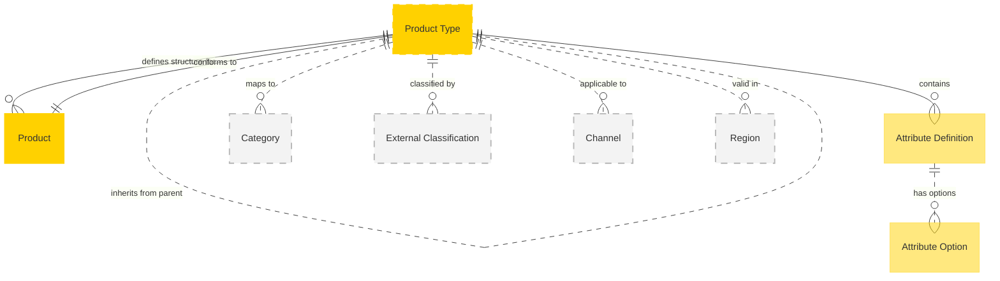

# MACH Alliance, Open Data Model Entity: `Product Type`

## Table of contents

- [MACH Alliance, Open Data Model Entity: `Product Type`](#mach-alliance-open-data-model-entity-product-type)
  - [Table of contents](#table-of-contents)
  - [Entity purpose](#entity-purpose)
  - [Object: Product Type](#object-product-type)
  - [YAML Schema Definition](#yaml-schema-definition)
    - [Product Type Schema](#product-type-schema)
    - [Supporting Type Definitions](#supporting-type-definitions)
  - [Sample Object: Minimal Product Type](#sample-object-minimal-product-type)
  - [Sample Object: Basic Product Type](#sample-object-basic-product-type)
  - [Sample Object: Multi-language Product Type](#sample-object-multi-language-product-type)
  - [Sample Object: Complex B2B Product Type](#sample-object-complex-b2b-product-type)
  - [Sample Object: Product Type with Advanced Attribute Definitions](#sample-object-product-type-with-advanced-attribute-definitions)
  - [Sample Object: Regional Product Type with Compliance](#sample-object-regional-product-type-with-compliance)
  - [Localization Pattern](#localization-pattern)
    - [Single Language (Simple String)](#single-language-simple-string)
    - [Multi-Language (Localized Object)](#multi-language-localized-object)
    - [Language Code Standards](#language-code-standards)
  - [Core Components \& Relationships](#core-components--relationships)
    - [Components](#components)
    - [Typical Relationships](#typical-relationships)
  - [Typical pitfalls](#typical-pitfalls)
    - [Design Anti-patterns](#design-anti-patterns)
    - [Schema Evolution Challenges](#schema-evolution-challenges)
    - [Performance and Scalability Issues](#performance-and-scalability-issues)
    - [Integration Problems](#integration-problems)
    - [Data Governance Issues](#data-governance-issues)
    - [Compliance and Regulatory Gaps](#compliance-and-regulatory-gaps)
    - [Common Implementation Mistakes](#common-implementation-mistakes)

---

## Entity purpose

A unified product type model that defines the classification, structure, and shared attributes for products across all commerce channels. It resides within Product Information Management (PIM) systems, Commerce Engines, and Master Data Management systems. The product type serves as a template that enforces consistency, enables attribute inheritance, and supports complex product hierarchies for both B2B and B2C scenarios.

The Entity describes:
- Product classification and categorization structure
- Attribute definitions and validation rules
- Required vs optional field specifications
- Inheritance patterns for product families
- Data type constraints and allowed values
- Localization requirements for global commerce
- Compliance and regulatory attribute requirements
- Integration with external classification systems (UNSPSC, eCl@ss)
- Versioning and evolution of product schemas
- Channel and region-specific attribute variations

---

## Object: Product Type

| Field                   | Description                                           | Practice    |
| ----------------------- | ----------------------------------------------------- | ----------- |
| `id`                    | Unique identifier for the product type                | MUST        |
| `name`                  | Product type name (string or localized object)        | MUST        |
| `status`                | Lifecycle status (`active`, `inactive`, `deprecated`) | SHOULD      |
| `external_references`   | Dictionary of cross-system IDs (e.g., UNSPSC, eCl@ss) | SHOULD      |
| `created_at`            | ISO 8601 creation timestamp                           | SHOULD      |
| `updated_at`            | ISO 8601 update timestamp                             | SHOULD      |
| `description`           | Product type description (string or localized object) | SHOULD      |
| `parent_type_id`        | Reference to parent type for inheritance              | COULD       |
| `attribute_definitions` | Schema defining attributes for products of this type  | MUST        |
| `required_attributes`   | List of attribute IDs that must be populated          | RECOMMENDED |
| `category_path`         | Hierarchical category classification                  | RECOMMENDED |
| `version`               | Schema version for migration support                  | RECOMMENDED |
| `tags`                  | Array of tags for filtering and organization          | COULD       |
| `applicable_channels`   | Channels where this product type is valid             | COULD       |
| `applicable_regions`    | Regions where this product type is valid              | COULD       |
| `extensions`            | Namespaced dictionary for extension data              | RECOMMENDED |

---

## YAML Schema Definition

### Product Type Schema

```yaml
ProductType:
  type: object
  required:
    - id
    - name
    - attribute_definitions
  properties:
    # Core identification
    id:
      type: string
      description: Unique identifier for the product type
      # example: "PT-APPAREL-001"

    # Display information (localizable)
    name:
      oneOf:
        - type: string  # Single language
        - type: object  # Multi-language
          additionalProperties:
            type: string
      description: Product type name
      # example:
      #   en-US: "Apparel & Accessories"
      #   es-ES: "Ropa y Accesorios"

    description:
      oneOf:
        - type: string  # Single language
        - type: object  # Multi-language
          additionalProperties:
            type: string
      description: Product type description

    # Status and lifecycle
    status:
      type: string
      enum: ["active", "inactive", "deprecated"]
      description: Lifecycle status of the product type
      default: "active"

    # External references
    external_references:
      type: object
      description: Dictionary of cross-system IDs and classification codes
      additionalProperties:
        type: string
      # example:
      #   unspsc: "53102500"  # Shirts and blouses
      #   eclass: "EC123456"
      #   internal_code: "APP-001"

    # Timestamps
    created_at:
      type: string
      format: date-time
      description: ISO 8601 creation timestamp

    updated_at:
      type: string
      format: date-time
      description: ISO 8601 update timestamp

    # Hierarchy and inheritance
    parent_type_id:
      type: string
      description: Reference to parent type for attribute inheritance
      # example: "PT-CLOTHING-BASE"

    # Attribute schema
    attribute_definitions:
      type: object
      description: Schema defining attributes for products of this type
      additionalProperties:
        $ref: "#/components/schemas/AttributeDefinition"

    required_attributes:
      type: array
      items:
        type: string
      description: List of attribute IDs that must be populated
      # example: ["material", "care_instructions", "size"]

    # Classification and organization
    category_path:
      type: array
      items:
        type: string
      description: Hierarchical category classification
      # example: ["clothing", "apparel", "shirts"]

    version:
      type: string
      pattern: "^\\d+\\.\\d+\\.\\d+$"
      description: Schema version for migration support (semantic versioning)
      # example: "2.1.0"

    tags:
      type: array
      items:
        type: string
      description: Tags for filtering and organization
      # example: ["sustainable", "b2c", "fashion"]

    # Applicability
    applicable_channels:
      type: array
      items:
        type: string
      description: Channels where this product type is valid
      # example: ["web", "mobile", "store", "b2b-portal"]

    applicable_regions:
      type: array
      items:
        type: string
      description: Regions where this product type is valid (ISO codes)
      # example: ["US", "CA", "EU", "APAC"]

    # Extensibility
    extensions:
      type: object
      description: Namespaced dictionary for extension data
      additionalProperties: true
      # example:
      #   seo:
      #     meta_template: "Buy {product_name} - {brand} | Store"
      #     url_pattern: "/products/{category}/{slug}"
      #   compliance:
      #     requires_origin_country: true
      #     age_verification: false
```

### Supporting Type Definitions

```yaml
AttributeDefinition:
  type: object
  required:
    - type
    - label
  properties:
    type:
      type: string
      enum: [
        "text", "number", "boolean", "date", "datetime",
        "select", "multiselect", "money", "dimension",
        "weight", "url", "email", "json", "rich_text"
      ]
      description: Data type of the attribute

    label:
      oneOf:
        - type: string  # Single language
        - type: object  # Multi-language
          additionalProperties:
            type: string
      description: Display label for the attribute

    description:
      oneOf:
        - type: string  # Single language
        - type: object  # Multi-language
          additionalProperties:
            type: string
      description: Help text or description for the attribute

    is_required:
      type: boolean
      description: Whether this attribute is mandatory
      default: false

    is_unique:
      type: boolean
      description: Whether values must be unique across products
      default: false

    is_searchable:
      type: boolean
      description: Whether this attribute is searchable
      default: true

    is_variant_defining:
      type: boolean
      description: Whether this attribute creates product variants
      default: false

    validation:
      $ref: "#/components/schemas/AttributeValidation"
      description: Validation rules for the attribute

    options:
      type: array
      items:
        $ref: "#/components/schemas/AttributeOption"
      description: Available options for select/multiselect types

    default_value:
      description: Default value for the attribute (type varies)

    unit:
      type: string
      description: Unit of measurement for numeric attributes
      # example: "cm", "kg", "pieces"

    source:
      type: string
      description: System that manages this attribute
      # example: "pim_system", "erp", "cms"

    position:
      type: integer
      description: Display order for the attribute
      minimum: 0

AttributeValidation:
  type: object
  properties:
    pattern:
      type: string
      description: Regex pattern for text validation
      # example: "^[A-Z]{3}-\\d{6}$"

    min:
      type: number
      description: Minimum value for numeric attributes

    max:
      type: number
      description: Maximum value for numeric attributes

    min_length:
      type: integer
      description: Minimum length for text attributes

    max_length:
      type: integer
      description: Maximum length for text attributes

    allowed_values:
      type: array
      description: Explicit list of allowed values

    custom_validator:
      type: string
      description: Reference to custom validation function
      # example: "validate_isbn"

AttributeOption:
  type: object
  required:
    - value
    - label
  properties:
    value:
      type: string
      description: Internal value stored in the system

    label:
      oneOf:
        - type: string  # Single language
        - type: object  # Multi-language
          additionalProperties:
            type: string
      description: Display label for the option

    position:
      type: integer
      description: Display order for the option
      minimum: 0

    is_default:
      type: boolean
      description: Whether this is the default option
      default: false

    metadata:
      type: object
      description: Additional metadata for the option
      additionalProperties: true
```

---

## Sample Object: Minimal Product Type

A minimal product type with only required fields.

```json
{
  "id": "PT-BASIC",
  "name": "Basic Product",
  "attribute_definitions": {
    "name": {
      "type": "text",
      "label": "Product Name",
      "is_required": true
    }
  }
}
```

## Sample Object: Basic Product Type

Simple product type for apparel with essential attributes.

```json
{
  "id": "PT-APPAREL-001",
  "name": "Apparel",
  "description": "Clothing and fashion items",
  "status": "active",
  "external_references": {
    "unspsc": "53100000",
    "internal_code": "APP-001"
  },
  "created_at": "2024-01-01T00:00:00Z",
  "updated_at": "2024-06-15T10:30:00Z",
  "attribute_definitions": {
    "material": {
      "type": "text",
      "label": "Material Composition",
      "is_required": true,
      "is_searchable": true,
      "source": "pim_system"
    },
    "size": {
      "type": "select",
      "label": "Size",
      "is_required": true,
      "is_variant_defining": true,
      "options": [
        { "value": "xs", "label": "Extra Small" },
        { "value": "s", "label": "Small" },
        { "value": "m", "label": "Medium" },
        { "value": "l", "label": "Large" },
        { "value": "xl", "label": "Extra Large" }
      ],
      "source": "pim_system"
    },
    "color": {
      "type": "select",
      "label": "Color",
      "is_required": true,
      "is_variant_defining": true,
      "is_searchable": true,
      "source": "pim_system"
    },
    "care_instructions": {
      "type": "text",
      "label": "Care Instructions",
      "is_required": false,
      "source": "pim_system"
    }
  },
  "required_attributes": ["material", "size", "color"],
  "category_path": ["clothing", "apparel"],
  "version": "1.0.0",
  "tags": ["fashion", "b2c"],
  "applicable_channels": ["web", "mobile", "store"]
}
```

## Sample Object: Multi-language Product Type

Product type with comprehensive multi-language support.

```json
{
  "id": "PT-ELECTRONICS-001",
  "name": {
    "en-US": "Consumer Electronics",
    "es-ES": "Electrónica de Consumo",
    "fr-FR": "Électronique Grand Public",
    "de-DE": "Unterhaltungselektronik",
    "ja-JP": "家電製品"
  },
  "description": {
    "en-US": "Electronic devices and accessories for personal use",
    "es-ES": "Dispositivos electrónicos y accesorios para uso personal",
    "fr-FR": "Appareils électroniques et accessoires à usage personnel",
    "de-DE": "Elektronische Geräte und Zubehör für den persönlichen Gebrauch",
    "ja-JP": "個人使用のための電子機器とアクセサリー"
  },
  "status": "active",
  "external_references": {
    "unspsc": "52160000",
    "eclass": "27-01-01-01"
  },
  "attribute_definitions": {
    "brand": {
      "type": "text",
      "label": {
        "en-US": "Brand",
        "es-ES": "Marca",
        "fr-FR": "Marque",
        "de-DE": "Marke",
        "ja-JP": "ブランド"
      },
      "is_required": true,
      "is_searchable": true,
      "validation": {
        "min_length": 1,
        "max_length": 100
      }
    },
    "model_number": {
      "type": "text",
      "label": {
        "en-US": "Model Number",
        "es-ES": "Número de Modelo",
        "fr-FR": "Numéro de Modèle",
        "de-DE": "Modellnummer",
        "ja-JP": "型番"
      },
      "is_required": true,
      "is_unique": true,
      "validation": {
        "pattern": "^[A-Z0-9-]+$"
      }
    },
    "warranty_period": {
      "type": "select",
      "label": {
        "en-US": "Warranty Period",
        "es-ES": "Período de Garantía",
        "fr-FR": "Période de Garantie",
        "de-DE": "Garantiezeitraum",
        "ja-JP": "保証期間"
      },
      "options": [
        {
          "value": "90days",
          "label": {
            "en-US": "90 Days",
            "es-ES": "90 Días",
            "fr-FR": "90 Jours",
            "de-DE": "90 Tage",
            "ja-JP": "90日"
          }
        },
        {
          "value": "1year",
          "label": {
            "en-US": "1 Year",
            "es-ES": "1 Año",
            "fr-FR": "1 An",
            "de-DE": "1 Jahr",
            "ja-JP": "1年"
          }
        },
        {
          "value": "2years",
          "label": {
            "en-US": "2 Years",
            "es-ES": "2 Años",
            "fr-FR": "2 Ans",
            "de-DE": "2 Jahre",
            "ja-JP": "2年"
          }
        }
      ],
      "default_value": "1year"
    },
    "energy_rating": {
      "type": "select",
      "label": {
        "en-US": "Energy Efficiency Rating",
        "es-ES": "Calificación de Eficiencia Energética",
        "fr-FR": "Classe d'Efficacité Énergétique",
        "de-DE": "Energieeffizienzklasse"
      },
      "options": [
        { "value": "A+++", "label": "A+++" },
        { "value": "A++", "label": "A++" },
        { "value": "A+", "label": "A+" },
        { "value": "A", "label": "A" },
        { "value": "B", "label": "B" },
        { "value": "C", "label": "C" }
      ],
      "is_searchable": true
    }
  },
  "required_attributes": ["brand", "model_number"],
  "category_path": ["electronics", "consumer"],
  "version": "2.0.0",
  "applicable_regions": ["US", "CA", "EU", "JP"],
  "extensions": {
    "compliance": {
      "ce_marking_required": true,
      "fcc_approval_required": true,
      "rohs_compliant": true
    },
    "display": {
      "show_energy_label": true,
      "comparison_enabled": true
    }
  }
}
```

## Sample Object: Complex B2B Product Type

Advanced product type for B2B industrial equipment with detailed specifications.

```json
{
  "id": "PT-INDUSTRIAL-PUMP-001",
  "name": "Industrial Centrifugal Pumps",
  "description": "High-performance centrifugal pumps for industrial applications",
  "status": "active",
  "parent_type_id": "PT-INDUSTRIAL-EQUIPMENT",
  "external_references": {
    "unspsc": "40151500",
    "eclass": "36-01-01-01",
    "sap_material_type": "PUMP"
  },
  "created_at": "2023-01-01T00:00:00Z",
  "updated_at": "2024-07-01T14:30:00Z",
  "version": "3.2.0",
  "attribute_definitions": {
    "flow_rate": {
      "type": "number",
      "label": "Flow Rate",
      "description": "Maximum flow rate at optimal efficiency",
      "is_required": true,
      "is_searchable": true,
      "unit": "m³/h",
      "validation": {
        "min": 0,
        "max": 10000
      },
      "source": "engineering_system"
    },
    "head_pressure": {
      "type": "number",
      "label": "Head Pressure",
      "description": "Maximum head pressure",
      "is_required": true,
      "is_searchable": true,
      "unit": "m",
      "validation": {
        "min": 0,
        "max": 500
      },
      "source": "engineering_system"
    },
    "motor_power": {
      "type": "number",
      "label": "Motor Power",
      "is_required": true,
      "is_searchable": true,
      "unit": "kW",
      "validation": {
        "min": 0.1,
        "max": 1000
      },
      "source": "engineering_system"
    },
    "inlet_diameter": {
      "type": "dimension",
      "label": "Inlet Diameter",
      "is_required": true,
      "unit": "mm",
      "validation": {
        "min": 25,
        "max": 600
      },
      "source": "engineering_system"
    },
    "outlet_diameter": {
      "type": "dimension",
      "label": "Outlet Diameter",
      "is_required": true,
      "unit": "mm",
      "validation": {
        "min": 25,
        "max": 500
      },
      "source": "engineering_system"
    },
    "material_construction": {
      "type": "multiselect",
      "label": "Materials of Construction",
      "is_required": true,
      "options": [
        { "value": "cast_iron", "label": "Cast Iron" },
        { "value": "stainless_316", "label": "Stainless Steel 316" },
        { "value": "duplex", "label": "Duplex Stainless Steel" },
        { "value": "bronze", "label": "Bronze" },
        { "value": "hastelloy", "label": "Hastelloy" }
      ],
      "source": "engineering_system"
    },
    "certifications": {
      "type": "multiselect",
      "label": "Certifications",
      "options": [
        { "value": "atex", "label": "ATEX Explosion Proof" },
        { "value": "api610", "label": "API 610 Compliant" },
        { "value": "iso9001", "label": "ISO 9001" },
        { "value": "ce", "label": "CE Marked" },
        { "value": "ul", "label": "UL Listed" }
      ],
      "source": "compliance_system"
    },
    "npsh_required": {
      "type": "number",
      "label": "NPSH Required",
      "description": "Net Positive Suction Head required",
      "unit": "m",
      "validation": {
        "min": 0,
        "max": 50
      },
      "source": "engineering_system"
    },
    "efficiency_curve": {
      "type": "json",
      "label": "Efficiency Curve Data",
      "description": "Performance curve data points",
      "is_required": false,
      "source": "engineering_system"
    },
    "cad_drawing_url": {
      "type": "url",
      "label": "CAD Drawing Link",
      "is_required": false,
      "validation": {
        "pattern": "^https?://.*\\.(dwg|dxf|step|iges)$"
      },
      "source": "engineering_system"
    },
    "spare_parts_list": {
      "type": "json",
      "label": "Spare Parts List",
      "description": "List of spare parts with part numbers",
      "is_required": false,
      "source": "erp_system"
    }
  },
  "required_attributes": [
    "flow_rate",
    "head_pressure",
    "motor_power",
    "inlet_diameter",
    "outlet_diameter",
    "material_construction"
  ],
  "category_path": ["industrial", "pumps", "centrifugal"],
  "tags": ["b2b", "industrial", "rotating-equipment", "api-compliant"],
  "applicable_channels": ["b2b-portal", "dealer-network"],
  "applicable_regions": ["global"],
  "extensions": {
    "engineering": {
      "design_standard": "API 610",
      "impeller_type": "closed",
      "seal_type": "mechanical",
      "bearing_type": "anti-friction"
    },
    "procurement": {
      "lead_time_days": 45,
      "minimum_order_quantity": 1,
      "country_of_origin_required": true
    },
    "service": {
      "mtbf_hours": 25000,
      "recommended_service_interval": "6months",
      "warranty_conditions": "standard_industrial"
    },
    "pricing": {
      "pricing_model": "quote_based",
      "volume_discounts_available": true
    }
  }
}
```

## Sample Object: Product Type with Advanced Attribute Definitions

Product type showcasing various attribute types and validation rules.

```json
{
  "id": "PT-FURNITURE-001",
  "name": "Home Furniture",
  "description": "Furniture items for residential use",
  "status": "active",
  "external_references": {
    "unspsc": "56101500"
  },
  "created_at": "2024-01-15T00:00:00Z",
  "updated_at": "2024-06-20T11:45:00Z",
  "version": "1.5.0",
  "attribute_definitions": {
    "product_name": {
      "type": "text",
      "label": "Product Name",
      "is_required": true,
      "is_searchable": true,
      "validation": {
        "min_length": 3,
        "max_length": 200,
        "pattern": "^[A-Za-z0-9\\s\\-&]+$"
      }
    },
    "sku_prefix": {
      "type": "text",
      "label": "SKU Prefix",
      "is_required": true,
      "is_unique": true,
      "validation": {
        "pattern": "^FRN-[A-Z]{3}-\\d{4}$"
      },
      "description": "Format: FRN-XXX-0000"
    },
    "dimensions": {
      "type": "json",
      "label": "Product Dimensions",
      "is_required": true,
      "validation": {
        "custom_validator": "validate_furniture_dimensions"
      },
      "description": "JSON object with width, height, depth in cm"
    },
    "weight": {
      "type": "weight",
      "label": "Product Weight",
      "is_required": true,
      "unit": "kg",
      "validation": {
        "min": 0.1,
        "max": 500
      }
    },
    "assembly_required": {
      "type": "boolean",
      "label": "Assembly Required",
      "is_required": true,
      "default_value": true
    },
    "assembly_time": {
      "type": "number",
      "label": "Estimated Assembly Time",
      "unit": "minutes",
      "is_required": false,
      "validation": {
        "min": 5,
        "max": 480
      }
    },
    "material_primary": {
      "type": "select",
      "label": "Primary Material",
      "is_required": true,
      "is_searchable": true,
      "options": [
        { "value": "solid_wood", "label": "Solid Wood" },
        { "value": "engineered_wood", "label": "Engineered Wood" },
        { "value": "metal", "label": "Metal" },
        { "value": "glass", "label": "Glass" },
        { "value": "plastic", "label": "Plastic" },
        { "value": "fabric", "label": "Fabric" },
        { "value": "leather", "label": "Leather" }
      ]
    },
    "color_options": {
      "type": "multiselect",
      "label": "Available Colors",
      "is_required": true,
      "is_variant_defining": true,
      "options": [
        {
          "value": "oak_natural",
          "label": "Oak Natural",
          "metadata": { "hex_code": "#C8A882", "material": "wood" }
        },
        {
          "value": "walnut_dark",
          "label": "Dark Walnut",
          "metadata": { "hex_code": "#5D432C", "material": "wood" }
        },
        {
          "value": "white",
          "label": "White",
          "metadata": { "hex_code": "#FFFFFF", "material": "paint" }
        },
        {
          "value": "black",
          "label": "Black",
          "metadata": { "hex_code": "#000000", "material": "paint" }
        }
      ]
    },
    "style": {
      "type": "multiselect",
      "label": "Furniture Style",
      "is_searchable": true,
      "options": [
        { "value": "modern", "label": "Modern" },
        { "value": "traditional", "label": "Traditional" },
        { "value": "industrial", "label": "Industrial" },
        { "value": "scandinavian", "label": "Scandinavian" },
        { "value": "mid_century", "label": "Mid-Century Modern" }
      ]
    },
    "room_type": {
      "type": "multiselect",
      "label": "Suitable Rooms",
      "is_searchable": true,
      "options": [
        { "value": "living_room", "label": "Living Room" },
        { "value": "bedroom", "label": "Bedroom" },
        { "value": "dining_room", "label": "Dining Room" },
        { "value": "office", "label": "Home Office" },
        { "value": "outdoor", "label": "Outdoor" }
      ]
    },
    "max_weight_capacity": {
      "type": "number",
      "label": "Maximum Weight Capacity",
      "unit": "kg",
      "validation": {
        "min": 10,
        "max": 1000
      }
    },
    "warranty_years": {
      "type": "number",
      "label": "Warranty Period",
      "unit": "years",
      "is_required": true,
      "validation": {
        "min": 1,
        "max": 25,
        "allowed_values": [1, 2, 3, 5, 10, 15, 20, 25]
      }
    },
    "sustainability_certifications": {
      "type": "multiselect",
      "label": "Sustainability Certifications",
      "options": [
        { "value": "fsc", "label": "FSC Certified" },
        { "value": "greenguard", "label": "GREENGUARD Gold" },
        { "value": "pefc", "label": "PEFC Certified" },
        { "value": "recycled", "label": "Made from Recycled Materials" }
      ]
    },
    "care_instructions": {
      "type": "rich_text",
      "label": "Care and Maintenance Instructions",
      "is_required": false,
      "validation": {
        "max_length": 5000
      }
    },
    "delivery_method": {
      "type": "select",
      "label": "Delivery Method",
      "is_required": true,
      "options": [
        {
          "value": "standard",
          "label": "Standard Delivery",
          "metadata": { "max_dimensions": "200x100x100cm" }
        },
        {
          "value": "white_glove",
          "label": "White Glove Delivery",
          "metadata": { "includes": ["unpacking", "assembly", "placement"] }
        },
        {
          "value": "freight",
          "label": "Freight Delivery",
          "metadata": { "min_weight": "50kg" }
        }
      ]
    },
    "country_of_manufacture": {
      "type": "select",
      "label": "Country of Manufacture",
      "is_required": true,
      "validation": {
        "allowed_values": ["US", "CA", "MX", "IT", "DE", "PL", "CN", "VN", "IN"]
      }
    }
  },
  "required_attributes": [
    "product_name",
    "sku_prefix",
    "dimensions",
    "weight",
    "assembly_required",
    "material_primary",
    "color_options",
    "warranty_years",
    "delivery_method",
    "country_of_manufacture"
  ],
  "category_path": ["home", "furniture"],
  "tags": ["furniture", "home-decor", "b2c"],
  "applicable_channels": ["web", "mobile", "showroom"],
  "extensions": {
    "visualization": {
      "ar_enabled": true,
      "3d_model_required": true,
      "room_planner_compatible": true
    },
    "logistics": {
      "stackable": false,
      "requires_special_handling": true,
      "max_stack_height": 1
    },
    "marketing": {
      "lifestyle_images_required": 4,
      "video_assembly_guide": true
    }
  }
}
```

## Sample Object: Regional Product Type with Compliance

Product type with region-specific compliance and regulatory requirements.

```json
{
  "id": "PT-FOOD-SUPPLEMENT-001",
  "name": {
    "en-US": "Dietary Supplements",
    "es-ES": "Suplementos Dietéticos",
    "fr-FR": "Compléments Alimentaires"
  },
  "description": {
    "en-US": "Vitamins, minerals, and dietary supplements",
    "es-ES": "Vitaminas, minerales y suplementos dietéticos",
    "fr-FR": "Vitamines, minéraux et compléments alimentaires"
  },
  "status": "active",
  "external_references": {
    "fda_category": "dietary_supplement",
    "eu_novel_food": "traditional"
  },
  "created_at": "2024-02-01T00:00:00Z",
  "updated_at": "2024-07-15T09:20:00Z",
  "version": "2.3.0",
  "attribute_definitions": {
    "product_name": {
      "type": "text",
      "label": {
        "en-US": "Product Name",
        "es-ES": "Nombre del Producto",
        "fr-FR": "Nom du Produit"
      },
      "is_required": true,
      "validation": {
        "max_length": 200
      }
    },
    "active_ingredients": {
      "type": "json",
      "label": {
        "en-US": "Active Ingredients",
        "es-ES": "Ingredientes Activos",
        "fr-FR": "Ingrédients Actifs"
      },
      "is_required": true,
      "description": {
        "en-US": "List of active ingredients with amounts per serving",
        "es-ES": "Lista de ingredientes activos con cantidades por porción",
        "fr-FR": "Liste des ingrédients actifs avec quantités par portion"
      }
    },
    "supplement_form": {
      "type": "select",
      "label": {
        "en-US": "Supplement Form",
        "es-ES": "Forma del Suplemento",
        "fr-FR": "Forme du Supplément"
      },
      "is_required": true,
      "options": [
        {
          "value": "tablet",
          "label": {
            "en-US": "Tablet",
            "es-ES": "Tableta",
            "fr-FR": "Comprimé"
          }
        },
        {
          "value": "capsule",
          "label": {
            "en-US": "Capsule",
            "es-ES": "Cápsula",
            "fr-FR": "Capsule"
          }
        },
        {
          "value": "softgel",
          "label": {
            "en-US": "Softgel",
            "es-ES": "Cápsula Blanda",
            "fr-FR": "Capsule Molle"
          }
        },
        {
          "value": "powder",
          "label": {
            "en-US": "Powder",
            "es-ES": "Polvo",
            "fr-FR": "Poudre"
          }
        },
        {
          "value": "liquid",
          "label": {
            "en-US": "Liquid",
            "es-ES": "Líquido",
            "fr-FR": "Liquide"
          }
        }
      ]
    },
    "serving_size": {
      "type": "text",
      "label": {
        "en-US": "Serving Size",
        "es-ES": "Tamaño de la Porción",
        "fr-FR": "Taille de la Portion"
      },
      "is_required": true
    },
    "servings_per_container": {
      "type": "number",
      "label": {
        "en-US": "Servings per Container",
        "es-ES": "Porciones por Envase",
        "fr-FR": "Portions par Contenant"
      },
      "is_required": true,
      "validation": {
        "min": 1,
        "max": 1000
      }
    },
    "allergen_information": {
      "type": "multiselect",
      "label": {
        "en-US": "Allergen Information",
        "es-ES": "Información sobre Alérgenos",
        "fr-FR": "Informations sur les Allergènes"
      },
      "is_required": true,
      "options": [
        { "value": "gluten_free", "label": "Gluten Free" },
        { "value": "dairy_free", "label": "Dairy Free" },
        { "value": "soy_free", "label": "Soy Free" },
        { "value": "nut_free", "label": "Nut Free" },
        { "value": "egg_free", "label": "Egg Free" },
        { "value": "shellfish_free", "label": "Shellfish Free" }
      ]
    },
    "gmp_certified": {
      "type": "boolean",
      "label": {
        "en-US": "GMP Certified Facility",
        "es-ES": "Instalación Certificada GMP",
        "fr-FR": "Installation Certifiée BPF"
      },
      "is_required": true
    },
    "third_party_tested": {
      "type": "boolean",
      "label": {
        "en-US": "Third Party Tested",
        "es-ES": "Probado por Terceros",
        "fr-FR": "Testé par un Tiers"
      },
      "is_required": true
    },
    "expiration_date": {
      "type": "date",
      "label": {
        "en-US": "Expiration Date",
        "es-ES": "Fecha de Vencimiento",
        "fr-FR": "Date d'Expiration"
      },
      "is_required": true
    },
    "storage_instructions": {
      "type": "text",
      "label": {
        "en-US": "Storage Instructions",
        "es-ES": "Instrucciones de Almacenamiento",
        "fr-FR": "Instructions de Conservation"
      },
      "is_required": true,
      "validation": {
        "max_length": 500
      }
    },
    "health_claims": {
      "type": "multiselect",
      "label": {
        "en-US": "Health Claims",
        "es-ES": "Declaraciones de Salud",
        "fr-FR": "Allégations Santé"
      },
      "options": [
        { "value": "immune_support", "label": "Immune Support" },
        { "value": "heart_health", "label": "Heart Health" },
        { "value": "bone_health", "label": "Bone Health" },
        { "value": "energy_metabolism", "label": "Energy Metabolism" },
        { "value": "cognitive_function", "label": "Cognitive Function" }
      ],
      "description": {
        "en-US": "FDA/EFSA approved health claims only",
        "es-ES": "Solo declaraciones de salud aprobadas por FDA/EFSA",
        "fr-FR": "Uniquement les allégations santé approuvées par FDA/EFSA"
      }
    }
  },
  "required_attributes": [
    "product_name",
    "active_ingredients",
    "supplement_form",
    "serving_size",
    "servings_per_container",
    "allergen_information",
    "gmp_certified",
    "third_party_tested",
    "expiration_date",
    "storage_instructions"
  ],
  "category_path": ["health", "supplements", "dietary"],
  "tags": ["health", "wellness", "regulated"],
  "applicable_channels": ["web", "pharmacy", "health-store"],
  "applicable_regions": ["US", "CA", "EU"],
  "extensions": {
    "regulatory": {
      "fda_disclaimer_required": true,
      "eu_food_supplement_directive": true,
      "health_canada_npn_required": true,
      "requires_age_verification": true,
      "minimum_age": 18
    },
    "compliance": {
      "supplement_facts_panel_required": true,
      "batch_tracking_required": true,
      "adverse_event_reporting": true,
      "serialization_required": false
    },
    "quality": {
      "certificate_of_analysis_required": true,
      "heavy_metal_testing": true,
      "microbiological_testing": true,
      "stability_testing": true
    },
    "marketing": {
      "health_claim_substantiation_required": true,
      "before_after_claims_prohibited": true,
      "testimonial_disclaimer_required": true
    }
  }
}
```

---

## Localization Pattern

All fields that are displayed to end users support flexible localization. Fields can accept either a simple string (for single-language stores) or a localized object (for multi-language stores).

### Single Language (Simple String)
```json
{
  "name": "Apparel",
  "description": "Clothing and fashion items"
}
```

### Multi-Language (Localized Object)
```json
{
  "name": {
    "en-US": "Apparel",
    "es-ES": "Ropa",
    "fr-FR": "Vêtements",
    "de-DE": "Bekleidung"
  },
  "description": {
    "en-US": "Clothing and fashion items",
    "es-ES": "Artículos de ropa y moda",
    "fr-FR": "Articles de mode et vêtements",
    "de-DE": "Kleidung und Modeartikel"
  }
}
```

This pattern applies to all localizable fields including:
- Product Type: `name`, `description`
- Attribute Definition: `label`, `description`
- Attribute Option: `label`
- Extension fields that contain display text

### Language Code Standards
Use BCP 47 language tags (e.g., `en-US`, `es-ES`, `fr-FR`) for consistency across systems.

---

## Core Components & Relationships

### Components

| Concept                  | Description                                              | Typical Source of Truth             |
| ------------------------ | -------------------------------------------------------- | ----------------------------------- |
| Product Type             | Template defining product structure and behavior         | PIM / Master Data Management        |
| Attribute Definitions    | Schema defining required and optional product attributes | PIM / Commerce Engine               |
| Inheritance Hierarchy    | Parent-child relationships for attribute inheritance     | PIM / Master Data Management        |
| Validation Rules         | Constraints and business rules for data quality          | PIM / Data Governance System        |
| Localized Content        | Multi-language names, labels, and descriptions           | CMS / Translation Management System |
| External Classifications | Industry standard codes (UNSPSC, eCl@ss)                 | External Classification Services    |
| Compliance Requirements  | Regulatory and certification attributes                  | Compliance Management System        |
| Extensions               | Domain-specific customizations and metadata              | Various domain systems              |

`Product Type` typically resides in many systems, including:

- Product Information Management (PIM)
- Master Data Management (MDM)
- Commerce Engine
- Content Management System (CMS)
- ERP Systems
- Data Governance Platform
- Compliance Management System

### Typical Relationships



---

## Typical pitfalls

### Design Anti-patterns

- **Creating overly generic product types** - "Universal Product" types with hundreds of optional attributes lead to inconsistent data and poor user experience. Create specific types for each product category with relevant attributes.
- **No attribute inheritance strategy** - Flat structure without parent types causes massive duplication. Implement hierarchical types where child types inherit common attributes from parents.
- **Hardcoding attribute values in type definition** - Embedding actual product data in the type schema. Types should define structure, not content.
- **Missing validation rules** - Allowing any data format leads to quality issues. Define patterns, ranges, and constraints for each attribute.
- **Ignoring multi-language from the start** - Retrofitting localization is painful. Design with localization in mind even if launching in one language.

### Schema Evolution Challenges

- **No versioning strategy** - Changes break existing products. Implement semantic versioning and migration paths.
- **Breaking changes without migration** - Removing or renaming attributes breaks integrations. Provide deprecation periods and transformation logic.
- **Inflexible attribute definitions** - Can't add new validation rules or options. Design attributes to be extensible.
- **Missing audit trail for schema changes** - Can't track why changes were made. Log all modifications with timestamps and reasons.

### Performance and Scalability Issues

- **Loading full type hierarchy always** - Fetching all parent types and definitions for every request. Implement lazy loading and caching strategies.
- **No caching of type definitions** - Repeatedly fetching static schemas. Cache aggressively with proper invalidation.
- **Complex validation on every save** - Running all rules synchronously blocks users. Implement async validation for non-critical rules.
- **Storing calculated attributes** - Deriving values that should be computed. Keep types focused on source data.

### Integration Problems

- **Tight coupling to specific PIM features** - Using vendor-specific attribute types. Stick to standard data types for portability.
- **No mapping to external classifications** - Missing UNSPSC or eCl@ss codes limits B2B capabilities. Include standard classification codes.
- **Inconsistent attribute naming** - Same concept with different names across types. Establish naming conventions and stick to them.
- **Missing source system references** - Can't track where attributes are mastered. Always indicate the source of truth.

### Data Governance Issues

- **No clear ownership model** - Unclear who can modify product types. Establish governance and approval workflows.
- **Missing required field enforcement** - Optional fields that should be mandatory. Clearly define and enforce required attributes.
- **Allowing conflicting attributes** - Size as both "S/M/L" and "Small/Medium/Large". Standardize option values across types.
- **No data quality rules** - Accepting any input without validation. Implement comprehensive validation rules.

### Compliance and Regulatory Gaps

- **Missing region-specific attributes** - Same type used globally without regional fields. Support region-specific requirements through extensions.
- **No audit trail for compliance** - Can't prove data lineage for audits. Track all changes with full history.
- **Hardcoded compliance rules** - Embedding regulations that change. Use extensible compliance frameworks.
- **Missing certification tracking** - No way to track required certifications. Include compliance attributes in regulated categories.

### Common Implementation Mistakes

- **Not using established patterns** - Reinventing attribute types and validation. Follow industry standards and patterns.
- **Overengineering simple types** - Complex schemas for basic products. Start simple and extend as needed.
- **Underengineering complex types** - Oversimplifying B2B or regulated products. Analyze requirements thoroughly upfront.
- **Missing extensibility hooks** - No way to add custom attributes. Always include an extensions pattern.
- **Poor error messages** - Generic validation failures. Provide specific, actionable error messages.

---

>  This MACH Alliance Canonical Data Model is intentionally __vendor-neutral__ and serves as a foundation for interoperability across composable architectures. It is __continually evolving__ through community contributions, which are reviewed and approved collaboratively.
>
>  All contributions are made under the __Creative Commons Attribution 4.0 International License (CC BY 4.0)__. By submitting a contribution, you agree to license your content under <a href="https://creativecommons.org/licenses/by/4.0/deed.en">CC BY 4.0</a>, allowing others to share and adapt the material with proper attribution.
>
>  We welcome and encourage continued improvements through community input. For more information and guidance on how to contribute, please refer to the <a href="https://github.com/machalliance/common-data-model/blob/main/contributing.md">Contributor Guide</a>.
