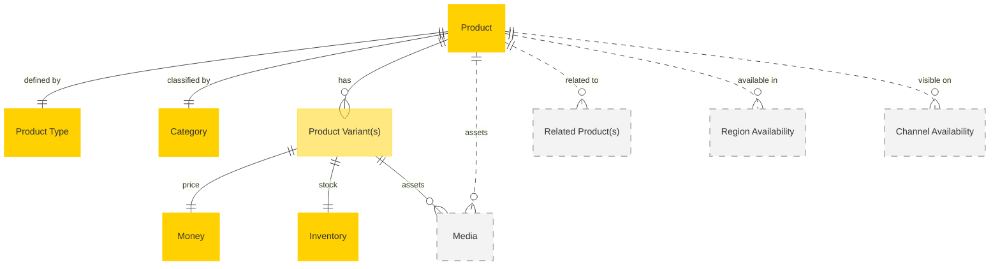

# MACH Alliance, Open Data Model Entity: `Product`

## Table of contents

- [MACH Alliance, Open Data Model Entity: `Product`](#mach-alliance-open-data-model-entity-product)
  - [Table of contents](#table-of-contents)
  - [Entity purpose](#entity-purpose)
  - [Object: Product](#object-product)
  - [Object: ProductVariant](#object-productvariant)
  - [YAML Schema Definition](#yaml-schema-definition)
    - [Product Schema](#product-schema)
    - [ProductVariant Schema](#productvariant-schema)
    - [Supporting Type Definitions](#supporting-type-definitions)
  - [Implementation Approaches](#implementation-approaches)
    - [Option 1: Nested Variants (Recommended)](#option-1-nested-variants-recommended)
    - [Option 2: Separate Entities](#option-2-separate-entities)
  - [Sample Object: Simple Product](#sample-object-simple-product)
  - [Sample Object: Product with Variants](#sample-object-product-with-variants)
  - [Sample Object: Digital Product](#sample-object-digital-product)
  - [Localization Pattern](#localization-pattern)
    - [Single Language (Simple String)](#single-language-simple-string)
    - [Multi-Language (Localized Object)](#multi-language-localized-object)
  - [Core Components \& Relationships](#core-components--relationships)
    - [Updated Relationship Diagram](#updated-relationship-diagram)
    - [Typical pitfalls](#typical-pitfalls)
    - [Variant-Specific Pitfalls](#variant-specific-pitfalls)

---

## Entity purpose

A unified product model that supports the core unit of sale across both B2B and B2C commerce scenarios. The model follows modern MACH platform conventions where every product has at least one variant, even for simple products. This aligns with platforms like commercetools, Shopify, and BigCommerce.

The model supports:
- **Products**: The master entity containing shared information (name, description, brand, categories)
- **Product Variants**: The actual sellable items with specific SKUs, prices, and inventory
- **Options**: The attributes that differentiate variants (size, color, material)
- **Flexible Localization**: All display fields support both single-language (string) and multi-language (object) formats

---

## Object: Product

The Product entity represents the master product information shared across all variants.

| Field                 | Description                                                     | Practice    |
| --------------------- | --------------------------------------------------------------- | ----------- |
| `id`                  | Unique identifier for the product                               | MUST        |
| `type`                | Reference to Product Type for classification                    | SHOULD      |
| `status`              | Product lifecycle status (`active`, `inactive`, `archived`, `draft`) | SHOULD      |
| `external_references` | Dictionary of cross-system IDs (e.g., ERP, PIM)                 | SHOULD      |
| `created_at`          | ISO 8601 creation timestamp                                     | SHOULD      |
| `updated_at`          | ISO 8601 update timestamp                                       | SHOULD      |
| `name`                | Product name (string or localized object)                       | MUST        |
| `description`         | Product description (string or localized object)                | SHOULD      |
| `slug`                | URL-friendly string for routing and SEO                         | RECOMMENDED |
| `brand`               | Brand name or identifier                                        | COULD       |
| `categories`          | Array of category references                                    | RECOMMENDED |
| `tags`                | Array of tags for filtering and search                          | COULD       |
| `options`             | Array of option definitions for variants                        | SHOULD      |
| `default_variant_id`  | ID of the primary/master variant                                | SHOULD      |
| `variants`            | Array of product variants (Option 1)                            | SHOULD      |
| `fulfillment_type`    | How the product is delivered (`physical`, `digital`, `service`) | SHOULD      |
| `tax_category`        | Default tax classification for the product                      | SHOULD      |
| `primary_image`       | Primary product image                                           | SHOULD      |
| `media`               | Additional images, videos, documents                            | COULD       |
| `seo`                 | Metadata for search engine optimization                         | SHOULD      |
| `rating`              | Aggregated customer review information                          | COULD       |
| `related_products`    | Array of related product IDs                                    | COULD       |
| `extensions`          | Namespaced dictionary for extension data                        | RECOMMENDED |

---

## Object: ProductVariant

The ProductVariant entity represents individual sellable items with specific attribute combinations.

| Field               | Description                                             | Practice |
| ------------------- | ------------------------------------------------------- | -------- |
| `id`                | Unique identifier for the variant                       | MUST     |
| `product_id`        | Reference to parent product (Option 2 only)             | MUST     |
| `sku`               | Stock Keeping Unit - unique identifier                  | MUST     |
| `status`            | Variant status (`active`, `inactive`, `discontinued`)   | SHOULD   |
| `position`          | Sort order for display purposes                         | SHOULD   |
| `option_values`     | Array of option/value pairs for this variant            | MUST     |
| `price`             | Variant pricing                                         | MUST     |
| `compare_at_price`  | Original/MSRP price for showing discounts               | COULD    |
| `cost`              | Cost of goods for margin calculations                   | COULD    |
| `weight`            | Physical weight for shipping calculations               | SHOULD   |
| `dimensions`        | Physical dimensions (length, width, height)             | COULD    |
| `barcode`           | Barcode (UPC, EAN, ISBN, etc.)                          | COULD    |
| `inventory`         | Inventory levels and tracking                           | SHOULD   |
| `tax_category`      | Tax classification override (if different from product) | COULD    |
| `shipping_required` | Whether physical shipping is needed                     | SHOULD   |
| `media`             | Variant-specific images                                 | COULD    |
| `attributes`        | Additional variant-specific attributes                  | COULD    |
| `created_at`        | ISO 8601 creation timestamp                             | SHOULD   |
| `updated_at`        | ISO 8601 update timestamp                               | SHOULD   |

---

## YAML Schema Definition

### Product Schema

```yaml
Product:
  type: object
  required:
    - id
    - name
  properties:
    # Core identification
    id:
      type: string
      description: Unique identifier for the product
      # example: "PROD-001"

    # Classification and status
    type:
      type: string
      description: Reference to Product Type for classification
      # example: "PT-APPAREL-001"

    status:
      type: string
      enum: ["active", "archived", "draft"]
      description: Product lifecycle status
      default: "active"

    # External system references
    external_references:
      type: object
      description: Dictionary of cross-system IDs
      additionalProperties:
        type: string
      # example:
      #   erp_id: "ERP-12345"
      #   pim_id: "PIM-67890"

    # Timestamps
    created_at:
      type: string
      format: date-time
      description: ISO 8601 creation timestamp

    updated_at:
      type: string
      format: date-time
      description: ISO 8601 update timestamp

    # Display information (localizable)
    name:
      oneOf:
        - type: string  # Single language
        - type: object  # Multi-language
          additionalProperties:
            type: string
      description: Product name (string or localized object)
      # example:
      #   en-US: "Classic T-Shirt"
      #   es-ES: "Camiseta Clásica"

    description:
      oneOf:
        - type: string  # Single language
        - type: object  # Multi-language
          additionalProperties:
            type: string
      description: Product description (string or localized object)

    # URL and branding
    slug:
      type: string
      pattern: "^[a-z0-9]+(?:-[a-z0-9]+)*$"
      description: URL-friendly string for routing and SEO
      # example: "classic-t-shirt"

    brand:
      type: string
      description: Brand name or identifier

    # Categorization
    categories:
      type: array
      items:
        type: string
      description: Array of category references
      # example: ["apparel", "shirts"]

    tags:
      type: array
      items:
        type: string
      description: Array of tags for filtering and search

    # Variant configuration
    options:
      type: array
      items:
        $ref: "#/components/schemas/ProductOption"
      description: Array of option definitions for variants

    default_variant_id:
      type: string
      description: ID of the primary/master variant

    variants:
      type: array
      items:
        $ref: "#/components/schemas/ProductVariant"
      description: Array of product variants (nested approach)

    # Fulfillment and tax
    fulfillment_type:
      type: string
      enum: ["physical", "digital", "service"]
      description: How the product is delivered
      default: "physical"

    tax_category:
      type: string
      description: Default tax classification for the product
      # example: "apparel-standard"

    # Media assets
    primary_image:
      $ref: "#/components/schemas/Media"
      description: Primary product image

    media:
      type: array
      items:
        $ref: "#/components/schemas/Media"
      description: Additional images, videos, documents

    # SEO and ratings
    seo:
      $ref: "#/components/schemas/SEO"
      description: Metadata for search engine optimization

    rating:
      $ref: "#/components/schemas/Rating"
      description: Aggregated customer review information

    # Relationships
    related_products:
      type: array
      items:
        type: string
      description: Array of related product IDs

    # Extensibility
    extensions:
      type: object
      description: Namespaced dictionary for extension data
      additionalProperties: true
      # example:
      #   loyalty_points:
      #     points_earned: 100
      #   sustainability:
      #     carbon_neutral: true
      #     materials: ["organic-cotton", "recycled-polyester"]
```

### ProductVariant Schema

```yaml
ProductVariant:
  type: object
  required:
    - id
    - sku
    - option_values
    - price
  properties:
    # Core identification
    id:
      type: string
      description: Unique identifier for the variant
      # example: "VAR-001"

    product_id:
      type: string
      description: Reference to parent product (only for separate entities approach)

    sku:
      type: string
      description: Stock Keeping Unit - unique identifier
      # example: "TSHIRT-RED-S"

    # Status and ordering
    status:
      type: string
      enum: ["active", "discontinued"]
      description: Variant status
      default: "active"

    position:
      type: integer
      description: Sort order for display purposes
      minimum: 1
      # example: 1

    # Variant options
    option_values:
      type: array
      items:
        type: object
        required:
          - option_id
          - value
        properties:
          option_id:
            type: string
            description: Reference to option definition
          value:
            type: string
            description: Selected value for this option
      description: Array of option/value pairs for this variant

    # Pricing
    price:
      $ref: "#/components/schemas/Money"
      description: Variant pricing

    compare_at_price:
      $ref: "#/components/schemas/Money"
      description: Original/MSRP price for showing discounts

    cost:
      $ref: "#/components/schemas/Money"
      description: Cost of goods for margin calculations

    # Physical attributes
    weight:
      type: object
      properties:
        value:
          type: number
          description: Weight value
        unit:
          type: string
          enum: ["g", "kg", "oz", "lb"]
          description: Weight unit
      description: Physical weight for shipping calculations

    dimensions:
      type: object
      properties:
        length:
          type: number
        width:
          type: number
        height:
          type: number
        unit:
          type: string
          enum: ["cm", "m", "in", "ft"]
      description: Physical dimensions

    # Identification and tracking
    barcode:
      type: string
      description: Barcode (UPC, EAN, ISBN, etc.)
      pattern: "^[0-9A-Za-z-]+$"

    inventory:
      $ref: "#/components/schemas/Inventory"
      description: Inventory levels and tracking

    # Tax and shipping
    tax_category:
      type: string
      description: Tax classification override (if different from product)

    shipping_required:
      type: boolean
      description: Whether physical shipping is needed
      default: true

    # Media and attributes
    media:
      type: array
      items:
        $ref: "#/components/schemas/Media"
      description: Variant-specific images

    attributes:
      type: object
      additionalProperties: true
      description: Additional variant-specific attributes
      # example:
      #   material_composition: "100% organic cotton"
      #   care_instructions: "Machine wash cold"

    # Timestamps
    created_at:
      type: string
      format: date-time
      description: ISO 8601 creation timestamp

    updated_at:
      type: string
      format: date-time
      description: ISO 8601 update timestamp
```

### Supporting Type Definitions

```yaml
ProductOption:
  type: object
  required:
    - id
    - name
    - values
  properties:
    id:
      type: string
      description: Unique identifier for the option
      # example: "opt-color"
    name:
      oneOf:
        - type: string  # Single language
        - type: object  # Multi-language
          additionalProperties:
            type: string
      description: Display name for the option
      # example: "Color"
    position:
      type: integer
      description: Display order for the option
      minimum: 1
    values:
      type: array
      items:
        oneOf:
          - type: string  # Single language
          - type: object  # Multi-language
            additionalProperties:
              type: string
      description: Available values for this option
      # example: ["Red", "Blue", "Black"]

# References to utility objects defined in other files
Money:
  $ref: "../utilities/money.yaml#/Money"

Media:
  $ref: "../utilities/media.yaml#/Media"

SEO:
  $ref: "../utilities/seo.yaml#/SEO"

Inventory:
  $ref: "../inventory/inventory.yaml#/Inventory"

Rating:
  type: object
  properties:
    average:
      type: number
      minimum: 0
      maximum: 5
      description: Average rating score
    count:
      type: integer
      description: Total number of ratings
```

---

## Implementation Approaches

### Option 1: Nested Variants (Recommended)

This approach embeds variants within the product entity, following the pattern used by most modern MACH platforms.

```json
{
  "id": "PROD-001",
  "name": "Classic T-Shirt",
  "description": "Comfortable cotton t-shirt",
  "status": "active",
  "brand": "MACH Apparel",
  "categories": ["apparel", "shirts"],
  "default_variant_id": "VAR-001",
  "fulfillment_type": "physical",
  "tax_category": "apparel-standard",
  "external_references": {
    "erp_id": "ERP-12345",
    "pim_id": "PIM-TSHIRT-001"
  },

  // Option definitions
  "options": [
  {
    "id": "opt-color",
    "name": "Color",
    "position": 1,
    "values": ["Red", "Blue", "Black"]
  },
  {
    "id": "opt-size",
    "name": "Size",
    "position": 2,
    "values": ["S", "M", "L"]
  }
  ],

  // Embedded variants
  "variants": [
  {
    "id": "VAR-001",
    "sku": "TSHIRT-RED-S",
    "status": "active",
    "position": 1,
    "option_values": [
    { "option_id": "opt-color", "value": "Red" },
    { "option_id": "opt-size", "value": "S" }
    ],
    "price": {
    "amount": 29.99,
    "currency": "USD"
    },
    "inventory": {
    "track_inventory": true,
    "quantity": 100,
    "location_quantities": {
      "warehouse-1": 60,
      "warehouse-2": 40
    }
    },
    "weight": {
    "value": 150,
    "unit": "g"
    }
  },
  // ... more variants
  ]
}
```

### Option 2: Separate Entities

This approach uses separate Product and ProductVariant entities, connected by references.

**Product Entity:**
```json
{
  "id": "PROD-001",
  "name": "Classic T-Shirt",
  "description": "Comfortable cotton t-shirt",
  "status": "active",
  "brand": "MACH Apparel",
  "categories": ["apparel", "shirts"],
  "default_variant_id": "VAR-001",
  "fulfillment_type": "physical",
  "tax_category": "apparel-standard",
  "external_references": {
    "erp_id": "ERP-12345",
    "pim_id": "PIM-TSHIRT-001"
  },
  "options": [
  {
    "id": "opt-color",
    "name": "Color",
    "position": 1,
    "values": ["Red", "Blue", "Black"]
  },
  {
    "id": "opt-size",
    "name": "Size",
    "position": 2,
    "values": ["S", "M", "L"]
  }
  ],
  // Shared attributes only
  "primary_image": {...},
  "seo": {...}
}
```

**ProductVariant Entity:**
```json
{
  "id": "VAR-001",
  "product_id": "PROD-001",
  "sku": "TSHIRT-RED-S",
  "status": "active",
  "position": 1,
  "option_values": [
  { "option_id": "opt-color", "value": "Red" },
  { "option_id": "opt-size", "value": "S" }
  ],
  "price": {
  "amount": 29.99,
  "currency": "USD"
  },
  "inventory": {
  "track_inventory": true,
  "quantity": 100
  }
}
```

---

## Sample Object: Simple Product

A simple product with only one variant (following the pattern that every product must have at least one variant).

```json
{
  "id": "PROD-001",
  "name": "Organic Cotton T-Shirt",
  "description": "Sustainable, soft cotton t-shirt",
  "status": "active",
  "type": "PT-APPAREL-001",
  "slug": "organic-cotton-tshirt",
  "brand": "MACH Apparel",
  "categories": ["apparel", "shirts", "sustainable"],
  "default_variant_id": "VAR-001",
  "fulfillment_type": "physical",
  "tax_category": "apparel-standard",
  "external_references": {
    "erp_id": "ERP-67890",
    "pim_id": "PIM-ORGANIC-001"
  },

  // No options needed for simple product
  "options": [],

  // Single variant
  "variants": [
  {
    "id": "VAR-001",
    "sku": "TSHIRT-001",
    "status": "active",
    "position": 1,
    "option_values": [], // No options for simple product
    "price": {
    "amount": 34.95,
    "currency": "EUR"
    },
    "inventory": {
    "track_inventory": true,
    "quantity": 28,
    "allow_backorder": true,
    "backorder_quantity": 72,
    "lead_time_days": 2
    },
    "weight": {
    "value": 200,
    "unit": "g"
    },
    "barcode": "1234567890123",
    "shipping_required": true
  }
  ],

  "primary_image": {
  "url": "https://cdn.example.com/img/tshirt-primary.webp",
  "alt_text": "Organic Cotton T-Shirt"
  },

  "seo": {
  "meta_title": "Organic Cotton T-Shirt - Sustainable Fashion",
  "meta_description": "Eco-friendly organic cotton t-shirt for conscious consumers."
  }
}
```

---

## Sample Object: Product with Variants

A product with multiple variants based on color and size options.

```json
{
  "id": "PROD-002",
  "name": "Classic Fit T-Shirt",
  "description": "Our signature t-shirt in multiple colors and sizes",
  "status": "active",
  "brand": "MACH Apparel",
  "categories": ["apparel", "shirts"],
  "default_variant_id": "VAR-001",
  "fulfillment_type": "physical",
  "tax_category": "apparel-standard",
  "external_references": {
    "erp_id": "ERP-45678"
  },

  "options": [
  {
    "id": "opt-color",
    "name": "Color",
    "position": 1,
    "values": ["Black", "White", "Navy"]
  },
  {
    "id": "opt-size",
    "name": "Size",
    "position": 2,
    "values": ["S", "M", "L", "XL"]
  }
  ],

  "variants": [
  {
    "id": "VAR-001",
    "sku": "CLASSIC-BLACK-M",
    "status": "active",
    "position": 1,
    "option_values": [
    { "option_id": "opt-color", "value": "Black" },
    { "option_id": "opt-size", "value": "M" }
    ],
    "price": {
    "amount": 29.99,
    "currency": "USD"
    },
    "compare_at_price": {
    "amount": 39.99,
    "currency": "USD"
    },
    "inventory": {
    "track_inventory": true,
    "quantity": 150
    },
    "media": [
    {
      "url": "https://cdn.example.com/img/classic-black.webp",
      "alt_text": "Classic T-Shirt in Black"
    }
    ]
  },
  {
    "id": "VAR-002",
    "sku": "CLASSIC-BLACK-L",
    "status": "active",
    "position": 2,
    "option_values": [
    { "option_id": "opt-color", "value": "Black" },
    { "option_id": "opt-size", "value": "L" }
    ],
    "price": {
    "amount": 29.99,
    "currency": "USD"
    },
    "inventory": {
    "track_inventory": true,
    "quantity": 75
    }
  }
  // ... more variants for other color/size combinations
  ]
}
```

---

## Sample Object: Digital Product

A digital product example showing the use of `fulfillment_type: "digital"`.

```json
{
  "id": "PROD-003",
  "name": {
    "en-US": "Premium Design Templates",
    "es-ES": "Plantillas de Diseño Premium"
  },
  "description": {
    "en-US": "Professional design template bundle with 50+ layouts",
    "es-ES": "Paquete de plantillas de diseño profesional con más de 50 diseños"
  },
  "status": "active",
  "brand": "MACH Digital",
  "categories": ["digital", "design", "templates"],
  "default_variant_id": "VAR-001",
  "fulfillment_type": "digital",
  "tax_category": "digital-goods",
  "external_references": {
    "license_server": "LIC-TEMPLATES-001"
  },

  "options": [],

  "variants": [
  {
    "id": "VAR-001",
    "sku": "TEMPLATES-PRO",
    "status": "active",
    "position": 1,
    "option_values": [],
    "price": {
    "amount": 79.99,
    "currency": "USD"
    },
    "shipping_required": false,
    "attributes": {
      "download_limit": 5,
      "license_type": "single-user",
      "file_size_mb": 450
    }
  }
  ],

  "primary_image": {
    "url": "https://cdn.example.com/img/templates-preview.webp",
    "alt_text": "Premium Design Templates Preview"
  },

  "extensions": {
    "digital_delivery": {
      "delivery_method": "download",
      "access_period_days": 365,
      "drm_protected": false
    }
  }
}
```

---

## Localization Pattern

All fields that are displayed to end users support flexible localization. Fields can accept either a simple string (for single-language stores) or a localized object (for multi-language stores).

### Single Language (Simple String)
```json
{
  "name": "Classic T-Shirt",
  "description": "Our signature cotton t-shirt"
}
```

### Multi-Language (Localized Object)
```json
{
  "name": {
    "en-US": "Classic T-Shirt",
    "es-ES": "Camiseta Clásica",
    "fr-FR": "T-Shirt Classique"
  },
  "description": {
    "en-US": "Our signature cotton t-shirt",
    "es-ES": "Nuestra camiseta de algodón exclusiva",
    "fr-FR": "Notre t-shirt en coton signature"
  }
}
```

This pattern applies to all localizable fields including:
- Product: `name`, `description`
- Variant: `attributes` (when containing display values)
- Option: `name`, `values`
- Media: `alt_text`
- SEO: `meta_title`, `meta_description`

---

## Core Components & Relationships

### Updated Relationship Diagram



---


### Typical pitfalls
- Relying solely on real-time federation of product data across systems – Leads to increased latency, compute overhead, and performance degradation under load. Without an orchestration layer or indexed materialization, querying product details from multiple backends at runtime (e.g., PIM, inventory, pricing) results in poor customer experience, especially during peak traffic or high-volume listings.
- Inadequate support for product variants and attribute-driven SKUs - Leads to poor user experience, inability to differentiate similar products, and challenges in inventory tracking.
- Not handling localization for product content and specifications - Results in inconsistent customer experience across regions, regulatory compliance issues, and lower international conversion rates.
- Missing or misconfiguring support for multiple pricing and tax models (e.g., tiered, regional, customer-specific)
- Poor handling of product supply chain states (e.g., sellable, out of stock, active, discontinued)
- Not maintaining relationships between related or substitute products - Reduces cross-sell and up-sell opportunities and weakens the recommendation engine's effectiveness.
- Poor integration with inventory and availability systems - Leads to underselling or overselling

### Variant-Specific Pitfalls
- **Not enforcing at least one variant per product** - Creates inconsistency with modern MACH platforms and complicates inventory/pricing logic
- **Confusing SKU terminology** - SKU should be an attribute of the variant, not a separate entity
- **Poor option value management** - Not properly defining option sets leads to data inconsistency
- **Missing variant-level inventory** - Inventory must be tracked at variant level, not product level
- **Ignoring variant-specific pricing** - Different variants often have different prices
- **Not supporting variant-level media** - Color variants need their own images


---

>  This MACH Alliance Canonical Data Model is intentionally __vendor-neutral__ and serves as a foundation for interoperability across composable architectures. It is __continually evolving__ through community contributions, which are reviewed and approved collaboratively.
>
>  All contributions are made under the __Creative Commons Attribution 4.0 International License (CC BY 4.0)__. By submitting a contribution, you agree to license your content under <a href="https://creativecommons.org/licenses/by/4.0/deed.en">CC BY 4.0</a>, allowing others to share and adapt the material with proper attribution.
>
>  We welcome and encourage continued improvements through community input. For more information and guidance on how to contribute, please refer to the <a href="../../CONTRIBUTING.md">Contributor Guide</a>.

