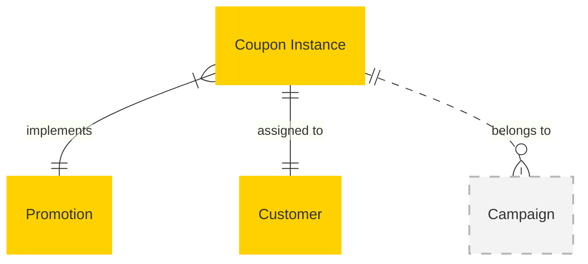

# MACH Alliance, Open Data Model Entity: `Coupon Instance`

## Table of contents

- [MACH Alliance, Open Data Model Entity: `Coupon Instance`](#mach-alliance-open-data-model-entity-coupon-instance)
  - [Table of contents](#table-of-contents)
  - [Entity purpose](#entity-purpose)
  - [Object: Coupon Instance](#object-coupon-instance)
  - [YAML Schema Definition](#yaml-schema-definition)
    - [CouponInstance Schema](#couponinstance-schema)
    - [Supporting Type Definitions](#supporting-type-definitions)
  - [Sample Object: Single-Use Coupon](#sample-object-single-use-coupon)
  - [Sample Object: Multi-Use Coupon with Limits](#sample-object-multi-use-coupon-with-limits)
  - [Sample Object: Personalized Coupon](#sample-object-personalized-coupon)
  - [Sample Object: Bulk Generated Coupon](#sample-object-bulk-generated-coupon)
  - [Sample Object: Dynamic Coupon with Real-Time Usage](#sample-object-dynamic-coupon-with-real-time-usage)
  - [Sample Object: Referral Coupon](#sample-object-referral-coupon)
  - [Core Components \& Relationships](#core-components--relationships)
    - [Typical Relationships](#typical-relationships)
  - [Typical pitfalls](#typical-pitfalls)

---

## Entity purpose

A unified coupon instance model that represents individual coupon codes and their usage tracking across both B2B and B2C commerce scenarios. It resides within Promotion Management Systems, Commerce Engines, and Campaign Management platforms. The coupon instance model supports single-use codes, multi-use coupons, personalized offers, bulk generation, and real-time usage monitoring. It serves as the operational layer that tracks actual coupon redemptions and enforces usage limits defined in the parent Promotion entity.

The Entity describes:
- Individual coupon codes and their unique identifiers
- Usage tracking and redemption history
- Assignment to specific customers or campaigns
- Real-time status and availability
- Integration with parent promotion rules and limits
- Fraud prevention and validation logic
- Expiration and scheduling at the instance level
- Cross-system synchronization for coupon state

---

## Object: Coupon Instance

| Field                 | Description                                                           | Practice    |
| --------------------- | --------------------------------------------------------------------- | ----------- |
| `id`                  | Unique identifier for the coupon instance                             | MUST        |
| `code`                | The actual coupon code string used by customers                       | MUST        |
| `promotion_id`        | Reference to parent Promotion entity                                  | MUST        |
| `status`              | Instance status (`active`, `used`, `expired`, `disabled`, `reserved`) | SHOULD      |
| `type`                | Instance type (`single_use`, `multi_use`, `unlimited`)                | SHOULD      |
| `external_references` | Dictionary of cross-system IDs (e.g., CRM, Campaign)                  | SHOULD      |
| `created_at`          | ISO 8601 creation timestamp                                           | SHOULD      |
| `updated_at`          | ISO 8601 update timestamp                                             | SHOULD      |
| `assigned_to`         | Customer ID or segment this coupon is assigned to                     | COULD       |
| `valid_from`          | ISO 8601 start timestamp for coupon availability                      | RECOMMENDED |
| `valid_to`            | ISO 8601 end timestamp for coupon expiration                          | RECOMMENDED |
| `usage_count`         | Number of times this coupon has been used                             | SHOULD      |
| `usage_limit`         | Maximum allowed uses for this specific instance                       | RECOMMENDED |
| `last_used_at`        | ISO 8601 timestamp of last redemption                                 | COULD       |
| `last_used_by`        | Customer ID of last user                                              | COULD       |
| `generation_batch`    | Batch identifier for bulk-generated coupons                           | COULD       |
| `extensions`          | Namespaced dictionary for extension data                              | RECOMMENDED |

---

## YAML Schema Definition

### CouponInstance Schema

```yaml
CouponInstance:
  type: object
  required:
    - id
    - code
    - promotion_id
  properties:
    # Core identification
    id:
      type: string
      description: Unique identifier for the coupon instance
      # example: "COUP-INST-001"

    code:
      type: string
      description: The actual coupon code string used by customers
      pattern: "^[A-Z0-9-]+$"
      # example: "WELCOME10-ABC123"

    promotion_id:
      type: string
      description: Reference to parent Promotion entity
      # example: "PROMO-WELCOME-001"

    # Status and type
    status:
      type: string
      enum: ["active", "used", "expired", "disabled", "reserved"]
      description: Instance status
      default: "active"

    type:
      type: string
      enum: ["single_use", "multi_use", "unlimited"]
      description: Instance type
      default: "single_use"

    # External references
    external_references:
      type: object
      description: Dictionary of cross-system IDs
      additionalProperties:
        type: string
      # example:
      #   campaign: "CAMPAIGN-WELCOME-2024"
      #   email_send: "email-send-abc123"
      #   crm_contact: "contact-789"

    # Timestamps
    created_at:
      type: string
      format: date-time
      description: ISO 8601 creation timestamp

    updated_at:
      type: string
      format: date-time
      description: ISO 8601 update timestamp

    # Assignment and validity
    assigned_to:
      type: string
      description: Customer ID or segment this coupon is assigned to
      # example: "CUST-001" or "SEGMENT-HIGH-VALUE"

    valid_from:
      type: string
      format: date-time
      description: ISO 8601 start timestamp for coupon availability

    valid_to:
      type: string
      format: date-time
      description: ISO 8601 end timestamp for coupon expiration

    # Usage tracking
    usage_count:
      type: integer
      description: Number of times this coupon has been used
      minimum: 0
      default: 0

    usage_limit:
      type: integer
      description: Maximum allowed uses for this specific instance
      minimum: 1

    last_used_at:
      type: string
      format: date-time
      description: ISO 8601 timestamp of last redemption

    last_used_by:
      type: string
      description: Customer ID of last user

    # Generation tracking
    generation_batch:
      type: string
      description: Batch identifier for bulk-generated coupons
      # example: "BATCH-WELCOME-070124"

    # Extensibility
    extensions:
      type: object
      description: Namespaced dictionary for extension data
      additionalProperties: true
      # example:
      #   personalization:
      #     customer_segment: "new_customer"
      #     delivery_method: "email"
      #   attribution:
      #     acquisition_channel: "organic_search"
      #     campaign_source: "google"
```

### Supporting Type Definitions

```yaml
# Usage records could be tracked separately for audit trail
UsageRecord:
  type: object
  properties:
    timestamp:
      type: string
      format: date-time
      description: When the coupon was used
    customer_id:
      type: string
      description: Who used the coupon
    order_id:
      type: string
      description: Order where coupon was applied
    discount_amount:
      $ref: "../utilities/money.yaml#/Money"
      description: Actual discount given
    channel:
      type: string
      description: Where the coupon was used (web, mobile, store)

# References to utility objects
Money:
  $ref: "../utilities/money.yaml#/Money"
```

---

## Sample Object: Single-Use Coupon

Individual coupon code for one-time use, typically personalized.

```json
{
  "id": "COUP-INST-001",
  "code": "WELCOME10-ABC123",
  "promotion_id": "PROMO-WELCOME-001",
  "status": "active",
  "type": "single_use",
  "external_references": {
    "campaign": "CAMPAIGN-WELCOME-2024",
    "email_send": "email-send-abc123"
  },
  "created_at": "2024-07-01T10:30:00Z",
  "updated_at": "2024-07-01T10:30:00Z",
  "assigned_to": "CUST-001",
  "valid_from": "2024-07-01T10:30:00Z",
  "valid_to": "2024-08-01T23:59:59Z",
  "usage_count": 0,
  "usage_limit": 1,
  "last_used_at": null,
  "last_used_by": null,
  "generation_batch": "BATCH-WELCOME-070124",
  "extensions": {
    "personalization": {
      "customer_segment": "new_customer",
      "delivery_method": "email",
      "template_variant": "welcome_a"
    },
    "attribution": {
      "acquisition_channel": "organic_search",
      "campaign_source": "google",
      "referrer": "https://google.com/search"
    },
    "fraud": {
      "generation_ip": "192.168.1.1",
      "validation_required": false,
      "risk_score": 0.1
    }
  }
}
```

## Sample Object: Multi-Use Coupon with Limits

Coupon code that can be used multiple times with specific limits.

```json
{
  "id": "COUP-INST-002",
  "code": "SAVE20NOW",
  "promotion_id": "PROMO-SAVE20-001",
  "status": "active",
  "type": "multi_use",
  "external_references": {
    "campaign": "CAMPAIGN-FLASH-SALE",
    "social_post": "post-twitter-001"
  },
  "created_at": "2024-07-15T08:00:00Z",
  "updated_at": "2024-07-16T14:22:00Z",
  "assigned_to": null,
  "valid_from": "2024-07-15T08:00:00Z",
  "valid_to": "2024-07-17T23:59:59Z",
  "usage_count": 47,
  "usage_limit": 500,
  "last_used_at": "2024-07-16T14:22:00Z",
  "last_used_by": "CUST-423",
  "generation_batch": "BATCH-FLASH-071524",
  "extensions": {
    "social": {
      "platform": "twitter",
      "post_id": "tweet-12345",
      "influencer": "fashion_blogger_jen",
      "reach": 15000
    },
    "performance": {
      "conversion_rate": 0.15,
      "average_order_value": {
        "amount": 89.50,
        "currency": "USD"
      },
      "total_revenue": {
        "amount": 4207.50,
        "currency": "USD"
      }
    },
    "velocity": {
      "uses_per_hour": 2.3,
      "peak_usage_time": "2024-07-16T13:00:00Z",
      "projected_depletion": "2024-07-25T18:00:00Z"
    }
  }
}
```

## Sample Object: Personalized Coupon

Customer-specific coupon with enhanced targeting and personalization.

```json
{
  "id": "COUP-INST-003",
  "code": "BIRTHDAY25-EMMA",
  "promotion_id": "PROMO-BIRTHDAY-001",
  "status": "active",
  "type": "single_use",
  "external_references": {
    "campaign": "CAMPAIGN-BIRTHDAY-2024",
    "crm_trigger": "birthday-automation-001",
    "customer": "CUST-EMMA-001"
  },
  "created_at": "2024-06-20T00:00:00Z",
  "updated_at": "2024-06-20T00:00:00Z",
  "assigned_to": "CUST-EMMA-001",
  "valid_from": "2024-06-20T00:00:00Z",
  "valid_to": "2024-07-20T23:59:59Z",
  "usage_count": 0,
  "usage_limit": 1,
  "last_used_at": null,
  "last_used_by": null,
  "generation_batch": "BATCH-BIRTHDAY-062024",
  "extensions": {
    "personalization": {
      "customer_name": "Emma",
      "customer_tier": "gold",
      "preferred_categories": ["apparel", "accessories"],
      "purchase_history_months": 18,
      "average_order_value": {
        "amount": 125.00,
        "currency": "USD"
      }
    },
    "lifecycle": {
      "trigger_event": "birthday",
      "customer_journey_stage": "retention",
      "days_since_last_purchase": 45,
      "loyalty_points_balance": 850
    },
    "delivery": {
      "channel": "email",
      "send_time": "2024-06-20T09:00:00Z",
      "timezone": "America/New_York",
      "opened": true,
      "clicked": false
    }
  }
}
```

## Sample Object: Bulk Generated Coupon

One of many coupons generated in bulk for distribution.

```json
{
  "id": "COUP-INST-004",
  "code": "BULK2024-XY9K2M",
  "promotion_id": "PROMO-BULK-DISCOUNT-001",
  "status": "active",
  "type": "single_use",
  "external_references": {
    "campaign": "CAMPAIGN-PARTNERSHIP-RETAILER",
    "partner": "PARTNER-RETAILER-001",
    "distribution": "bulk-export-001"
  },
  "created_at": "2024-05-01T00:00:00Z",
  "updated_at": "2024-05-01T00:00:00Z",
  "assigned_to": null,
  "valid_from": "2024-08-01T00:00:00Z",
  "valid_to": "2024-12-31T23:59:59Z",
  "usage_count": 0,
  "usage_limit": 1,
  "last_used_at": null,
  "last_used_by": null,
  "generation_batch": "BATCH-PARTNER-050124",
  "extensions": {
    "bulk_generation": {
      "batch_size": 50000,
      "batch_sequence": 23847,
      "algorithm": "secure_random",
      "code_pattern": "BULK2024-{6_alphanumeric}",
      "generation_duration_ms": 245
    },
    "distribution": {
      "partner_name": "Retail Partner Inc",
      "distribution_method": "csv_export",
      "export_date": "2024-05-15T00:00:00Z",
      "file_reference": "bulk_coupons_050124.csv",
      "encryption": "AES256"
    },
    "compliance": {
      "data_classification": "restricted",
      "retention_period_days": 2555,
      "geographic_restrictions": ["EU", "CA"],
      "audit_required": true
    }
  }
}
```

## Sample Object: Dynamic Coupon with Real-Time Usage

Coupon with real-time tracking and dynamic behavior modification.

```json
{
  "id": "COUP-INST-005",
  "code": "DYNAMIC-SAVE15",
  "promotion_id": "PROMO-DYNAMIC-001",
  "status": "active",
  "type": "multi_use",
  "external_references": {
    "campaign": "CAMPAIGN-REALTIME-OPTIMIZATION",
    "ab_test": "test-dynamic-coupons-001",
    "segment": "high-value-customers"
  },
  "created_at": "2024-07-01T00:00:00Z",
  "updated_at": "2024-07-20T16:45:00Z",
  "assigned_to": "SEGMENT-HIGH-VALUE",
  "valid_from": "2024-07-01T00:00:00Z",
  "valid_to": "2024-07-31T23:59:59Z",
  "usage_count": 127,
  "usage_limit": 1000,
  "last_used_at": "2024-07-20T16:45:00Z",
  "last_used_by": "CUST-789",
  "generation_batch": "BATCH-DYNAMIC-070124",
  "extensions": {
    "dynamic_optimization": {
      "current_discount_percent": 15,
      "original_discount_percent": 10,
      "adjustment_reason": "low_conversion_rate",
      "last_optimization": "2024-07-15T10:30:00Z",
      "performance_threshold": 0.12
    },
    "real_time_metrics": {
      "conversion_rate": 0.08,
      "click_through_rate": 0.23,
      "abandonment_recovery_rate": 0.45,
      "revenue_impact": {
        "amount": 8945.00,
        "currency": "USD"
      },
      "last_calculated": "2024-07-20T16:45:00Z"
    },
    "segmentation": {
      "target_segment": "high_value_customers",
      "segment_size": 2500,
      "eligibility_criteria": [
        "lifetime_value > $500",
        "last_purchase < 30_days",
        "tier in [gold, platinum]"
      ]
    }
  }
}
```

## Sample Object: Referral Coupon

Coupon generated for referral programs with tracking of referrer and referee.

```json
{
  "id": "COUP-INST-006",
  "code": "FRIEND20-EMMA-REF",
  "promotion_id": "PROMO-REFERRAL-001",
  "status": "active",
  "type": "single_use",
  "external_references": {
    "campaign": "CAMPAIGN-REFERRAL-PROGRAM",
    "referrer": "CUST-EMMA-001",
    "referee": "PROSPECT-NEW-456"
  },
  "created_at": "2024-07-10T14:20:00Z",
  "updated_at": "2024-07-10T14:20:00Z",
  "assigned_to": "PROSPECT-NEW-456",
  "valid_from": "2024-07-10T14:20:00Z",
  "valid_to": "2024-08-10T23:59:59Z",
  "usage_count": 0,
  "usage_limit": 1,
  "last_used_at": null,
  "last_used_by": null,
  "generation_batch": "BATCH-REFERRAL-071024",
  "extensions": {
    "referral": {
      "referrer_customer_id": "CUST-EMMA-001",
      "referrer_name": "Emma Larsen",
      "referrer_email": "emma@example.com",
      "referee_email": "friend@example.com",
      "referral_method": "email_share",
      "referrer_reward": {
        "type": "store_credit",
        "amount": 10.00,
        "currency": "USD"
      }
    },
    "social_sharing": {
      "share_url": "https://shop.example.com/ref/emma-friend20",
      "utm_source": "referral",
      "utm_medium": "email",
      "utm_campaign": "friend_referral",
      "social_platforms_shared": ["email"]
    },
    "conversion_tracking": {
      "referrer_qualified": false,
      "referee_converted": false,
      "conversion_value": null,
      "referrer_credited": false,
      "qualification_requirements": "first_purchase_min_50"
    }
  }
}
```

---

## Core Components & Relationships

| Concept          | Description                                            | Typical Source of Truth           |
| ---------------- | ------------------------------------------------------ | --------------------------------- |
| Code             | Unique coupon code string for customer redemption      | Coupon Generation Service         |
| Promotion ID     | Reference to parent promotion rules and logic          | Promotion Management System       |
| Status           | Real-time state of individual coupon instance          | Coupon Management System          |
| Usage Tracking   | Count and limits for individual coupon redemptions     | Commerce Engine / Usage Tracker   |
| Assignment       | Customer or segment targeting for personalized coupons | Customer Management / CRM         |
| Generation Batch | Bulk generation tracking and audit trail               | Coupon Generation Service         |
| Validation       | Real-time validation and fraud prevention              | Validation Service / Fraud Engine |
| Expiration       | Instance-level scheduling and expiration logic         | Coupon Management System          |

`Coupon Instance` typically resides in many systems, including:

- Coupon Management System
- Promotion Management System
- Commerce Engine
- Campaign Management Platform
- Customer Data Platform (CDP)
- Email Marketing Platform
- Analytics Platform
- Fraud Detection System

### Typical Relationships



---

## Typical pitfalls

- **Not separating coupon instances from promotion definitions** – Leads to confusion between the rules (Promotion) and the individual codes (Coupon Instance). Each serves different purposes in the system architecture.
- **Missing real-time usage tracking and validation** – Results in overselling, fraud, and customer frustration when coupons are accepted but later rejected. Implement synchronous validation at redemption time.
- **Inadequate bulk generation and batch tracking** – Makes it impossible to audit coupon distribution, track performance by batch, or manage large-scale campaigns effectively.
- **Poor integration between coupon instances and parent promotions** – Causes inconsistent business rules application and makes it difficult to update promotion logic across existing coupon codes.
- **Missing fraud prevention and validation logic** – Exposes the system to coupon abuse, unauthorized generation, and financial losses. Include IP tracking, usage pattern analysis, and validation requirements.
- **Not handling personalization and assignment properly** – Limits targeting capabilities and creates poor customer experience when generic codes are used instead of personalized offers.
- **Inadequate status management and lifecycle tracking** – Makes it difficult to manage coupon inventory, track usage, and provide customer support for coupon-related issues.
- **Missing cross-system synchronization** – Leads to inconsistent coupon state across platforms, especially in omnichannel scenarios where coupons might be used across web, mobile, and in-store.
- **Poor performance with high-volume usage** – Results in slow redemption processes and poor customer experience during peak traffic. Design for real-time validation at scale.
- **Using unstructured meta fields instead of namespaced extensions** – Makes coupon data difficult to query, analyze, and integrate with analytics and attribution systems.

---

>  This MACH Alliance Canonical Data Model is intentionally __vendor-neutral__ and serves as a foundation for interoperability across composable architectures. It is __continually evolving__ through community contributions, which are reviewed and approved collaboratively.
>
>  All contributions are made under the __Creative Commons Attribution 4.0 International License (CC BY 4.0)__. By submitting a contribution, you agree to license your content under <a href="https://creativecommons.org/licenses/by/4.0/deed.en">CC BY 4.0</a>, allowing others to share and adapt the material with proper attribution.
>
>  We welcome and encourage continued improvements through community input. For more information and guidance on how to contribute, please refer to the <a href="../../CONTRIBUTING.md">Contributor Guide</a>.
