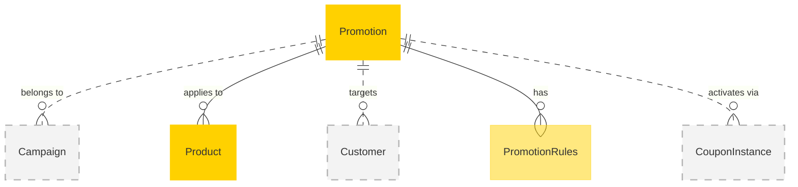

# MACH Alliance, Open Data Model Entity: `Promotion`

## Table of contents

- [Entity purpose](#entity-purpose)
- [Object: Promotion](#object-promotion)
- [YAML Schema Definition](#yaml-schema-definition)
  - [Promotion Schema](#promotion-schema)
  - [Supporting Type Definitions](#supporting-type-definitions)
- [Sample Object: Minimal Promotion](#sample-object-minimal-promotion)
- [Sample Object: Cart Promotion](#sample-object-cart-promotion)
- [Sample Object: Product Promotion](#sample-object-product-promotion)
- [Sample Object: Shipping Promotion](#sample-object-shipping-promotion)
- [Sample Object: Code-Based Promotion](#sample-object-code-based-promotion)
- [Sample Object: BOGO (Buy One Get One) Promotion](#sample-object-bogo-buy-one-get-one-promotion)
- [Sample Object: Tiered Cart Promotion](#sample-object-tiered-cart-promotion)
- [Localization Pattern](#localization-pattern)
- [Core Components & Relationships](#core-components-relationships)
- [Typical pitfalls](#typical-pitfalls)

---

## Entity purpose

A unified promotion model that supports flexible, rule-based discount strategies across all commerce channels. It resides within Promotion Management Systems, Commerce Engines, and Marketing Platforms. The promotion model supports percentage, fixed amount, BOGO, free gift, shipping discounts, and complex tiered promotions through a composable rules engine. It serves as the foundational data structure for all promotional activities, from simple discounts to sophisticated multi-condition campaigns.

The Entity describes:
- Rule-based promotion logic with conditions and actions
- Flexible activation methods (automatic, code-based, customer-specific)
- Multi-channel targeting and scheduling
- Usage limits and tracking
- Stacking rules and priority management
- Performance metrics and analytics
- Integration with loyalty and customer segments

---

## Object: Promotion

| Field         | Description | Practice |
|---------------|-------------|----------|
| `id`                   | Unique identifier for the promotion                      | MUST |
| `name`                 | Promotion name for internal and customer-facing use (string or localized object) | MUST |
| `type`                 | What the promotion applies to (`cart`, `product`, `shipping`) | MUST |
| `rules`                | Conditions and actions that define the promotion         | MUST |
| `status`               | Lifecycle status (`draft`, `scheduled`, `active`, `paused`, `expired`, `archived`) | SHOULD |
| `description`          | Promotion description for customer communication (string or localized object) | SHOULD |
| `slug`                 | URL-friendly string for routing and SEO                  | SHOULD |
| `external_references`  | Dictionary of cross-system IDs (e.g., PIM, ERP, CMS)     | SHOULD |
| `created_at`           | ISO 8601 creation timestamp                              | SHOULD |
| `updated_at`           | ISO 8601 update timestamp                                | SHOULD |
| `valid_from`           | ISO 8601 start timestamp for promotion availability      | SHOULD |
| `valid_to`             | ISO 8601 end timestamp for promotion expiration          | SHOULD |
| `activation_method`    | How promotion is triggered (`automatic`, `code`, `customer_specific`, `link`) | SHOULD |
| `codes`                | Configuration for code-based activation                  | COULD |
| `usage_limits`         | Usage restrictions and limits                            | RECOMMENDED |
| `eligibility`          | Customer and context-based eligibility criteria          | RECOMMENDED |
| `priority`             | Promotion priority for stacking and conflict resolution  | RECOMMENDED |
| `stackable`            | Whether this promotion can be combined with others       | RECOMMENDED |
| `extensions`           | Namespaced dictionary for extension data                 | RECOMMENDED |

---

## YAML Schema Definition

### Promotion Schema

```yaml
Promotion:
  type: object
  required:
    - id
    - name
    - type
    - rules
  properties:
    # Core identification
    id:
      type: string
      description: Unique identifier for the promotion
      # example: "PROMO-001"
    
    # Display information (localizable)
    name:
      oneOf:
        - type: string  # Single language
        - type: object  # Multi-language
          additionalProperties:
            type: string
      description: Promotion name for internal and customer-facing use
      # example:
      #   en-US: "Summer Sale - 20% Off"
      #   es-ES: "Venta de Verano - 20% de Descuento"
    
    description:
      oneOf:
        - type: string  # Single language
        - type: object  # Multi-language
          additionalProperties:
            type: string
      description: Promotion description for customer communication
    
    # Classification and targeting
    type:
      type: string
      enum: ["cart", "product", "shipping"]
      description: What the promotion applies to
    
    slug:
      type: string
      pattern: "^[a-z0-9]+(?:-[a-z0-9]+)*$"
      description: URL-friendly string for routing and SEO
      # example: "summer-sale-2024"
    
    # Status and lifecycle
    status:
      type: string
      enum: ["draft", "scheduled", "active", "paused", "expired", "archived"]
      description: Lifecycle status of the promotion
      default: "draft"
    
    # External references
    external_references:
      type: object
      description: Dictionary of cross-system IDs
      additionalProperties:
        type: string
      # example:
      #   campaign_id: "CAMP-SUMMER-2024"
      #   cms_id: "promo-123"
      #   analytics_id: "GA-PROMO-001"
    
    # Timestamps
    created_at:
      type: string
      format: date-time
      description: ISO 8601 creation timestamp
    
    updated_at:
      type: string
      format: date-time
      description: ISO 8601 update timestamp
    
    valid_from:
      type: string
      format: date-time
      description: ISO 8601 start timestamp for promotion availability
    
    valid_to:
      type: string
      format: date-time
      description: ISO 8601 end timestamp for promotion expiration
    
    # Promotion logic
    rules:
      $ref: "#/components/schemas/PromotionRules"
      description: Conditions and actions that define the promotion
    
    # Activation and codes
    activation_method:
      type: string
      enum: ["automatic", "code", "customer_specific", "link"]
      description: How promotion is triggered
      default: "automatic"
    
    codes:
      $ref: "#/components/schemas/PromotionCodes"
      description: Configuration for code-based activation
    
    # Usage and eligibility
    usage_limits:
      $ref: "#/components/schemas/UsageLimits"
      description: Usage restrictions and limits
    
    eligibility:
      $ref: "#/components/schemas/Eligibility"
      description: Customer and context-based eligibility criteria
    
    # Stacking and priority
    priority:
      type: integer
      description: Promotion priority (higher number = higher priority)
      minimum: 0
      maximum: 1000
      default: 100
    
    stackable:
      type: boolean
      description: Whether this promotion can be combined with others
      default: false
    
    # Extensibility
    extensions:
      type: object
      description: Namespaced dictionary for extension data
      additionalProperties: true
      # example:
      #   marketing:
      #     campaign_name: "Summer Sale 2024"
      #     tracking_pixel: "https://analytics.example.com/promo/SAVE20"
      #   analytics:
      #     conversion_goal: "increase_aov"
      #     target_aov: 
      #       amount: 150.00
      #       currency: "USD"
```

### Supporting Type Definitions

```yaml
PromotionRules:
  type: object
  required:
    - actions
  properties:
    conditions:
      type: array
      items:
        $ref: "#/components/schemas/Condition"
      description: Conditions that must be met for the promotion to apply
    actions:
      type: array
      items:
        $ref: "#/components/schemas/Action"
      minItems: 1
      description: Actions to take when conditions are met

Condition:
  type: object
  required:
    - type
    - operator
    - value
  properties:
    type:
      type: string
      enum: [
        "cart_minimum", "cart_subtotal", "cart_quantity",
        "product_category", "product_sku", "product_brand",
        "customer_segment", "customer_type", "first_purchase",
        "shipping_method", "shipping_zone",
        "payment_method", "coupon_code",
        "date_range", "time_range", "day_of_week"
      ]
      description: Type of condition to evaluate
    field:
      type: string
      description: Optional field to evaluate (e.g., "subtotal", "quantity")
    operator:
      type: string
      enum: ["equals", "not_equals", "in", "not_in", "gte", "gt", "lte", "lt", "contains"]
      description: Comparison operator
    value:
      description: Value to compare against (type varies by condition)
      # Can be string, number, array, or Money object

Action:
  type: object
  required:
    - type
  properties:
    type:
      type: string
      enum: [
        "percentage_discount", "fixed_discount", "fixed_price",
        "item_percentage_discount", "item_fixed_discount",
        "shipping_percentage_discount", "shipping_fixed_discount",
        "bogo_discount", "gift_item", "tiered_discount"
      ]
      description: Type of discount action
    value:
      description: Discount value (percentage or Money object)
    apply_to:
      type: string
      description: What to apply the discount to
      # example: "cart_subtotal", "product_price", "cheapest", "most_expensive"
    max_discount:
      $ref: "#/components/schemas/Money"
      description: Maximum discount amount (for percentage discounts)
    # Additional properties for complex actions like BOGO
    buy_quantity:
      type: integer
      description: For BOGO - quantity to buy
    get_quantity:
      type: integer
      description: For BOGO - quantity to get
    discount_type:
      type: string
      enum: ["percentage", "fixed", "free"]
      description: For BOGO - type of discount on "get" items
    discount_value:
      type: number
      description: For BOGO - discount value for "get" items
    repeat:
      type: boolean
      description: For BOGO - whether to repeat the pattern
    tiers:
      type: array
      items:
        $ref: "#/components/schemas/DiscountTier"
      description: For tiered discounts

DiscountTier:
  type: object
  required:
    - min_value
    - discount_type
    - discount_value
  properties:
    min_value:
      $ref: "#/components/schemas/Money"
      description: Minimum cart value for this tier
    discount_type:
      type: string
      enum: ["percentage", "fixed"]
    discount_value:
      type: number
      description: Discount amount for this tier

PromotionCodes:
  type: object
  properties:
    generation_type:
      type: string
      enum: ["single", "bulk", "pattern"]
      description: How codes are generated
      default: "single"
    
    single_code:
      type: string
      description: The code for single-code promotions
      pattern: "^[A-Z0-9-]+$"
      # example: "SAVE20"
    
    coupon_instances:
      type: array
      items:
        type: string
      description: References to coupon-instance entities for bulk codes
      # example: ["COUP-INST-001", "COUP-INST-002"]
    
    pattern:
      type: object
      description: Pattern for generating codes
      properties:
        prefix:
          type: string
          # example: "SUMMER"
        suffix_type:
          type: string
          enum: ["numeric", "alphanumeric", "uuid"]
        length:
          type: integer
          minimum: 4
          maximum: 20
          # example: 6
        case_sensitive:
          type: boolean
          default: false

UsageLimits:
  type: object
  properties:
    total_uses:
      type: integer
      description: Maximum total uses across all customers
      minimum: 1
    uses_remaining:
      type: integer
      description: Number of uses remaining
      minimum: 0
    per_customer:
      type: integer
      description: Maximum uses per customer
      minimum: 1
    per_customer_period:
      type: string
      enum: ["lifetime", "promotion", "day", "week", "month", "year"]
      description: Period for per-customer limit
      default: "promotion"
    per_order:
      type: integer
      description: Maximum applications per order
      minimum: 1
      default: 1

Eligibility:
  type: object
  properties:
    customer_types:
      type: array
      items:
        type: string
        enum: ["all", "new", "existing", "vip", "loyalty_member"]
      description: Eligible customer types
    customer_segments:
      type: array
      items:
        type: string
      description: Specific customer segment IDs
    channels:
      type: array
      items:
        type: string
        enum: ["web", "mobile", "store", "call_center", "marketplace"]
      description: Eligible sales channels
    regions:
      type: array
      items:
        type: string
      description: Eligible geographic regions (ISO codes)
    exclude_regions:
      type: array
      items:
        type: string
      description: Excluded geographic regions
    payment_methods:
      type: array
      items:
        type: string
      description: Eligible payment methods
    minimum_age:
      type: integer
      description: Minimum customer age requirement
    requires_account:
      type: boolean
      description: Whether customer must be logged in
      default: false

# References to utility objects
Money:
  $ref: "../utilities/money.yaml#/Money"
```

---

## Sample Object: Minimal Promotion

A simple automatic promotion with minimal configuration.

```json
{
  "id": "PROMO-MIN-001",
  "name": "10% Off Everything",
  "type": "cart",
  "status": "active",
  "rules": {
    "actions": [
      {
        "type": "percentage_discount",
        "value": 10,
        "apply_to": "cart_subtotal"
      }
    ]
  }
}
```

## Sample Object: Cart Promotion

Cart-level promotion that applies discount based on cart total or item count.

```json
{
  "id": "PROMO-CART-001",
  "name": "20% Off Orders Over $100",
  "description": "Get 20% off your entire order when you spend $100 or more",
  "type": "cart",
  "status": "active",
  "external_references": {
    "campaign": "CAMPAIGN-SUMMER-2024",
    "cms": "cms-promo-123"
  },
  "created_at": "2024-06-01T00:00:00Z",
  "updated_at": "2024-06-15T10:30:00Z",
  "valid_from": "2024-07-01T00:00:00Z",
  "valid_to": "2024-08-31T23:59:59Z",
  "activation_method": "automatic",
  "rules": {
    "conditions": [
      {
        "type": "cart_subtotal",
        "operator": "gte",
        "value": {
          "amount": 100.00,
          "currency": "USD"
        }
      }
    ],
    "actions": [
      {
        "type": "percentage_discount",
        "value": 20,
        "apply_to": "cart_subtotal"
      }
    ]
  },
  "usage_limits": {
    "total_uses": 1000,
    "uses_remaining": 847,
    "per_customer": 1,
    "per_customer_period": "promotion"
  },
  "eligibility": {
    "customer_types": ["all"],
    "channels": ["web", "mobile"],
    "regions": ["US", "CA"]
  },
  "priority": 10,
  "stackable": false,
  "extensions": {
    "marketing": {
      "campaign_name": "Summer Sale 2024",
      "tracking_pixel": "https://analytics.example.com/promo/SAVE20"
    },
    "analytics": {
      "conversion_goal": "increase_aov",
      "target_aov": {
        "amount": 150.00,
        "currency": "USD"
      }
    }
  }
}
```

## Sample Object: Product Promotion

Product-specific promotion targeting individual items or categories.

```json
{
  "id": "PROMO-PRODUCT-001",
  "name": "30% Off All T-Shirts",
  "description": "Save 30% on all t-shirts in our collection",
  "type": "product",
  "status": "active",
  "external_references": {
    "campaign": "CAMPAIGN-APPAREL-CLEARANCE",
    "merchandising": "merch-rule-456"
  },
  "created_at": "2024-06-01T00:00:00Z",
  "updated_at": "2024-06-20T14:15:00Z",
  "valid_from": "2024-07-15T00:00:00Z",
  "valid_to": "2024-07-31T23:59:59Z",
  "activation_method": "automatic",
  "rules": {
    "conditions": [
      {
        "type": "product_category",
        "operator": "in",
        "value": ["CAT-TSHIRTS", "CAT-POLOS"]
      }
    ],
    "actions": [
      {
        "type": "item_percentage_discount",
        "value": 30,
        "apply_to": "product_price"
      }
    ]
  },
  "usage_limits": {
    "total_uses": null,
    "per_customer": 5,
    "per_customer_period": "promotion"
  },
  "eligibility": {
    "customer_types": ["all"],
    "channels": ["web", "mobile", "store"],
    "regions": ["global"]
  },
  "priority": 5,
  "stackable": true,
  "extensions": {
    "merchandising": {
      "clearance_event": true,
      "inventory_target": "reduce_overstock",
      "target_products": ["PROD-001", "PROD-002", "PROD-003"]
    },
    "inventory": {
      "stock_threshold": 50,
      "auto_disable_when_sold": false
    }
  }
}
```

## Sample Object: Shipping Promotion

Shipping-related promotion offering free or discounted delivery.

```json
{
  "id": "PROMO-SHIPPING-001",
  "name": "Free Shipping on Orders Over $75",
  "description": "Get free standard shipping on all orders over $75",
  "type": "shipping",
  "status": "active",
  "external_references": {
    "campaign": "CAMPAIGN-FREE-SHIPPING-2024",
    "logistics": "shipping-rule-789"
  },
  "created_at": "2024-06-01T00:00:00Z",
  "updated_at": "2024-06-10T09:45:00Z",
  "valid_from": "2024-07-01T00:00:00Z",
  "valid_to": "2024-12-31T23:59:59Z",
  "activation_method": "code",
  "codes": {
    "generation_type": "single",
    "single_code": "FREESHIP"
  },
  "rules": {
    "conditions": [
      {
        "type": "cart_subtotal",
        "operator": "gte",
        "value": {
          "amount": 75.00,
          "currency": "USD"
        }
      },
      {
        "type": "shipping_method",
        "operator": "in",
        "value": ["standard", "economy"]
      }
    ],
    "actions": [
      {
        "type": "shipping_percentage_discount",
        "value": 100,
        "max_discount": {
          "amount": 15.00,
          "currency": "USD"
        }
      }
    ]
  },
  "usage_limits": {
    "total_uses": null,
    "per_customer": null,
    "per_order": 1
  },
  "eligibility": {
    "customer_types": ["all"],
    "channels": ["web", "mobile"],
    "regions": ["US"],
    "exclude_regions": ["AK", "HI", "PR"]
  },
  "priority": 15,
  "stackable": true,
  "extensions": {
    "logistics": {
      "carrier_restrictions": ["fedex", "ups"],
      "exclude_express": true,
      "max_weight": {
        "value": 50,
        "unit": "lbs"
      }
    },
    "cost": {
      "estimated_cost": {
        "amount": 8.99,
        "currency": "USD"
      },
      "budget_impact": "absorbed_margin"
    }
  }
}
```

## Sample Object: Code-Based Promotion

Promotion requiring a coupon code for activation with bulk unique codes.

```json
{
  "id": "PROMO-CODE-001",
  "name": "Welcome $25 Off",
  "description": "Welcome to our store! Enjoy $25 off your first order",
  "type": "cart",
  "status": "active",
  "external_references": {
    "campaign": "CAMPAIGN-WELCOME-SERIES",
    "email": "email-template-welcome-001"
  },
  "created_at": "2024-06-01T00:00:00Z",
  "updated_at": "2024-06-25T16:20:00Z",
  "valid_from": "2024-07-01T00:00:00Z",
  "valid_to": "2024-12-31T23:59:59Z",
  "activation_method": "code",
  "codes": {
    "generation_type": "bulk",
    "coupon_instances": [
      "COUP-INST-001",
      "COUP-INST-002",
      "COUP-INST-003"
    ]
  },
  "rules": {
    "conditions": [
      {
        "type": "first_purchase",
        "operator": "equals",
        "value": true
      },
      {
        "type": "cart_subtotal",
        "operator": "gte",
        "value": {
          "amount": 50.00,
          "currency": "USD"
        }
      }
    ],
    "actions": [
      {
        "type": "fixed_discount",
        "value": {
          "amount": 25.00,
          "currency": "USD"
        },
        "apply_to": "cart_subtotal"
      }
    ]
  },
  "usage_limits": {
    "total_uses": 5000,
    "uses_remaining": 4237,
    "per_customer": 1,
    "per_customer_period": "lifetime"
  },
  "eligibility": {
    "customer_types": ["new"],
    "channels": ["web", "mobile"],
    "regions": ["global"],
    "requires_account": true
  },
  "priority": 20,
  "stackable": false,
  "extensions": {
    "email": {
      "automation_trigger": "account_created",
      "delivery_delay": "24_hours",
      "template_id": "welcome-email-001"
    },
    "onboarding": {
      "journey": "new_customer_flow",
      "step": 2,
      "next_action": "browse_categories"
    },
    "attribution": {
      "acquisition_source": "email",
      "campaign_id": "welcome-series-2024"
    }
  }
}
```

## Sample Object: BOGO (Buy One Get One) Promotion

Complex promotion with multiple conditions and actions.

```json
{
  "id": "PROMO-BOGO-001",
  "name": "Buy One, Get One 50% Off",
  "description": "Buy any shoe, get the second one (of equal or lesser value) 50% off",
  "type": "product",
  "status": "active",
  "external_references": {
    "campaign": "CAMPAIGN-BOGO-SUMMER",
    "merchandising": "bogo-rule-001"
  },
  "created_at": "2024-06-01T00:00:00Z",
  "updated_at": "2024-06-18T11:30:00Z",
  "valid_from": "2024-07-01T00:00:00Z",
  "valid_to": "2024-07-14T23:59:59Z",
  "activation_method": "automatic",
  "rules": {
    "conditions": [
      {
        "type": "product_category",
        "operator": "equals",
        "value": "shoes"
      }
    ],
    "actions": [
      {
        "type": "bogo_discount",
        "buy_quantity": 1,
        "get_quantity": 1,
        "discount_type": "percentage",
        "discount_value": 50,
        "apply_to": "cheapest",
        "repeat": true
      }
    ]
  },
  "usage_limits": {
    "total_uses": 2000,
    "uses_remaining": 1654,
    "per_customer": 3,
    "per_customer_period": "promotion"
  },
  "eligibility": {
    "customer_types": ["all"],
    "channels": ["web", "mobile", "store"],
    "regions": ["US", "CA", "EU"]
  },
  "priority": 8,
  "stackable": false,
  "extensions": {
    "logic": {
      "calculation_type": "item_pairing",
      "sort_order": "price_desc",
      "max_pairs": 3
    },
    "display": {
      "badge_text": "BOGO 50% OFF",
      "highlight_color": "#FF6B35",
      "show_savings": true
    }
  }
}
```

## Sample Object: Tiered Cart Promotion

Progressive discount based on cart value tiers.

```json
{
  "id": "PROMO-TIERED-001",
  "name": "Spend More, Save More",
  "description": "Save up to 20% based on your order total",
  "type": "cart",
  "status": "active",
  "external_references": {
    "campaign": "CAMPAIGN-SPEND-MORE-SAVE-MORE",
    "analytics": "tier-analysis-001"
  },
  "created_at": "2024-06-01T00:00:00Z",
  "updated_at": "2024-06-22T13:45:00Z",
  "valid_from": "2024-08-01T00:00:00Z",
  "valid_to": "2024-08-31T23:59:59Z",
  "activation_method": "automatic",
  "rules": {
    "conditions": [
      {
        "type": "cart_subtotal",
        "operator": "gte",
        "value": {
          "amount": 50.00,
          "currency": "USD"
        }
      }
    ],
    "actions": [
      {
        "type": "tiered_discount",
        "tiers": [
          {
            "min_value": {
              "amount": 50.00,
              "currency": "USD"
            },
            "discount_type": "percentage",
            "discount_value": 10
          },
          {
            "min_value": {
              "amount": 100.00,
              "currency": "USD"
            },
            "discount_type": "percentage",
            "discount_value": 15
          },
          {
            "min_value": {
              "amount": 200.00,
              "currency": "USD"
            },
            "discount_type": "percentage",
            "discount_value": 20
          }
        ]
      }
    ]
  },
  "usage_limits": {
    "total_uses": null,
    "per_customer": 2,
    "per_customer_period": "month"
  },
  "eligibility": {
    "customer_types": ["all"],
    "channels": ["web", "mobile"],
    "regions": ["US"]
  },
  "priority": 12,
  "stackable": true,
  "extensions": {
    "gamification": {
      "progress_bar": true,
      "next_tier_message": "Spend ${amount} more to save {discount}%",
      "celebrate_upgrade": true
    },
    "psychology": {
      "urgency_factor": "limited_time",
      "social_proof": "popular_choice"
    }
  }
}
```

---

## Localization Pattern

All fields that are displayed to end users support flexible localization. Fields can accept either a simple string (for single-language stores) or a localized object (for multi-language stores).

### Single Language (Simple String)
```json
{
  "name": "Summer Sale - 20% Off",
  "description": "Get 20% off on all summer collection items"
}
```

### Multi-Language (Localized Object)
```json
{
  "name": {
    "en-US": "Summer Sale - 20% Off",
    "es-ES": "Venta de Verano - 20% de Descuento",
    "fr-FR": "Soldes d'Été - 20% de Réduction"
  },
  "description": {
    "en-US": "Get 20% off on all summer collection items",
    "es-ES": "Obtén un 20% de descuento en todos los artículos de la colección de verano",
    "fr-FR": "Bénéficiez de 20% de réduction sur tous les articles de la collection été"
  }
}
```

This pattern applies to all localizable fields including:
- `name` - Promotion display name
- `description` - Promotion description
- Extension fields that contain display text

---

## Core Components & Relationships

| Concept             | Description                                                    | Typical Source of Truth             |
| -------------------- | -------------------------------------------------------------- | --------------------------------------- |
| Promotion Rules     | Conditions and actions defining promotion behavior             | Promotion Engine        |
| Code Configuration  | Settings for coupon code generation and validation             | Promotion Engine        |
| Usage Tracking      | Monitoring promotion usage and limits                          | Promotion Engine        |
| Customer Segments   | Target audience definitions                                    | CDP/Marketing Platform  |
| Product Categories  | Hierarchical product classifications                           | PIM/Commerce Engine     |
| Validity Period     | Time-based activation with timezone support                    | Promotion Engine        |
| Stacking Rules      | Logic for combining multiple promotions                        | Promotion Engine        |
| Channel Targeting   | Omnichannel promotion availability                            | Commerce Engine         |
| Analytics           | Performance tracking and attribution                           | Analytics Platform      |

`Promotion` typically resides in many systems, including:

- Promotion Management System
- Campaign Management Platform
- Commerce Engine
- Pricing Engine
- Customer Data Platform (CDP)
- Email Marketing Platform
- Analytics Platform
- Loyalty Platform

### Typical Relationships



---

## Typical pitfalls

### Design Anti-patterns
- **Hardcoding promotion logic in code** - Use rule engine patterns instead of if/else chains
- **Missing timezone handling** - Promotions must work correctly across time zones
- **Weak code generation** - Predictable patterns enable fraud
- **No version control** - Changes to active promotions must be tracked
- **Inflexible rule structure** - Rules should be composable and extensible

### Performance Issues
- **Not indexing code lookups** - Coupon validation must be fast
- **Loading all rules for evaluation** - Use efficient rule filtering
- **Missing caching strategies** - Cache promotion eligibility calculations
- **No batch code generation** - Generate unique codes asynchronously

### Integration Challenges
- **Tight coupling to commerce engine** - Promotions should be service-independent
- **No event streaming** - Missing real-time updates to other systems
- **Inconsistent tax handling** - Clear rules for pre/post-tax discounts
- **Poor inventory coordination** - BOGO promotions need inventory checks

### Business Logic Errors
- **Allowing infinite stacking** - Always set maximum discount limits
- **Missing fraud prevention** - Monitor unusual redemption patterns
- **No budget controls** - Track total discount exposure
- **Unclear precedence rules** - Define clear priority and exclusion logic
- **Missing audit trails** - Track all changes for compliance

### Common Implementation Mistakes
- **Not validating rule combinations** - Some conditions conflict
- **Missing currency handling** - Multi-currency must be explicit
- **No dry-run capability** - Test promotions before activation
- **Weak error messages** - Clear feedback when promotions don't apply
- **Missing retroactive handling** - Strategy for already-placed orders
---

>  This MACH Alliance Canonical Data Model is intentionally __vendor-neutral__ and serves as a foundation for interoperability across composable architectures. It is __continually evolving__ through community contributions, which are reviewed and approved collaboratively.
>  
>  All contributions are made under the __Creative Commons Attribution 4.0 International License (CC BY 4.0)__. By submitting a contribution, you agree to license your content under <a href="https://creativecommons.org/licenses/by/4.0/deed.en">CC BY 4.0</a>, allowing others to share and adapt the material with proper attribution.
>  
>  We welcome and encourage continued improvements through community input. For more information and guidance on how to contribute, please refer to the <a href="../../CONTRIBUTING.md">Contributor Guide</a>.
