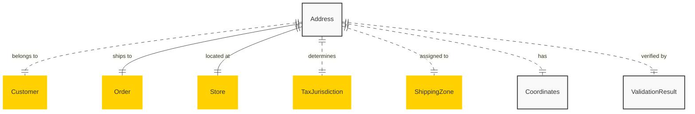

# MACH Alliance, Open Data Model Utility Object: `Address`

## Table of contents

- [MACH Alliance, Open Data Model Utility Object: `Address`](#mach-alliance-open-data-model-utility-object-address)
  - [Table of contents](#table-of-contents)
  - [Entity purpose](#entity-purpose)
  - [Object: Address](#object-address)
  - [YAML Schema Definition](#yaml-schema-definition)
    - [Address Schema](#address-schema)
    - [Supporting Type Definitions](#supporting-type-definitions)
  - [Sample Object: Minimal Address](#sample-object-minimal-address)
  - [Sample Object: US Business Address](#sample-object-us-business-address)
  - [Sample Object: European Residential Address](#sample-object-european-residential-address)
  - [Sample Object: Asian Address with Local Script](#sample-object-asian-address-with-local-script)
  - [Sample Object: Latin American Address](#sample-object-latin-american-address)
  - [Sample Object: Address with Delivery Instructions](#sample-object-address-with-delivery-instructions)
  - [Sample Object: PO Box Address](#sample-object-po-box-address)
  - [Localization Pattern](#localization-pattern)
    - [Single Language (Simple String)](#single-language-simple-string)
    - [Multi-Language (Localized Object)](#multi-language-localized-object)
    - [Localizable Fields](#localizable-fields)
    - [Format Considerations by Region](#format-considerations-by-region)
  - [Core Components \& Relationships](#core-components--relationships)
    - [Components](#components)
    - [Typical Relationships](#typical-relationships)
  - [Typical pitfalls](#typical-pitfalls)
    - [Data Structure Issues](#data-structure-issues)
    - [Validation and Standardization Problems](#validation-and-standardization-problems)
    - [International Support Failures](#international-support-failures)
    - [Delivery and Logistics Issues](#delivery-and-logistics-issues)
    - [Privacy and Security Concerns](#privacy-and-security-concerns)
    - [Integration Challenges](#integration-challenges)
    - [User Experience Problems](#user-experience-problems)

---

## Entity purpose

A standardized utility object for representing physical and mailing addresses across all entities in the MACH Alliance Common Data Model. It serves as the foundational structure for location information throughout commerce platforms, order management systems, logistics providers, and customer relationship management. The address model supports international address formats, validation requirements, and delivery specifications while maintaining consistency across diverse geographic regions and business contexts.

The Address utility object provides:
- Flexible international address formatting for 195+ countries
- Support for both structured and unstructured address data
- Delivery instructions and special handling requirements
- Geographic coordinates for mapping and routing
- Address validation and normalization metadata
- Type classification (residential, commercial, PO Box)
- Accessibility and delivery constraint information
- Multi-language support for international commerce
- Integration with address validation services
- Support for complex address scenarios (military, rural routes)

---

## Object: Address

| Field                   | Description                                                       | Practice    |
| ----------------------- | ----------------------------------------------------------------- | ----------- |
| `id`                    | Unique identifier for the address (when stored)                   | COULD       |
| `type`                  | Address type (`shipping`, `billing`, `business`, `residential`)   | SHOULD      |
| `status`                | Address status (`active`, `invalid`, `undeliverable`, `verified`) | COULD       |
| `line1`                 | Primary address line (street number and name)                     | MUST        |
| `line2`                 | Secondary address line (apartment, suite, unit)                   | COULD       |
| `line3`                 | Additional address line (building, complex name)                  | COULD       |
| `line4`                 | Extra address line for complex addresses                          | COULD       |
| `city`                  | City, town, or locality name                                      | MUST        |
| `district`              | District, neighborhood, or borough                                | COULD       |
| `region`                | State, province, or administrative region                         | SHOULD      |
| `postal_code`           | Postal code, ZIP code, or postcode                                | SHOULD      |
| `country`               | ISO 3166-1 alpha-2 country code                                   | MUST        |
| `coordinates`           | Geographic coordinates (latitude, longitude)                      | COULD       |
| `formatted`             | Pre-formatted complete address string                             | COULD       |
| `company`               | Company or organization name                                      | COULD       |
| `recipient`             | Recipient name for delivery                                       | COULD       |
| `phone`                 | Contact phone number for delivery                                 | COULD       |
| `email`                 | Contact email for delivery notifications                          | COULD       |
| `delivery_instructions` | Special delivery instructions or notes                            | COULD       |
| `access_codes`          | Gate codes, building access information                           | COULD       |
| `validation`            | Address validation metadata                                       | COULD       |
| `attributes`            | Additional address-specific attributes                            | COULD       |
| `created_at`            | ISO 8601 creation timestamp                                       | SHOULD      |
| `updated_at`            | ISO 8601 update timestamp                                         | SHOULD      |
| `verified_at`           | ISO 8601 verification timestamp                                   | COULD       |
| `extensions`            | Namespaced dictionary for extension data                          | RECOMMENDED |

---

## YAML Schema Definition

### Address Schema

```yaml
Address:
  type: object
  required:
    - line1
    - city
    - country
  properties:
    # Core identification
    id:
      type: string
      description: Unique identifier for the address (when stored)
      # example: "ADDR-001"

    # Classification
    type:
      type: string
      enum: ["shipping", "billing", "business", "residential", "mailing", "pickup"]
      description: Address type or usage
      default: "shipping"

    status:
      type: string
      enum: ["active", "invalid", "undeliverable", "verified", "unverified"]
      description: Address validation and delivery status
      default: "unverified"

    # Address lines (localizable)
    line1:
      oneOf:
        - type: string  # Single language
        - type: object  # Multi-language
          additionalProperties:
            type: string
      description: Primary address line
      # example: "123 Main Street" or {"en-US": "123 Main Street", "ja-JP": "メインストリート123"}

    line2:
      oneOf:
        - type: string
        - type: object
          additionalProperties:
            type: string
      description: Secondary address line (apartment, suite, unit)

    line3:
      oneOf:
        - type: string
        - type: object
          additionalProperties:
            type: string
      description: Additional address line (building, complex name)

    line4:
      oneOf:
        - type: string
        - type: object
          additionalProperties:
            type: string
      description: Extra address line for complex addresses

    # Location components (localizable)
    city:
      oneOf:
        - type: string
        - type: object
          additionalProperties:
            type: string
      description: City, town, or locality name
      # example: "New York" or {"en-US": "New York", "zh-CN": "纽约"}

    district:
      oneOf:
        - type: string
        - type: object
          additionalProperties:
            type: string
      description: District, neighborhood, or borough
      # example: "Manhattan" or {"en-US": "Shibuya", "ja-JP": "渋谷区"}

    region:
      type: string
      description: State, province, or administrative region
      # example: "NY", "Ontario", "Bayern"

    postal_code:
      type: string
      description: Postal code, ZIP code, or postcode
      # example: "10001", "SW1A 1AA", "100-0001"

    country:
      type: string
      pattern: "^[A-Z]{2}$"
      description: ISO 3166-1 alpha-2 country code
      # example: "US", "GB", "JP"

    # Geographic data
    coordinates:
      $ref: "#/components/schemas/Coordinates"
      description: Geographic coordinates for mapping

    formatted:
      oneOf:
        - type: string
        - type: object
          additionalProperties:
            type: string
      description: Pre-formatted complete address string

    # Contact information
    company:
      type: string
      description: Company or organization name
      # example: "MACH Alliance"

    recipient:
      type: string
      description: Recipient name for delivery
      # example: "John Doe"

    phone:
      type: string
      description: Contact phone number for delivery
      pattern: "^\\+?[1-9]\\d{1,14}$"  # E.164 format
      # example: "+1234567890"

    email:
      type: string
      format: email
      description: Contact email for delivery notifications

    # Delivery details
    delivery_instructions:
      oneOf:
        - type: string
        - type: object
          additionalProperties:
            type: string
      description: Special delivery instructions or notes
      # example: "Leave package at back door"

    access_codes:
      type: string
      description: Gate codes, building access information
      # example: "Gate: 1234, Building: 5678"

    # Validation metadata
    validation:
      $ref: "#/components/schemas/AddressValidation"
      description: Address validation metadata

    # Additional attributes
    attributes:
      type: object
      additionalProperties: true
      description: Additional address-specific attributes
      # example:
      #   building_type: "high-rise"
      #   delivery_window: "9am-5pm"
      #   requires_signature: true

    # Timestamps
    created_at:
      type: string
      format: date-time
      description: ISO 8601 creation timestamp

    updated_at:
      type: string
      format: date-time
      description: ISO 8601 update timestamp

    verified_at:
      type: string
      format: date-time
      description: ISO 8601 verification timestamp

    # Extensibility
    extensions:
      type: object
      description: Namespaced dictionary for extension data
      additionalProperties: true
      # example:
      #   logistics:
      #     delivery_zone: "A1"
      #     route_code: "R123"
      #   tax:
      #     jurisdiction_code: "12345"
      #     tax_zone: "ZONE-1"
```

### Supporting Type Definitions

```yaml
Coordinates:
  type: object
  required:
    - latitude
    - longitude
  properties:
    latitude:
      type: number
      minimum: -90
      maximum: 90
      description: Latitude coordinate
      # example: 40.7128

    longitude:
      type: number
      minimum: -180
      maximum: 180
      description: Longitude coordinate
      # example: -74.0060

    altitude:
      type: number
      description: Altitude in meters (optional)

    accuracy:
      type: number
      description: Accuracy radius in meters
      minimum: 0

AddressValidation:
  type: object
  properties:
    provider:
      type: string
      description: Validation service provider
      # example: "google-maps", "ups-address-validation", "usps"

    validation_id:
      type: string
      description: External validation reference ID

    confidence_score:
      type: number
      minimum: 0
      maximum: 100
      description: Validation confidence percentage

    standardized:
      type: boolean
      description: Whether address has been standardized
      default: false

    deliverable:
      type: boolean
      description: Whether address is deliverable

    residential:
      type: boolean
      description: Whether address is residential

    corrections:
      type: array
      items:
        $ref: "#/components/schemas/AddressCorrection"
      description: Suggested corrections

    validation_errors:
      type: array
      items:
        type: string
      description: Validation error messages

    validated_at:
      type: string
      format: date-time
      description: When validation was performed

AddressCorrection:
  type: object
  properties:
    field:
      type: string
      description: Field that needs correction
      # example: "postal_code"

    original:
      type: string
      description: Original value

    suggested:
      type: string
      description: Suggested correction

    confidence:
      type: number
      minimum: 0
      maximum: 100
      description: Confidence in suggestion
```

---

## Sample Object: Minimal Address

Basic address with only required fields.

```json
{
  "line1": "123 Main Street",
  "city": "New York",
  "country": "US"
}
```

## Sample Object: US Business Address

Complete US business address with validation.

```json
{
  "id": "ADDR-BUS-001",
  "type": "business",
  "status": "verified",
  "company": "MACH Technologies Inc.",
  "recipient": "Shipping Department",
  "line1": "1234 Business Park Drive",
  "line2": "Building 5, Suite 300",
  "city": "San Francisco",
  "region": "CA",
  "postal_code": "94105",
  "country": "US",
  "phone": "+14155551234",
  "email": "shipping@mach-tech.com",
  "coordinates": {
    "latitude": 37.7749,
    "longitude": -122.4194,
    "accuracy": 10
  },
  "delivery_instructions": "Use loading dock on west side",
  "access_codes": "Dock: 4567",
  "validation": {
    "provider": "usps",
    "validation_id": "VAL-123456",
    "confidence_score": 98.5,
    "standardized": true,
    "deliverable": true,
    "residential": false,
    "validated_at": "2024-01-15T10:30:00Z"
  },
  "attributes": {
    "building_type": "commercial",
    "loading_dock": true,
    "delivery_hours": "8am-5pm PST",
    "floor": "3",
    "requires_appointment": false
  },
  "created_at": "2024-01-01T00:00:00Z",
  "updated_at": "2024-01-15T10:30:00Z",
  "verified_at": "2024-01-15T10:30:00Z",
  "extensions": {
    "logistics": {
      "delivery_zone": "SF-COM-01",
      "route_code": "R-415-05",
      "carrier_notes": "Regular commercial delivery"
    },
    "tax": {
      "jurisdiction_code": "06075",
      "tax_zone": "SF-BUS"
    }
  }
}
```

## Sample Object: European Residential Address

European address with apartment details and localization.

```json
{
  "id": "ADDR-RES-002",
  "type": "residential",
  "status": "verified",
  "recipient": "Marie Dubois",
  "line1": "15 Rue de la Paix",
  "line2": "Appartement 4B",
  "line3": "Bâtiment Les Lilas",
  "city": "Paris",
  "district": "8ème arrondissement",
  "region": "Île-de-France",
  "postal_code": "75008",
  "country": "FR",
  "phone": "+33123456789",
  "email": "marie.dubois@example.com",
  "coordinates": {
    "latitude": 48.8566,
    "longitude": 2.3522,
    "accuracy": 5
  },
  "delivery_instructions": {
    "fr-FR": "Sonner à l'interphone 'Dubois'",
    "en-US": "Ring intercom 'Dubois'"
  },
  "access_codes": "1234A",
  "validation": {
    "provider": "la-poste",
    "confidence_score": 95,
    "standardized": true,
    "deliverable": true,
    "residential": true
  },
  "attributes": {
    "building_type": "apartment",
    "floor": "4",
    "elevator": true,
    "intercom": true
  },
  "extensions": {
    "delivery_preferences": {
      "safe_place": "Concierge",
      "neighbor_delivery": false,
      "weekend_delivery": true
    }
  }
}
```

## Sample Object: Asian Address with Local Script

Address with multilingual support for Asian markets.

```json
{
  "id": "ADDR-ASIA-003",
  "type": "shipping",
  "status": "verified",
  "recipient": "山田太郎",
  "line1": {
    "ja-JP": "渋谷区神南1-15-3",
    "en-US": "1-15-3 Jinnan, Shibuya-ku"
  },
  "line2": {
    "ja-JP": "MACHビル 5階",
    "en-US": "MACH Building 5F"
  },
  "city": {
    "ja-JP": "東京都",
    "en-US": "Tokyo"
  },
  "district": {
    "ja-JP": "渋谷区",
    "en-US": "Shibuya"
  },
  "postal_code": "150-0041",
  "country": "JP",
  "phone": "+81312345678",
  "formatted": {
    "ja-JP": "〒150-0041 東京都渋谷区神南1-15-3 MACHビル 5階",
    "en-US": "MACH Building 5F, 1-15-3 Jinnan, Shibuya-ku, Tokyo 150-0041"
  },
  "coordinates": {
    "latitude": 35.6651,
    "longitude": 139.6982
  },
  "delivery_instructions": {
    "ja-JP": "宅配ボックス使用可",
    "en-US": "Delivery box available"
  },
  "validation": {
    "provider": "japan-post",
    "confidence_score": 100,
    "standardized": true,
    "deliverable": true
  },
  "attributes": {
    "building_type": "office",
    "delivery_box": true,
    "business_hours": "9:00-18:00 JST"
  },
  "extensions": {
    "cultural": {
      "name_order": "family_first",
      "honorific": "様"
    }
  }
}
```

## Sample Object: Latin American Address

Complex Latin American address with neighborhood details.

```json
{
  "id": "ADDR-LATAM-004",
  "type": "residential",
  "status": "verified",
  "recipient": "João Silva Santos",
  "line1": "Avenida Paulista, 1578",
  "line2": "Apartamento 142, Torre B",
  "line3": "Condomínio Vista Verde",
  "city": "São Paulo",
  "district": "Bela Vista",
  "region": "SP",
  "postal_code": "01310-200",
  "country": "BR",
  "phone": "+5511987654321",
  "email": "joao.santos@example.com",
  "coordinates": {
    "latitude": -23.5629,
    "longitude": -46.6544,
    "accuracy": 8
  },
  "delivery_instructions": "Entregar na portaria. Autorizado deixar com porteiro.",
  "validation": {
    "provider": "correios",
    "confidence_score": 92,
    "standardized": true,
    "deliverable": true,
    "residential": true
  },
  "attributes": {
    "building_type": "condominium",
    "gated_community": true,
    "portaria_24h": true,
    "cpf_required": true
  },
  "extensions": {
    "brazilian_specific": {
      "cep": "01310-200",
      "ibge_code": "3550308",
      "neighborhood_type": "bairro_nobre"
    },
    "delivery": {
      "preferred_period": "afternoon",
      "receiver_cpf": "123.456.789-00"
    }
  }
}
```

## Sample Object: Address with Delivery Instructions

Detailed delivery address with special handling requirements.

```json
{
  "id": "ADDR-DELIVERY-005",
  "type": "shipping",
  "status": "active",
  "recipient": "Sarah Johnson",
  "company": "Home Office Solutions",
  "line1": "789 Oak Street",
  "line2": "Unit 12B",
  "city": "Seattle",
  "region": "WA",
  "postal_code": "98101",
  "country": "US",
  "phone": "+12065551234",
  "email": "sarah.j@example.com",
  "coordinates": {
    "latitude": 47.6062,
    "longitude": -122.3321
  },
  "delivery_instructions": "Ring doorbell twice. If no answer, leave with building manager in office. Do not leave unattended. Package contains fragile items.",
  "access_codes": "Gate: #4521, Building: 789*",
  "attributes": {
    "delivery_window": "10am-2pm",
    "requires_signature": true,
    "fragile": true,
    "leave_at_door": false,
    "photo_on_delivery": true,
    "weekend_delivery": false,
    "holiday_delivery": false
  },
  "extensions": {
    "special_handling": {
      "white_glove_service": true,
      "installation_required": false,
      "two_person_delivery": true,
      "packaging_removal": true
    },
    "notifications": {
      "sms_updates": true,
      "email_updates": true,
      "delivery_photo": true,
      "pre_delivery_call": true
    }
  }
}
```

## Sample Object: PO Box Address

Post office box address for mailing purposes.

```json
{
  "id": "ADDR-POBOX-006",
  "type": "mailing",
  "status": "verified",
  "company": "MACH Commerce LLC",
  "line1": "PO Box 12345",
  "city": "Denver",
  "region": "CO",
  "postal_code": "80201-2345",
  "country": "US",
  "phone": "+13035551234",
  "validation": {
    "provider": "usps",
    "confidence_score": 100,
    "standardized": true,
    "deliverable": true,
    "residential": false,
    "corrections": [
      {
        "field": "postal_code",
        "original": "80201",
        "suggested": "80201-2345",
        "confidence": 100
      }
    ]
  },
  "attributes": {
    "po_box": true,
    "physical_delivery": false,
    "mail_forwarding": true,
    "box_size": "large"
  },
  "extensions": {
    "postal_service": {
      "box_number": "12345",
      "postal_facility": "Denver Main",
      "rental_period": "annual",
      "expiry_date": "2025-12-31"
    },
    "restrictions": {
      "no_packages": false,
      "max_package_size": "24x18x12 inches",
      "signature_service": true
    }
  }
}
```

---

## Localization Pattern

The Address utility object supports flexible localization for international commerce. Fields that may need translation or local script support can accept either a simple string or a localized object.

### Single Language (Simple String)
```json
{
  "line1": "123 Main Street",
  "city": "New York",
  "delivery_instructions": "Leave at front door"
}
```

### Multi-Language (Localized Object)
```json
{
  "line1": {
    "en-US": "123 Main Street",
    "es-ES": "Calle Principal 123",
    "zh-CN": "主街123号"
  },
  "city": {
    "en-US": "New York",
    "es-ES": "Nueva York",
    "zh-CN": "纽约"
  },
  "delivery_instructions": {
    "en-US": "Leave at front door",
    "es-ES": "Dejar en la puerta principal",
    "zh-CN": "请放在前门"
  }
}
```

### Localizable Fields
- `line1`, `line2`, `line3`, `line4` - Address lines
- `city` - City name
- `district` - District or neighborhood
- `formatted` - Complete formatted address
- `delivery_instructions` - Delivery notes

### Format Considerations by Region

**North America (US, CA)**
- Street number before street name
- State/Province abbreviations common
- ZIP+4 format supported (US)

**Europe**
- Street name may come before number
- Postal code placement varies
- Building/staircase/floor details common

**Asia-Pacific**
- Local script essential for delivery
- Order often reversed (country → city → street)
- Building names more common than numbers

**Latin America**
- Neighborhood (barrio/colonia) important
- Reference points common
- Informal addressing frequent

---

## Core Components & Relationships

### Components

| Concept               | Description                          | Typical Source of Truth    |
| --------------------- | ------------------------------------ | -------------------------- |
| Address Lines         | Structured street address components | Address Validation Service |
| Geographic Region     | Country, state, city hierarchy       | Geographic Database        |
| Postal Code           | Mail routing code                    | Postal Authority           |
| Coordinates           | Latitude/longitude for mapping       | Geocoding Service          |
| Validation            | Address verification metadata        | Validation Provider        |
| Delivery Instructions | Special handling notes               | Customer Input             |
| Access Information    | Entry codes and restrictions         | Property Management        |
| Contact Details       | Phone/email for delivery             | Customer Profile           |

`Address` is utilized across many entities and systems:

- Customer profiles (billing/shipping addresses)
- Orders (delivery destinations)
- Store locations (physical addresses)
- Warehouses (fulfillment centers)
- Suppliers (business addresses)
- Returns (pickup locations)
- Tax calculations (jurisdiction determination)

### Typical Relationships



---

## Typical pitfalls

### Data Structure Issues
- **Fixed field assumptions** - Forcing all addresses into US-centric format breaks international commerce
- **Missing required fields by country** - Some countries require district/prefecture, others don't use postal codes
- **Single-language only** - Prevents proper delivery in countries requiring local script
- **No validation metadata** - Can't track whether addresses are deliverable or need correction

### Validation and Standardization Problems
- **Not validating on entry** - Invalid addresses cause delivery failures and customer dissatisfaction
- **Over-standardization** - Destroying valid local addressing formats to fit rigid rules
- **Ignoring validation suggestions** - Missing opportunities to correct common errors
- **No revalidation process** - Addresses become stale as postal systems change

### International Support Failures
- **Country-specific formats hardcoded** - Each country has unique address formatting rules
- **Character encoding issues** - UTF-8 support essential for global addresses
- **Missing coordinate support** - Many emerging markets rely on GPS over street addresses
- **No RTL language support** - Arabic and Hebrew addresses need special handling

### Delivery and Logistics Issues
- **No delivery instructions field** - Critical for successful last-mile delivery
- **Missing business hours** - Commercial addresses need delivery time windows
- **No access code storage** - Gated communities and secure buildings require codes
- **Ignoring address types** - PO boxes can't receive physical packages

### Privacy and Security Concerns
- **Storing unnecessary data** - Keep only required fields for each use case
- **No data retention policy** - Old addresses should be purged per privacy regulations
- **Weak access controls** - Address data is PII and needs protection
- **No audit trail** - Can't track who accessed or modified addresses

### Integration Challenges
- **Incompatible with carriers** - Each shipping provider has specific format requirements
- **Tax calculation mismatches** - Incorrect addresses lead to wrong tax rates
- **Poor geocoding** - Inaccurate coordinates affect delivery routing
- **No address deduplication** - Same address stored multiple times differently

### User Experience Problems
- **Complex form validation** - Frustrating users with overly strict rules
- **No address autocomplete** - Making users type full addresses increases errors
- **Missing common aliases** - Not recognizing "St" vs "Street" as equivalent
- **Poor mobile experience** - Address entry especially difficult on mobile devices

---

>  This MACH Alliance Canonical Data Model is intentionally __vendor-neutral__ and serves as a foundation for interoperability across composable architectures. It is __continually evolving__ through community contributions, which are reviewed and approved collaboratively.
>
>  All contributions are made under the __Creative Commons Attribution 4.0 International License (CC BY 4.0)__. By submitting a contribution, you agree to license your content under <a href="https://creativecommons.org/licenses/by/4.0/deed.en">CC BY 4.0</a>, allowing others to share and adapt the material with proper attribution.
>
>  We welcome and encourage continued improvements through community input. For more information and guidance on how to contribute, please refer to the <a href="https://github.com/machalliance/common-data-model/blob/main/contributing.md">Contributor Guide</a>.
>
