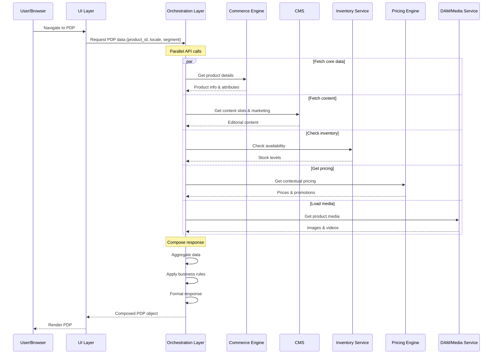

# MACH Alliance, Open Data Model

## Recipe: `PDP Orchestration (on the fly)`

## Table of contents

- [MACH Alliance, Open Data Model](#mach-alliance-open-data-model)
  - [Recipe: `PDP Orchestration (on the fly)`](#recipe-pdp-orchestration-on-the-fly)
  - [Table of contents](#table-of-contents)
  - [Recipe Purpose](#recipe-purpose)
  - [Recipe Overview](#recipe-overview)
      - [Approach Rationale](#approach-rationale)
        - [Performance \& User Experience](#performance--user-experience)
        - [Security \& Compliance](#security--compliance)
        - [Business Logic \& Consistency](#business-logic--consistency)
        - [Maintainability \& Scalability](#maintainability--scalability)
        - [Operational Excellence](#operational-excellence)
  - [Typical pitfalls](#typical-pitfalls)
  - [Actors / Stakeholders](#actors--stakeholders)
  - [Trigger Points / Events](#trigger-points--events)
  - [Recipe Flows](#recipe-flows)
      - [Swimlane or Sequence Diagram](#swimlane-or-sequence-diagram)
  - [Systems Involved](#systems-involved)
  - [Data Requirements](#data-requirements)
    - [Data Flow Details](#data-flow-details)
    - [Data Lineage \& Performance Considerations](#data-lineage--performance-considerations)
    - [Privacy/PII Considerations](#privacypii-considerations)
    - [Example Composed Object Output](#example-composed-object-output)
  - [Variants / Alternatives](#variants--alternatives)
  - [Failure Modes / Edge Cases](#failure-modes--edge-cases)
  - [Success Metrics / KPIs](#success-metrics--kpis)
  - [Security \& Compliance Notes](#security--compliance-notes)

## Recipe Purpose

> [!NOTE]
> This recipe is a "simple" version of a more complex [PDP Orchestration with Access Layer Optimization Strategy](PDP-orchestration-optimized-access.md) recipe that has a complex and aggressive data view optimization approach.

To deliver a fast, reliable, and fully populated Product Detail Page (PDP) by orchestrating multiple back-end services into a single, customer-facing API. This enables consistent display of product information, pricing, inventory, and rich content across channels.

**Key Business Goals:**
- Improve PDP load time and performance
- Reduce page abandonment rate
- Enable non-dev marketing updates to product content
- Enable personalized or contextual PDP content
- Streamline cross-channel consistency (web, mobile, kiosk)

**KPI tie-ins:** Conversion rate, average order value (AOV), content engagement metrics, page load time, SEO rankings, content publish velocity.

---

## Recipe Overview

When a user requests a product page, the system must gather and assemble product data from multiple domains: product info, pricing, availability, media, and content slots. This orchestration handles the back-end coordination, ensuring fast, complete, and accurate PDP rendering.

#### Approach Rationale

In composable commerce, using an orchestration layer instead of front-end binding is advantageous for several architectural, operational, and business reasons:
##### Performance & User Experience
- Reduced Client-Side Complexity: Front-end binding means the browser must orchestrate multiple API calls, handle failures, and manage complex business logic. This creates slower page loads, increased JavaScript bundle sizes, and potential for user-facing errors during API failures.
- Access Layer Optimization: An integration layer can implement sophisticated data view strategies, data transformation, and response optimization that would be impossible or inefficient to replicate in every front-end instance.
- Network Efficiency: Instead of making multiple round-trips from client to various services, the integration layer can aggregate data server-side and return optimized payloads.
##### Security & Compliance
- API Key Management: Front-end binding exposes API credentials in client-side code or requires complex token management. The integration layer keeps sensitive credentials server-side.
- Data Sanitization: Customer data, pricing information, and business logic can be properly filtered and sanitized before reaching the client, preventing data leakage.
- Rate Limiting & Throttling: Protection against API abuse and managing third-party service rate limits is handled centrally rather than hoping each client implementation respects limits.
##### Business Logic & Consistency
- Centralized Business Rules: Complex pricing calculations, inventory allocation rules, and customer-specific logic should be consistent across all touchpoints. Front-end binding leads to duplicated logic and potential inconsistencies.
- Data Transformation: Converting between different service formats, handling regional variations, and applying business-specific transformations is better managed in one place.
- Workflow Orchestration: Multi-step processes like order placement (inventory check → pricing calculation → payment processing → fulfillment) require reliable orchestration that can handle partial failures.
##### Maintainability & Scalability
- Single Source of Truth: When a third-party service changes its API, you update the integration layer once rather than hunting through multiple front-end implementations.
- Service Evolution: New services can be integrated without requiring front-end changes. Legacy services can be deprecated gracefully.
- Testing & Debugging: It's much easier to test, monitor, and debug server-side integration logic than distributed client-side implementations.
##### Operational Excellence
- Monitoring & Observability: Centralized logging, metrics, and alerting for all third-party service interactions. You can track performance, errors, and usage patterns effectively.
- Fallback Strategies: Implementing circuit breakers, graceful degradation, and fallback mechanisms is more reliable server-side.
Deployment Independence: Front-end applications can be deployed independently of backend service changes, and vice versa.

---
## Typical pitfalls
- This approach outlines using orchestration to assemble multiple sources on the fly. This approach is ideal if your underlying services are fast and reliable or if you have to make multiple decision points and business logic that may limit the benefit of access layer optimization:
  - For example, if the output is regularly changing based on changing underlying data or unique user requirements (such as personalizing by segment or geography).
- Depending on the speed of underlying services, you may wish to add access layer optimization approaches to improve performance.

> [!TIP]
> The recipe [PDP Orchestration with Access Layer Optimization Strategy](PDP-orchestration-optimized-access.md) describes a more complex and aggressive data view optimization approach if the use case requires it.

---


## Actors / Stakeholders

**Users:**
- **Customers:** Consume integrated content and commerce experiences
- **Content Authors:** Create and manage editorial content referencing products
- **Merchandisers:** Configure product displays and recommendations within content
- **Developers:** Implement and maintain integration patterns

**Systems:**
- **CMS:** Manages editorial content, templates, and content-product relationships
- **Commerce Engine:** Provides product data, pricing, inventory, and checkout functionality
- **Orchestration Layer:** Aggregates all service responses and a single API for front-end developers
- **Access Layer:** Delivers optimized data views with commerce data integration (optional - not shown in diagram - see [PDP Orchestration with Access Layer Optimization Strategy](PDP-orchestration-optimized-access.md) for more details)
- **Analytics Platform:** Tracks content and commerce performance metrics (optional - not shown in diagram)
- **DAM/Dynamic media delivery:** Provides image assets and other visual product renderings (optional - not shown in diagram)

**Teams:**
- **Content/Marketing:** Owns editorial strategy and content creation
- **Product Management:** Defines commerce data requirements and customer experience
- **Engineering:** Implements technical integration and performance optimization
- **Operations:** Manages deployment pipelines and system reliability


---

## Trigger Points / Events

What initiates this recipe?

**Action-based:**
- Customer navigates to content page with embedded product data
- Content author previews page with live commerce data

**Cache invalidation:**
- Product data changes in commerce system (price, inventory, attributes)
- New product launches requiring content integration
- Content deployment triggers commerce data validation
- Scheduled content publication workflows
- Periodic product catalog synchronization (e.g., nightly batch updates)
- Access layer refresh intervals for commerce data in content
---

## Recipe Flows

#### Swimlane or Sequence Diagram


---

## Systems Involved

| **System**          | **Role**                           | **Owner**             |
| ------------------- | ---------------------------------- | --------------------- |
| Commerce Engine     | Core product data, SKU, attributes | Product / Engineering |
| CMS                 | PDP content slots, copy, assets    | Marketing / CMS Team  |
| Inventory Service   | Real-time availability data        | Operations / Supply   |
| Pricing Engine      | Contextual and promotional pricing | Pricing / Product     |
| Orchestration Layer | Aggregates all service responses   | Architecture / API    |
| UI / Frontend       | Renders the final PDP experience   | Frontend Team         |


---

## Data Requirements

| **Entity**                                      | **Function**                                                              | **Source System**     |
| ----------------------------------------------- | ------------------------------------------------------------------------- | --------------------- |
| [Product](../entities/product/product.md)       | Input - ID or SKU (typically provided via URL) and outputted product info | Commerce Engine / PIM |
| [Language](../entities/utilities/language.md)   | Input (optional) - Language/locale/culture information                    | User Context          |
| Customer Segment                                | Input (optional) - additional context for personalization                 | CDP / User Session    |
| [Inventory](../entities/inventory/inventory.md) | Output - Real-time stock availability                                     | Inventory Service     |
| [Pricing](../entities/pricing/pricing.md)       | Output - Contextual pricing information                                   | Pricing Engine        |
| [Promotion](../entities/promotion/promotion.md) | Output - Active promotions and discounts                                  | Promotion Engine      |
| [Media](../entities/utilities/media.md)         | Output - Product images, videos, and 3D assets                            | DAM / Media Service   |
| [Category](../entities/product/category.md)     | Output - Product category hierarchy                                       | Commerce Engine       |

### Data Flow Details

**Inputs:**
- [Product](../entities/product/product.md) ID or SKU (typically provided via URL)
- [Language](../entities/utilities/language.md) (region/locale/culture, optional)
- Customer segment (optional) - for personalization and contextual pricing
- User location (optional) - for inventory availability and regional pricing

**Backend Service Calls:**
- [Product](../entities/product/product.md) details from Commerce Engine (attributes, variants, specifications)
- [Inventory](../entities/inventory/inventory.md) levels from Inventory Service (real-time availability)
- [Pricing](../entities/pricing/pricing.md) from Pricing Engine (list price, sale price, tier pricing)
- [Promotion](../entities/promotion/promotion.md) data from Promotion Engine (active discounts, badges)
- [Media](../entities/utilities/media.md) assets from DAM (images, videos, 360° views)
- [Category](../entities/product/category.md) hierarchy for breadcrumb navigation
- Marketing content from CMS (descriptions, features, benefits)

**Output:**
Fully composed PDP object containing all necessary data for client-side rendering.

### Data Lineage & Performance Considerations

- **Real-time vs. Cached:** Content can be served real-time or through optimized caching layers
- **Orchestration Strategy:** Parallel API calls reduce latency vs. sequential requests
- **Fallback Handling:** Graceful degradation when optional services are unavailable

### Privacy/PII Considerations

**Minimal Case:**
- Anonymous session data for general product viewing
- Location-based pricing without user identification
- Generic inventory availability

**Advanced Cases:**
- **Customer-specific pricing** requires authenticated session and secure data handling
- **Personalized content** must comply with consent management frameworks
- **Viewing history** integration follows data retention policies
- **Cross-border transfers** require appropriate data residency compliance
- **B2B scenarios** may expose negotiated rates requiring access control

### Example Composed Object Output

This example demonstrates a fully orchestrated PDP response combining data from multiple services:

```json
{
  "id": "PROD-WIRELESS-HEADPHONES-001",
  "sku": "WH-NOISE-CANCEL-BLK",
  "slug": "premium-wireless-noise-cancelling-headphones",
  "type": "PT-ELECTRONICS-AUDIO",
  "status": "sellable",
  "external_references": {
    "erp": "ERP-WH-5847291",
    "wms": "WMS-AUDIO-001",
    "supplier": "SONY-WH-1000XM5"
  },
  "created_at": "2024-11-15T09:30:00Z",
  "updated_at": "2025-07-02T14:22:00Z",


  "breadcrumbs": [
    { "label": "Home", "url": "/" },
    { "label": "Electronics", "url": "/electronics" },
    { "label": "Audio", "url": "/electronics/audio" },
    { "label": "Headphones", "url": "/electronics/audio/headphones" },
    { "label": "Wireless Headphones", "url": "/electronics/audio/headphones/wireless" }
  ],

  "pageInfo": {
    "title": "Premium Wireless Noise-Cancelling Headphones",
    "url": "/products/premium-wireless-noise-cancelling-headphones",
    "canonical_url": "https://audiotech.com/products/premium-wireless-noise-cancelling-headphones",
    "updated_at": "2025-07-02T14:22:00Z",
    "published_at": "2024-11-15T09:30:00Z"
  },

  "name": "Premium Wireless Noise-Cancelling Headphones",
  "description": "Experience studio-quality sound with industry-leading noise cancellation. These premium wireless headphones deliver exceptional audio clarity while blocking out distractions, perfect for travel, work, or leisure.",
  "shortDescription": "Premium wireless headphones with active noise cancellation and 30-hour battery life.",

  "marketingContent": {
    "headline": "Silence the World, Amplify Your Music",
    "tagline": "Professional-grade audio meets cutting-edge technology",
    "features": [
      "Industry-leading active noise cancellation blocks 99% of ambient noise",
      "Hi-Res Audio certified for studio-quality sound reproduction",
      "30-hour battery life with quick charge (3 hours playback in 3 minutes)",
      "Adaptive sound control automatically adjusts to your environment",
      "Premium materials: lightweight aluminum frame with soft leather padding"
    ],
    "benefits": [
      "Focus better in noisy environments like airplanes and cafes",
      "Enjoy every detail of your favorite music with crystal-clear highs and deep bass",
      "All-day comfort for long listening sessions without fatigue",
      "Seamless connectivity with multipoint Bluetooth 5.2 technology"
    ],
    "useCases": [
      "Professional audio mixing and mastering",
      "Long-haul travel and commuting",
      "Open office environments",
      "Gaming and entertainment"
    ]
  },

  "list_price": {
    "amount": 399.99,
    "currency": "USD",
    "taxIncluded": false
  },

  "inventory": {
    "quantities": {
    "onhand": 120,
    "reserved": 15,
    "available": 105,
    "incoming": 40
    }
  },

  "primary_image": {
    "url": "https://cdn.audiotech.com/img/wireless-headphones-primary.webp",
    "alt": "Premium Wireless Noise-Cancelling Headphones in Black",
    "width": 800,
    "height": 800
  },

  "media": [
    {
      "url": "https://cdn.audiotech.com/img/headphones-side-view.webp",
      "alt": "Side profile showing padded ear cups",
      "type": "image",
      "width": 800,
      "height": 600
    },
    {
      "url": "https://cdn.audiotech.com/img/headphones-controls.webp",
      "alt": "Touch controls and buttons detail",
      "type": "image",
      "width": 600,
      "height": 400
    },
    {
      "url": "https://cdn.audiotech.com/video/headphones-demo.mp4",
      "alt": "Product demonstration video",
      "type": "video"
    }
  ],

  "rating": {
    "average": 4.7,
    "count": 2847,
    "distribution": {
      "5": 1823,
      "4": 731,
      "3": 198,
      "2": 67,
      "1": 28
    }
  },

  "attributes": [
    { "label": "Brand", "value": "AudioTech Pro" },
    { "label": "Model", "value": "AT-WH-5000" },
    { "label": "Color", "value": "Midnight Black" },
    { "label": "Connectivity", "value": "Bluetooth 5.2, USB-C, 3.5mm" },
    { "label": "Battery Life", "value": "30 hours (ANC on), 40 hours (ANC off)" },
    { "label": "Charging Time", "value": "3 hours full charge" },
    { "label": "Weight", "value": "250g" },
    { "label": "Driver Size", "value": "40mm" },
    { "label": "Frequency Response", "value": "4Hz - 40kHz" },
    { "label": "Noise Cancellation", "value": "Active (up to 30dB reduction)" },
    { "label": "Microphone", "value": "Dual noise-cancelling mics" },
    { "label": "Warranty", "value": "2 years international" },
    { "label": "Certifications", "value": ["Hi-Res Audio", "FCC", "CE"] }
  ],

  "variants": [
    {
      "id": "VAR-WH-BLACK",
      "sku": "WH-NOISE-CANCEL-BLK",
      "name": "Premium Wireless Headphones - Midnight Black",
      "attributes": [
        { "label": "Color", "value": "Midnight Black" }
      ],
      "price": { "amount": 399.99, "currency": "USD" },
      "inventory": { "onhand": 47, "bulk": 150 },
      "primary_image": {
        "url": "https://cdn.audiotech.com/img/wireless-headphones-black.webp",
        "alt": "Midnight Black Wireless Headphones"
      }
    },
    {
      "id": "VAR-WH-SILVER",
      "sku": "WH-NOISE-CANCEL-SLV",
      "name": "Premium Wireless Headphones - Platinum Silver",
      "attributes": [
        { "label": "Color", "value": "Platinum Silver" }
      ],
      "price": { "amount": 399.99, "currency": "USD" },
      "inventory": { "onhand": 23, "bulk": 80 },
      "primary_image": {
        "url": "https://cdn.audiotech.com/img/wireless-headphones-silver.webp",
        "alt": "Platinum Silver Wireless Headphones"
      }
    }
  ],

  "category": {
    "id": "CAT-WIRELESS-HEADPHONES",
    "name": "Wireless Headphones",
    "slug": "wireless",
    "parent_id": "CAT-HEADPHONES"
  },

  "related_products": [
    {
      "id": "PROD-HEADPHONE-CASE-001",
      "sku": "HC-PREMIUM-001",
      "name": "Premium Headphone Travel Case",
      "relationship": "accessory",
      "price": { "amount": 49.99, "currency": "USD" },
      "primary_image": {
        "url": "https://cdn.audiotech.com/img/headphone-case-thumb.webp",
        "alt": "Premium Headphone Travel Case"
      }
    },
    {
      "id": "PROD-WIRELESS-EARBUDS-001",
      "sku": "WE-SPORT-001",
      "name": "Wireless Sport Earbuds",
      "relationship": "alternative",
      "price": { "amount": 199.99, "currency": "USD" },
      "primary_image": {
        "url": "https://cdn.audiotech.com/img/wireless-earbuds-thumb.webp",
        "alt": "Wireless Sport Earbuds"
      }
    },
    {
      "id": "PROD-HEADPHONE-STAND-001",
      "sku": "HS-BAMBOO-001",
      "name": "Bamboo Headphone Stand",
      "relationship": "accessory",
      "price": { "amount": 29.99, "currency": "USD" },
      "primary_image": {
        "url": "https://cdn.audiotech.com/img/headphone-stand-thumb.webp",
        "alt": "Bamboo Headphone Stand"
      }
    },
    {
      "id": "PROD-WIRELESS-HEADPHONES-PRO",
      "sku": "WH-PRO-001",
      "name": "Professional Studio Headphones",
      "relationship": "upsell",
      "price": { "amount": 599.99, "currency": "USD" },
      "primary_image": {
        "url": "https://cdn.audiotech.com/img/studio-headphones-thumb.webp",
        "alt": "Professional Studio Headphones"
      }
    }
  ],

  "extensions": {
    "seo": {
      "meta_title": "Premium Wireless Noise-Cancelling Headphones | AudioTech Pro",
      "meta_description": "Experience studio-quality sound with our premium wireless noise-cancelling headphones. 30-hour battery, Hi-Res Audio certified. Free shipping & 2-year warranty.",
      "metaKeywords": ["wireless headphones", "noise cancelling", "premium audio", "bluetooth headphones", "hi-res audio"],
      "openGraph": {
        "title": "Premium Wireless Noise-Cancelling Headphones",
        "description": "Industry-leading noise cancellation meets studio-quality sound",
        "image": "https://cdn.audiotech.com/img/wireless-headphones-og.webp",
        "url": "https://audiotech.com/products/premium-wireless-noise-cancelling-headphones"
      },
      "twitterCard": {
        "card": "summary_large_image",
        "title": "Premium Wireless Noise-Cancelling Headphones",
        "description": "Experience studio-quality sound with industry-leading noise cancellation",
        "image": "https://cdn.audiotech.com/img/wireless-headphones-twitter.webp"
      },
      "structuredData": {
        "@context": "https://schema.org",
        "@type": "Product",
        "name": "Premium Wireless Noise-Cancelling Headphones",
        "brand": "AudioTech Pro",
        "model": "AT-WH-5000",
        "offers": {
          "@type": "Offer",
          "price": "399.99",
          "priceCurrency": "USD",
          "availability": "InStock"
        },
        "aggregateRating": {
          "@type": "AggregateRating",
          "rating_value": "4.7",
          "reviewCount": "2847"
        }
      },
      "source": "pim",
      "lastOptimized": "2025-07-02T14:22:00Z"
    },
    "marketing": {
      "priority": 1,
      "type": "featured",
      "badges": ["bestseller", "editor-choice", "new-arrival"],
      "promotions": ["summer-sale-2025"],
      "source": "merchandising",
      "lastUpdated": "2025-07-01T10:00:00Z"
    },
    "analytics": {
      "productCategory": "Electronics > Audio > Headphones",
      "brand": "AudioTech Pro",
      "tracking_id": "AT-WH-5000-BLK",
      "source": "analytics"
    }
  }
}
```


---

## Variants / Alternatives

**Preview Environments:**
- Staging CMS with live commerce data connections for content validation
- Preview-specific API endpoints with test product data
- Content author tools showing live data impact before publication

**Multi-Market Support:**
- Regional content variations with market-specific product data
- Currency and pricing localization within content templates
- Geographic content routing with appropriate commerce data sources

**A/B Testing Integration:**
- Content variation testing with commerce performance tracking
- Product recommendation algorithm testing within editorial content
- Personalization strategy optimization across content and commerce

**DAM or Dynamic Media Integration:**
- Load assets at optimized display resolutions
- Rendering of complex views (3D, augmented reality, etc.)
- Automatic format conversion (WebP, AVIF) based on client capabilities
- Responsive image generation for different device types

---

## Failure Modes / Edge Cases

| **Scenario**                      | **Impact**                                                     | **Mitigation Strategy**                                                                                                                                                                                                        |
| --------------------------------- | -------------------------------------------------------------- | ------------------------------------------------------------------------------------------------------------------------------------------------------------------------------------------------------------------------------ |
| **Commerce API Unavailable**      | Content pages show incomplete product information              | Implement circuit breakers; serve optimized product data; display degraded experience with "pricing unavailable" messaging                                                                                                     |
| **Missing or Invalid Product ID** | Broken product references in published content                 | Pre-publication validation hooks; automated broken link detection; fallback to similar product recommendations                                                                                                                 |
| **Partial Data Delivery**         | Inconsistent product information across page elements          | Backend-for-Frontend (BFF) layer ensures complete data sets; graceful degradation with placeholder content                                                                                                                     |
| **Rate Limits/API Quotas**        | Commerce data unavailable during high traffic                  | Implement API usage throttling; access layer optimization strategies; dedicated read replicas for content integration                                                                                                          |
| **Multi-Region Mismatch**         | Wrong currency/availability shown for user location            | Geographic routing validation; market-specific content variants; runtime region detection and correction                                                                                                                       |
| **A/B Testing Conflicts**         | Inconsistent pricing between CMS content and commerce checkout | Unified personalization layer; consistent experiment assignment; real-time data validation at transaction points                                                                                                               |
| **Access Layer Refresh Lag**      | Stale pricing/inventory shown in content                       | Event-driven access layer refresh; short access key lifetimes for commerce data; real-time validation warnings - see [PDP Orchestration with Access Layer Optimization Strategy](PDP-orchestration-cached.md) for more details |
| **Content/Product Sync Timing**   | Content published before product availability                  | Scheduled publishing workflows; product readiness validation; preview mode restrictions                                                                                                                                        |


---

## Success Metrics / KPIs

**Performance Metrics:**
- Page load time (Time to Interactive) < 2 seconds
- Orchestration API response time < 500ms (p99)
- Individual service response times < 200ms (p95)
- System availability > 99.9% uptime
- CDN cache hit rate > 85% for static assets

**Business Metrics:**
- Conversion rate uplift: Target 15-20% improvement
- Average Order Value (AOV) increase from recommendations
- PDP bounce rate reduction: Target < 30%
- Add-to-cart rate improvement: Target 5-10% increase
- SEO organic traffic growth from rich content

**Operational Metrics:**
- Content publication success rate > 98%
- Data synchronization accuracy > 99.5%
- Mean Time to Recovery (MTTR) < 15 minutes
- Error rate < 0.1% of total requests
- API throttling incidents < 5 per month

---

## Security & Compliance Notes

> [!WARNING]
> This list is not exhaustive, and you must do your own due dilligence to ensure you meet the required security and compliance standards for your unique scenario, however, some common aspects to review are:

**GDPR/CCPA Implications:**
- Customer-specific product recommendations require explicit consent
- Product viewing history must support right-to-erasure requests
- Cross-border data transfers need appropriate safeguards (SCCs, adequacy decisions)
- Cookie consent required for personalization features

**Authentication & Authorization:**
- Service-to-service authentication using OAuth 2.0 or API keys
- Customer authentication for B2B pricing and exclusive products
- Content author authentication with role-based access control
- API rate limiting per client to prevent abuse

**Data Protection:**
- TLS 1.3 encryption for all API communications
- PII data masking in logs and monitoring systems
- Secure credential storage using secrets management
- Regular security audits and penetration testing

**Content Compliance:**
- Product claims verification against regulatory requirements
- Age-gating for restricted products (alcohol, tobacco)
- Accessibility compliance (WCAG 2.1 AA) for all content
- Multi-language content accuracy verification

---

>  This MACH Alliance Canonical Data Model is intentionally __vendor-neutral__ and serves as a foundation for interoperability across composable architectures. It is __continually evolving__ through community contributions, which are reviewed and approved collaboratively.
>
>  All contributions are made under the __Creative Commons Attribution 4.0 International License (CC BY 4.0)__. By submitting a contribution, you agree to license your content under <a href="https://creativecommons.org/licenses/by/4.0/deed.en">CC BY 4.0</a>, allowing others to share and adapt the material with proper attribution.
>
>  We welcome and encourage continued improvements through community input.
