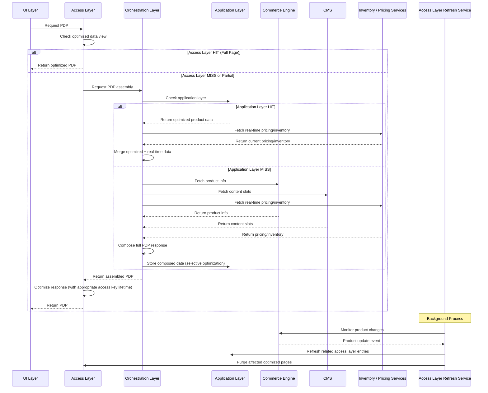
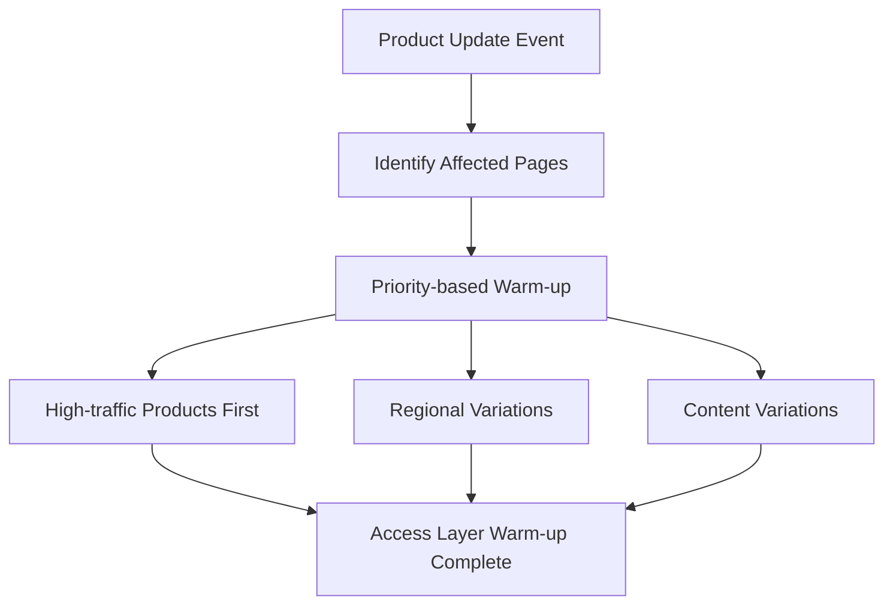

# MACH Alliance, Open Data Model

## Recipe: `PDP Orchestration with Access Layer Optimization Strategy`

## Table of contents

- [Recipe purpose](#recipe-purpose)
- [Recipe Overview](#recipe-overview)
- [Actors / Stakeholders](#actors--stakeholders)
- [Trigger Points / Events](#trigger-points--events)
- [Recipe Flows](#recipe-flows)
- [Systems Involved](#systems-involved)
- [Data Requirements](#data-requirements)
- [Variants / Alternatives](#variants--alternatives)
- [Failure Modes / Edge Cases](#failure-modes--edge-cases)
- [Success Metrics / KPIs](#success-metrics--kpis)
- [Security & Compliance Notes](#security--compliance-notes)

## Recipe Purpose

> [!NOTE]
> This recipe is an "enhanced" version of a simpler [PDP Orchestration](PDP-orchestration-on-the-fly.md) recipe that does not use access layer optimization.

To deliver a fast, reliable, and fully populated Product Detail Page (PDP) by orchestrating multiple back-end services *with intelligent access layer optimization* to optimize performance and reduce latency. This approach combines real-time data orchestration with strategic data view optimization to ensure both speed and data freshness.

**Key Business Goals:**
- Dramatically improve PDP load time and performance through access layer optimization
- Reduce backend service load and API costs
- Maintain data freshness for critical commerce information
- Enable high-scale traffic handling with consistent performance
- Reduce page abandonment rate through faster load times
- Enable non-dev marketing updates to product content
- Enable personalized or contextual PDP content with optimized data views
- Streamline cross-channel consistency (web, mobile, kiosk)

**KPI tie-ins:** Conversion rate, average order value (AOV), content engagement metrics, page load time, SEO rankings, content publish velocity, system reliability, cost reduction.

---

## Recipe Overview

When a user requests a product page, the system leverages a multi-layered access layer optimization strategy to deliver pre-assembled or partially optimized product data while selectively fetching real-time information for critical elements like pricing and inventory. This hybrid approach balances performance with data accuracy.

#### Approach Rationale

Building on the benefits of orchestration over front-end binding, adding access layer optimization provides additional advantages:

##### Enhanced Performance & User Experience
- **Sub-second Response Times**: Optimized product data, content, and media assets deliver immediate responses
- **Reduced API Latency**: Minimize calls to slower backend services by serving optimized data views
- **Predictable Performance**: Consistent response times regardless of backend service performance
- **Offline Resilience**: Optimized data views provide fallback during service outages

##### Cost Optimization
- **Reduced API Costs**: Fewer calls to expensive third-party services and internal APIs
- **Lower Infrastructure Load**: Reduced compute and network resources on backend systems
- **Efficient Resource Utilization**: Smart access layer optimization prevents redundant processing

##### Business Logic & Consistency (Enhanced)
- **Optimized Business Rules**: Pre-computed pricing tiers, promotions, and business logic
- **Consistent Data Layers**: Separate access layer refresh strategies for different data types
- **Intelligent Freshness**: Critical data (inventory, pricing) stays fresh while stable data (product specs) leverages longer access key lifetimes

---

## Access Layer Optimization Strategy Overview

The access layer optimization strategy implements a multi-tier approach to data delivery, balancing performance optimization with data freshness requirements. Each tier serves specific data types with appropriate optimization strategies and refresh mechanisms.

#### Comprehensive Access Layer Tiers & Data Types

| **Access Layer Tier**       | **Access Strategy**                | **Data Type**                                                      | **TTL (if applicable)** | **Freshness Strategy**                       |
| --------------------------- | ---------------------------------- | ------------------------------------------------------------------ | ----------------------- | -------------------------------------------- |
| **CDN/Edge**                | Cache                              | Static assets, pre-rendered HTML, composed PDP responses           | 24h – 7d                | Time-based + deployment invalidation         |
| **Frontend (Browser)**      | Cache                              | UI state, filters, cart, preferences, session data                 | Session/local           | User-driven refresh                          |
| **Orchestration Layer**     | Access Layer Model (Index + Cache) | Composed product views, contextual personalization, business logic | 1h – 6h or event-based  | Indexed on-write + cache on-read             |
| **Real-Time Data Services** | Direct API Call                    | Inventory, pricing, availability, promotions                       | N/A                     | Always fresh, bypasses access layer          |
| **Search/Discovery Engine** | Index                              | Searchable product records, faceted navigation data                | Near real-time          | Write-time sync via event bus or job         |
| **CMS Delivery API**        | Cache (Edge/CDN)                   | Content modules, PDP copy, marketing content                       | 2h – 24h                | Purged via webhook or publish event          |
| **Application Layer**       | Hybrid (Cache + Index)             | Product catalog, category hierarchies, attributes                  | 30min-2h                | Event-driven + time-based                    |
| **Database Layer**          | Index                              | Raw product data, relationships, metadata                          | 15min-1h                | Database-level indexing + query optimization |
| **Session Layer**           | Cache                              | User-specific data, personalization context                        | Session                 | User action-based + session expiry           |

#### Detailed Access Strategy Descriptions

**CDN/Edge Access Strategy:**
- **Purpose**: Global content delivery with minimal latency
- **Optimization Method**: Geographic distribution with edge computing
- **Data Handling**: Pre-computed responses, static asset optimization
- **Refresh Triggers**: Deployment events, content updates, manual purging
- **Fallback Strategy**: Origin server bypass on cache miss

**Frontend (Browser) Access Strategy:**
- **Purpose**: Client-side state management and user experience optimization
- **Optimization Method**: Local storage, session storage, memory caching
- **Data Handling**: User preferences, navigation state, form data
- **Refresh Triggers**: User interactions, page navigation, session events
- **Fallback Strategy**: Server-side state reconstruction

**Orchestration Layer Access Strategy:**
- **Purpose**: Centralized data composition and business logic application
- **Optimization Method**: Hybrid indexing and caching with intelligent composition
- **Data Handling**: Multi-source data aggregation, contextual personalization
- **Refresh Triggers**: Source system events, business rule changes, time-based expiry
- **Fallback Strategy**: Real-time composition on cache miss

**Real-Time Data Services Access Strategy:**
- **Purpose**: Critical business data requiring immediate accuracy
- **Optimization Method**: Direct API calls with no intermediate optimization
- **Data Handling**: Live inventory, dynamic pricing, availability status
- **Refresh Triggers**: Continuous monitoring, user actions, system events
- **Fallback Strategy**: Graceful degradation with stale data indicators

**Search/Discovery Engine Access Strategy:**
- **Purpose**: Fast product discovery and navigation
- **Optimization Method**: Write-time indexing with real-time search capabilities
- **Data Handling**: Product metadata, searchable attributes, faceted data
- **Refresh Triggers**: Product updates, catalog changes, search optimization
- **Fallback Strategy**: Database search fallback

**CMS Delivery API Access Strategy:**
- **Purpose**: Content delivery with editorial workflow integration
- **Optimization Method**: Edge caching with content management integration
- **Data Handling**: Marketing content, editorial copy, rich media
- **Refresh Triggers**: Content publishing, editorial updates, scheduled refreshes
- **Fallback Strategy**: Direct CMS API calls

#### Access Layer Refresh Triggers

**Time-Based Triggers:**
- **Product Catalog Updates**: Daily batch synchronization (00:00 UTC)
- **Content Publishing Schedules**: Hourly content refresh cycles
- **Promotional Content Changes**: Variable intervals based on campaign duration
- **Access Layer Warm-up**: Scheduled pre-loading of high-traffic products
- **Performance Optimization**: Periodic cache optimization and cleanup

**Event-Driven Triggers:**
- **Product Attribute Changes**: Immediate access layer refresh for affected products
- **Inventory Level Updates**: Real-time bypass for critical availability data
- **Price Changes**: Immediate refresh for pricing-sensitive data views
- **Content Modifications**: Webhook-triggered content cache purging
- **Promotional Activation/Deactivation**: Event-driven promotional data updates
- **User Authentication Changes**: Session-level access layer refresh

**User-Triggered Events:**
- **Cart Additions**: Inventory check triggering real-time data refresh
- **User Login/Logout**: Personalized data view refresh
- **Location Changes**: Regional content and pricing updates
- **Preference Updates**: User-specific access layer key regeneration
- **Search Queries**: Search index optimization and result caching

#### Access Layer Key Strategy

**Base Key Structure:**
```
{entity_type}:{entity_id}:{version}:{region}:{segment}:{variant}
```

**Key Components:**
- **Entity Type**: Product, category, content, user
- **Entity ID**: Unique identifier for the data entity
- **Version**: Data version for cache invalidation
- **Region**: Geographic or market-specific variations
- **Segment**: Customer segment or personalization context
- **Variant**: A/B test variant or content variation

**Key Examples:**
- **Product Base**: `pdp:PROD-001:v2:us:premium:control`
- **Category View**: `category:CAT-001:v1:eu:standard:default`
- **User Session**: `user:USER-123:v1:us:premium:personalized`
- **Content Block**: `content:BLOCK-001:v3:global:standard:default`

#### Access Layer Hierarchy & Performance Characteristics

**1. Browser Optimization (Static Assets)**
- **Lifetime**: 1-7 days
- **Storage**: Local storage, session storage, memory
- **Performance**: Sub-10ms access time
- **Capacity**: Limited by browser storage quotas
- **Optimization**: Compression, minification, lazy loading

**2. Edge Access Layer (Assembled Pages)**
- **Lifetime**: 1-24 hours
- **Storage**: Distributed edge locations
- **Performance**: 50-200ms access time
- **Capacity**: High, distributed across global network
- **Optimization**: Geographic distribution, compression

**3. Application Layer (Composed Objects)**
- **Lifetime**: 1-6 hours
- **Storage**: Application server memory, distributed cache
- **Performance**: 5-50ms access time
- **Capacity**: High, configurable based on infrastructure
- **Optimization**: Intelligent composition, business logic caching

**4. Database Layer (Raw Data)**
- **Lifetime**: 30 minutes - 2 hours
- **Storage**: Database indexes, query result cache
- **Performance**: 1-10ms access time
- **Capacity**: Very high, limited by database resources
- **Optimization**: Query optimization, indexing strategies

#### Access Layer Performance Optimization Techniques

**Smart Access Layer Warming:**
- **Priority-based Warming**: High-traffic products warmed first
- **Regional Variations**: Geographic-specific access layer preparation
- **Content Variations**: A/B test variant pre-loading
- **Predictive Warming**: ML-based traffic prediction for proactive warming
- **Background Warming**: Non-blocking access layer preparation

**Access Layer Efficiency Strategies:**
- **Partial Updates**: Incremental access layer refresh for changed data only
- **Compression**: Data compression to reduce storage and transfer costs
- **Deduplication**: Eliminate redundant data across access layer tiers
- **Intelligent Eviction**: LRU, LFU, and business-priority eviction policies
- **Tier Promotion**: Hot data promotion to faster access layers

**Monitoring & Optimization:**
- **Hit Rate Monitoring**: Track access layer effectiveness by tier
- **Performance Metrics**: Access time, throughput, error rates
- **Cost Optimization**: Storage and bandwidth cost analysis
- **Capacity Planning**: Proactive capacity management
- **Health Checks**: Access layer availability and performance monitoring

---

## Actors / Stakeholders

**Users:** *(Same as original [PDP Orchestration](PDP-orchestration-on-the-fly.md))*
- **Customers:** Consume integrated content and commerce experiences
- **Content Authors:** Create and manage editorial content referencing products
- **Merchandisers:** Configure product displays and recommendations within content
- **Developers:** Implement and maintain integration patterns

**Systems:** *(Enhanced)*
- **CMS:** Manages editorial content, templates, and content-product relationships
- **Commerce Engine:** Provides product data, pricing, inventory, and checkout functionality
- **Orchestration Layer:** Aggregates all service responses and a single API for front-end developers
- **Multi-Tier Access Layer:** Edge, Application, Database layers for different data types and access key lifetimes
- **Access Layer Refresh Service:** Manages data view refresh strategies and event-driven updates
- **Real-time Data Services:** Pricing, inventory, and personalization services bypass access layer optimization
- **Edge/Global Access Layer:** Delivers optimized content with commerce data integration
- **Analytics Platform:** Tracks content and commerce performance metrics plus access layer performance
- **DAM/Dynamic media delivery:** Provides image assets and other visual product renderings

**Teams:** *(Enhanced)*
- **Content/Marketing:** Owns editorial strategy and content creation
- **Product Management:** Defines commerce data requirements and customer experience
- **Engineering:** Implements technical integration, access layer optimization strategies, and performance optimization
- **Operations:** Manages deployment pipelines, system reliability, and access layer monitoring
- **Performance Engineering:** Optimizes access layer strategies and monitors optimization effectiveness

---

## Trigger Points / Events

What initiates this recipe?

**Action-based:**
- Customer navigates to content page with embedded product data
- Content author previews page with live commerce data

**Cache invalidation:**
- Product data changes in commerce system (price, inventory, attributes)
- New product launches requiring content integration
- Content deployment triggers commerce data validation
- Scheduled content publication workflows
- Periodic product catalog synchronization (e.g., nightly batch updates)
- Other access layer refresh intervals as noted in the [Access Layer Optimization Strategy Overview](#access-layer-optimization-strategy-overview) section

---

## Recipe Flows

#### Enhanced Swimlane Diagram with Access Layer Optimization



---

## Systems Involved

| **System**               | **Role**                             | **Owner**             | **Access Layer Tier**                  |
| ------------------------ | ------------------------------------ | --------------------- | -------------------------------------- |
| Commerce Engine          | Core product data, SKU, attributes   | Product / Engineering | Application Layer (1-6h)               |
| CMS                      | PDP content slots, copy, assets      | Marketing / CMS Team  | Edge (24h) + Application Layer (2h)    |
| Inventory Service        | Real-time availability data          | Operations / Supply   | No Optimization (Real-time)            |
| Pricing Engine           | Contextual and promotional pricing   | Pricing / Product     | No Optimization (Real-time)            |
| Orchestration Layer      | Aggregates all service responses     | Architecture / API    | Orchestrates access layer optimization |
| Edge/Global Access Layer | Static assets, composed responses    | Infrastructure Team   | 24h-7d access key lifetime             |
| Application Layer        | Composed objects, business logic     | Architecture / API    | 1h-6h access key lifetime              |
| Access Layer Refresh     | Manages data view refresh strategies | Architecture / API    | Event-driven                           |
| UI / Frontend            | Renders the final PDP experience     | Frontend Team         | Browser optimization                   |

---

## Data Requirements

| **Entity**                                      | **Function**                                                              | **Access Layer Strategy** |
| ----------------------------------------------- | ------------------------------------------------------------------------- | ------------------------- |
| [Product](../entities/product/product.md)       | Input - ID or SKU (typically provided via URL) and outputted product info | Application Layer (1-6h)  |
| [Language](../entities/utilities/language.md)   | Input (optional) - Language/locale/culture information                    | Session Layer             |
| Customer Segment                                | Input (optional) - additional context for personalization                 | Session Layer             |
| [Inventory](../entities/inventory/inventory.md) | Output - Real-time stock availability                                     | No Caching (Real-time)    |
| [Pricing](../entities/pricing/pricing.md)       | Output - Contextual pricing information                                   | No Caching (Real-time)    |
| [Promotion](../entities/promotion/promotion.md) | Output - Active promotions and discounts                                  | Application Layer (30min) |
| [Media](../entities/utilities/media.md)         | Output - Product images, videos, and 3D assets                            | CDN/Edge (7d)             |
| [Category](../entities/product/category.md)     | Output - Product category hierarchy                                       | Application Layer (2h)    |

### Data Flow Details

**Inputs:**
- [Product](../entities/product/product.md) ID or SKU (typically provided via URL)
- [Language](../entities/utilities/language.md) (region/locale/culture, optional)
- Customer segment (optional) - for personalization and contextual pricing
- User location (optional) - for inventory availability and regional pricing

**Backend Service Calls:**
- [Product](../entities/product/product.md) details from Commerce Engine (cached in Application Layer)
- [Inventory](../entities/inventory/inventory.md) levels from Inventory Service (always real-time)
- [Pricing](../entities/pricing/pricing.md) from Pricing Engine (always real-time)
- [Promotion](../entities/promotion/promotion.md) data from Promotion Engine (cached with short TTL)
- [Media](../entities/utilities/media.md) assets from DAM (heavily cached at Edge)
- [Category](../entities/product/category.md) hierarchy for breadcrumbs (cached)
- Marketing content from CMS (cached at Edge)

**Output:**
Fully composed PDP object with optimal caching strategy per data type.

#### Example composed object output
> [!NOTE]
> Consult the original [PDP Orchestration](PDP-orchestration-on-the-fly.md#example-composed-object-output) recipe to see the JSON output example.

#### Access Layer Enhanced Data Lineage

**Optimizable Data (Stable):**
- Product specifications, descriptions, attributes
- Content slots, marketing copy, media assets
- Category information, breadcrumbs
- SEO metadata, structured data
- Related product recommendations (with periodic refresh)

**Real-time Data (Non-optimizable):**
- Current inventory levels
- Dynamic pricing, promotions
- Customer-specific pricing
- Personalized recommendations
- A/B test assignments

**Access Layer Metadata:**
- Access layer timestamps and access key lifetimes
- Access layer key variations (region, segment, etc.)
- Refresh event tracking
- Performance metrics

#### Privacy/PII Considerations *(Enhanced)*

**Minimal case:**
- Anonymous session data with optimized base content
- Regional access layer optimization respects geographic data rules

**Advanced cases:**
- Customer-specific pricing requires secure access layer segmentation
- Personalized content optimization must comply with consent management
- Product viewing history integration in access layer follows data retention policies
- Cross-border optimized data transfer compliance for multi-region deployments
- **Access layer encryption for sensitive customer data**
- **Secure access layer key generation preventing data leakage**

---

### Access Layer Performance Optimization

#### Smart Access Layer Warming


#### Access Layer Key Strategy
- **Base Key:** `pdp:{product_id}:{version}`
- **Segmentation:** `pdp:{product_id}:{version}:{region}:{segment}`
- **Personalization:** `pdp:{product_id}:{version}:{region}:{customer_tier}`
- **Content Variation:** `pdp:{product_id}:{version}:{region}:{content_variant}`

#### Access Layer Hierarchy
1. **Browser Optimization** (Static assets): 1-7 days
2. **Edge Access Layer** (Assembled pages): 1-24 hours
3. **Application Layer** (Composed objects): 1-6 hours
4. **Database Layer** (Raw data): 30 minutes - 2 hours

---

## Variants / Alternatives

**Preview Environments with Access Layer Optimization:**
- Staging CMS with live commerce data connections and access layer simulation
- Preview-specific access layer tiers with test product data
- Content author tools showing optimized vs. live data impact before publication

**Multi-Market Support with Regional Access Layer Optimization:**
- Regional access layer clusters for improved performance
- Market-specific access layer refresh strategies
- Currency and pricing localization with appropriate access key lifetimes

**A/B Testing Integration with Access Layer Awareness:**
- Access layer-aware A/B testing ensuring consistent experiences
- Experiment-specific access layer keys preventing cross-contamination
- Performance tracking for optimized vs. non-optimized experiment variants

**Access Layer-Aware DAM Integration:**
- Progressive image loading with edge optimization
- Optimized asset delivery with global access layer
- Dynamic media rendering with appropriate access layer strategies

---

## Failure Modes / Edge Cases

| **Scenario**                          | **Impact**                                                       | **Mitigation Strategy**                                                                 |
| ------------------------------------- | ---------------------------------------------------------------- | --------------------------------------------------------------------------------------- |
| **Access Layer Refresh Failure**      | Stale data served to customers                                   | Multiple refresh channels; manual purge capabilities; access key lifetime as fallback   |
| **Access Layer Stampede**             | Multiple requests trigger expensive backend calls simultaneously | Access layer lock mechanisms; background refresh; stale-while-revalidate patterns       |
| **Partial Access Layer Corruption**   | Mixed fresh/stale data in responses                              | Access layer validation checksums; atomic access layer updates; rollback mechanisms     |
| **Access Layer Server Outage**        | Performance degradation but service continues                    | Multi-tier access layer redundancy; automatic access layer bypass; graceful degradation |
| **Access Layer Memory Exhaustion**    | Access layer eviction of important data                          | Access layer size monitoring; LRU eviction policies; access layer tier optimization     |
| **Regional Access Layer Sync Issues** | Inconsistent data across regions                                 | Event-driven global access layer refresh; monitoring access layer consistency           |
| **Real-time Data Service Failure**    | Optimized data without current pricing/inventory                 | Fallback to optimized pricing with staleness indicators; error messaging                |
| **Access Layer Key Collision**        | Wrong data served to users                                       | Unique access layer key generation; access layer key validation; namespace isolation    |

---

## Success Metrics / KPIs

**Performance Metrics (Enhanced):**
- Page load time (Time to Interactive) < 1 second (improved from 2s)
- Cache hit rate > 85% for product data
- Cache hit rate > 95% for static content
- Average API response time < 200ms (improved from 500ms)
- System availability > 99.9% uptime
- Cache refresh success rate > 99.5%
- Cache refresh latency < 100ms

**Cache-Specific Metrics:**
- Cache hit/miss ratios by tier (CDN, Application, Database)
- Cache refresh accuracy and timing
- Cache storage utilization and efficiency
- Cache warming success rates
- Regional cache performance variations

**Business Metrics (Enhanced):**
- Conversion rate uplift: Target 20-30% improvement
- Average Order Value (AOV) increase from faster recommendations
- PDP bounce rate reduction: Target < 25%
- SEO ranking improvements from sub-second load times
- Mobile conversion rate improvement
- Cost reduction from reduced API calls: Target 60-80%
- Infrastructure cost optimization: Target 40% reduction

**Operational Metrics (Enhanced):**
- Content publication success rate > 98%
- Data synchronization accuracy > 99.5%
- Cache invalidation accuracy > 99.9%
- Mean Time to Recovery (MTTR) < 10 minutes
- Cache system reliability > 99.95%
- Event processing time < 50ms (p99)

---

## Security & Compliance Notes

> [!WARNING]
> This list is not exhaustive, and you must do your own due diligence to ensure you meet the required security and compliance standards for your unique scenario, however, some common aspects to review are:

**GDPR/CCPA Implications (Enhanced):**
- Customer-specific product recommendations in optimized content require consent tracking
- Optimized product viewing history must support data deletion requests and access layer purging
- Cross-border optimized content delivery with commerce data needs appropriate legal basis
- **Access layer retention policies must align with data protection regulations**
- **Right to be forgotten requires comprehensive access layer refresh**

**Authentication & Authorization (Enhanced):**
- Content preview with optimized live commerce data requires secure author authentication
- Customer-specific optimized pricing integration needs secure session management
- API access between CMS and commerce systems requires service authentication
- **Access layer access controls preventing unauthorized data access**
- **Secure access layer key generation preventing data inference**

**Data Protection (Enhanced):**
- Optimized commerce data must follow retention policies with automatic purging
- Product information in access layer requires secure data transmission and storage
- Content-commerce analytics from optimized data must anonymize customer identifiers
- **Access layer encryption for sensitive customer data**
- **Audit logging for access layer access and modifications**

**Content Moderation (Enhanced):**
- User-generated content integration with optimized product pages requires moderation workflows
- Optimized product review content needs compliance validation and update mechanisms
- Editorial content with optimized commerce claims requires accuracy verification
- **Access layer refresh for content moderation actions**

---

### Access Layer Monitoring & Alerting

**Key Monitoring Points:**
- Cache hit/miss ratios trending below thresholds
- Cache refresh failures or delays
- Cache server performance and availability
- Cache storage utilization approaching limits
- Inconsistent data between cache tiers
- Regional cache synchronization issues

**Alerting Strategies:**
- Real-time alerts for cache system failures
- Performance degradation warnings
- Cache refresh success rate monitoring
- Cost optimization alerts for cache efficiency
- Security alerts for cache access anomalies

>  This MACH Alliance Canonical Data Model is intentionally __vendor-neutral__ and serves as a foundation for interoperability across composable architectures. It is __continually evolving__ through community contributions, which are reviewed and approved collaboratively.
>
>  All contributions are made under the __Creative Commons Attribution 4.0 International License (CC BY 4.0)__. By submitting a contribution, you agree to license your content under <a href="https://creativecommons.org/licenses/by/4.0/deed.en">CC BY 4.0</a>, allowing others to share and adapt the material with proper attribution.
>
>  We welcome and encourage continued improvements through community input.
