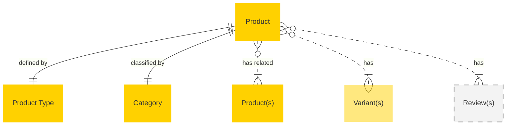

# Guide to creating entity relationship diagrams

## Purpose

When [Creating canonical data models](creating-canonical-data-models.md) an entity relationship diagram is helpful to provide additional context about the relationships between entities in a composable solution.

## Principles

The diagram should add contextual information to that already encapsulated in the list of fields.

- The primary purpose of the Entity Relationship diagram is to indicate when entities are dependant or optionally dependant on other entities:
  - Dependant to *external entities* (those relationships flagged as SHOULD) are shown with solid lines
  - Optionally dependant (those relationships flagged as COULD and may not exist in all scenarios) are shown with grey boxes
- The secondary purpose of the Entity Relationship diagram is to indicate when a sub-object may be repeated (such as a `Product` that has multiple `Variants`)
- Fields that are singularly part of the entity (such as `ID`, `timestamp`, etc.) are not shown. This includes utility objects.
- Only outbound relationships should be shown. For example, an `Order` generally has a SKU or Product ID associated with a `Product` in order to associate product information with an order - therefore you should show that an `Order` _is dependant_ on a reference to a `Product` (via `SKU`). But `Products` are _not dependant_ on `Orders`, so this relationship is _not_ shown on the `Product` entity.
- Any relationship via `extension` is not included, since these are by nature extensions and optional.
- The diagram should show _entity relationships_ and not every listed field.

- Ordering
  - Required / common relationships with required / common data (SHOULD / RECOMMENDED)
  - Common external relationships with optional data (SHOULD)
  - Common internal sub-object relationships with optional data (COULD)
  - Optional relationships (COULD)

## Formatting guidelines

- Entity objects are yellow: `#ffd100` (Class: entity)
- Sub-objects are semi-transparent yellow: `#ffd10080` (Class: internalRel)
- Optional relationship entity objects are grey: `#b5b5b580` (Class: optionalRel)

### Readability
- It is preferrable to use plain English instead of relationship notation when describing relationships (Use `1 to 1` or `0+ optionally to 1+` instead of `||--||` or `}o..|{`)
- Use Entity names (capital first letter) as the reference, and describe the relationship (for example, don't say "Related Products" as the reference, since the entity is `Product`)
- In addition to using the correct syntax to describe the relationship, assist the reader by indicating a "many" relationship by adding a plural to the name (such as "Product(s)" - in the case of related products)

> [!WARNING]
> Mermaid requires encapsulation with quotes for labels or relationship descriptions with spaces (e.g. "Product Type") - omitting this will throw an error.


## Example: Product


### Mermaid syntax and classes for the above example

```
erDiagram
    Product:::entity 1 to 1 "Product Type":::entity : "defined by"
    Product 1 to 1 Category:::entity : "classified by"
    Product 0+ optionally to 1+ "Product(s)":::entity : "has related"
    Product 0+ optionally to 1+ "Variant(s)":::internalRel : "has"
    Product 0+ optionally to 1+ "Review(s)":::optionalRel : "has"

    classDef entity fill:#ffd100, stroke:#ffd100,stroke-width:2px
    classDef internalRel fill:#ffd10080, stroke:#ffd10080,stroke-width:1px
    classDef optionalRel stroke:#b5b5b5, stroke-dasharray: 1 1, fill:#f3f3f3, stroke-width:2px
```
