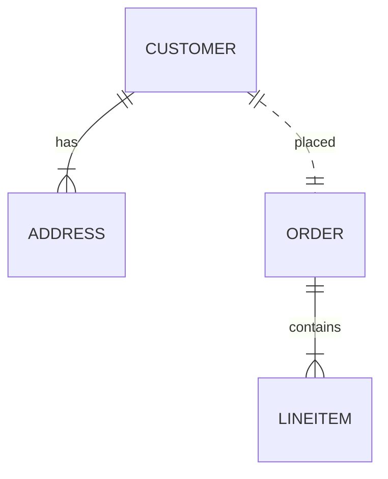

# MACH Alliance Canonical Entity Model Template

## Entity: `Entity Name`

> [!IMPORTANT]
> This template defines how to describe canonical entities within a MACH composable architecture. It serves as a recipe for data interoperability across vendors and platforms.
>
> Each entity should:
> - Be easy to read, extend, and version.
> - Include both tabular and JSON examples—**samples appear at the top** to streamline developer adoption.
> - Encourage the use of **utility objects** (e.g., `Address`) for reuse.
> - Promote the use of **namespaced extension dictionaries** for flexibility and semantic clarity.


## Table of contents

- [MACH Alliance Canonical Entity Model Template](#mach-alliance-canonical-entity-model-template)
  - [Entity: `Entity Name`](#entity-entity-name)
  - [Table of contents](#table-of-contents)
  - [Purpose](#purpose)
  - [Object: Object Name](#object-object-name)
  - [Sample Object: Customer](#sample-object-customer)
  - [Sample Object: Address Utility Object](#sample-object-address-utility-object)
  - [Components](#components)
  - [Typical Relationships](#typical-relationships)
  - [Typical Pitfalls](#typical-pitfalls)
---

## Purpose

> [!NOTE]
> What functions and data this entity is designed to support.

> [!TIP]
>  A **Customer Entity** example is included throughout this template:

A unified customer model that supports both B2B (company) and B2C (individual) use cases. The model is compatible with CDP and CRM-like systems and includes flexible metadata, contact structure, international-ready address support, and cross-platform external_references.

The Entity describes:
- Customer identity and classification (person vs company)
- Contact information and communication preferences
- Address management for billing and shipping
- Cross-system integration and reference management
- Customer lifecycle and status tracking
- Extensible metadata and business-specific attributes


---

## Object: Object Name

> [!NOTE]
> Define the field names, description and practice within this entity.


| Field                 | Description                                                                                 | Practice    |
| --------------------- | ------------------------------------------------------------------------------------------- | ----------- |
| `id`                  | Unique identifier in given context (e.g., UUID, slug).                                      | SHOULD      |
| `type`                | Indicates `person` or `company`.                                                            | SHOULD      |
| `status`              | Lifecycle status (`active`, `inactive`, `archived`).                                        | SHOULD      |
| `external_references` | Dictionary of cross-system IDs (e.g., CRM, ERP, commerce) to ease orchestration logic       | SHOULD      |
| `created_at`          | ISO 8601 creation timestamp.                                                                | SHOULD      |
| `updated_at`          | ISO 8601 update timestamp.                                                                  | SHOULD      |
| `extensions`          | Namespaced dictionary for extension data grouped by concern (e.g., `marketing`, `loyalty`). | RECOMMENDED |
| `person`              | Object for person data. Only present if `type = person`.                                    | COULD       |
| `company`             | Object for company data. Only present if `type = company`.                                  | COULD       |
| `addresses`           | List of typed addresses. Uses the shared utility object `Address`.                          | RECOMMENDED |

---

## Sample Object: Customer

> [!NOTE]
> Sample JSON examples.  Multiple examples may be used.

```json
{
  "id": "cus_001",
  "type": "person",
  "status": "active",
  "external_references": {
    "crm_contact_id": "123456",
    "commercetools": "customer-98765"
  },
  "created_at": "2025-06-01T12:00:00Z",
  "updated_at": "2025-06-10T12:30:00Z",
  "extensions": {
    "marketing": {
      "consent": "optedIn"
    },
    "loyalty": {
      "points": 200,
      "tier": "silver",
      "source": "talonone",
      "source_id":"s9df8"
    }
  },
  "person": {
    "first_name": "Emma",
    "last_name": "Larsen",
    "email": "emma@example.com",
    "phone": "+45 12345678"
  },
  "addresses": [
    {
      "type": "shipping",
      "address": {
        "line1": "Strandvejen 100",
        "city": "Aarhus",
        "region": "Midtjylland",
        "postal_code": "8000",
        "country": "DK"
      }
    }
  ]
}
```

---

## Sample Object: Address Utility Object

Utility objects are shared, composable models used across entities eg.: reusing `Address` across `Customer`, `Order`, and `Company`.

```json
{
  "line1": "Strandvejen 100",
  "line2": "c/o Novak",
  "city": "Aarhus",
  "region": "Midtjylland",
  "postal_code": "8000",
  "country": "DK"
}
```

> See Address utility object.

---

## Components

> [!NOTE]
> Define the typical concepts, descritions and source of truth

| Concept      | Description                        | Typical Source of Truth |
| ------------ | ---------------------------------- | ----------------------- |
| ID           | Unique customer identifier         | CRM / CDP / Commerce    |
| Reference Id | External system identifiers        | Integration Layer       |
| Extensions   | Optional and scoped extensions     | CDP / Loyalty / CRM     |
| Address      | Customer billing/shipping location | Commerce / OMS / ERP    |

## Typical Relationships

> [!NOTE]
> Use Mermaid to build examples: https://mermaid.js.org/



---

## Typical Pitfalls

> [!NOTE]
> Define common mistakes and oversights here.

- Not distinguishing between `company` and `person` fields. Keep these clearly separated using nested objects.
- Overloading a `meta` or `customVariables` field with unstructured data. Use namespaced `extensions` instead.
- Using `zip` or `zipcode`—standardize on `postal_code` per ISO guidelines.
- Forgetting that address records must be immutable on orders or other transactional states for data records. Always store a snapshot: If you saw it, log it.


---

>  This MACH Alliance Canonical Data Model is intentionally __vendor-neutral__ and serves as a foundation for interoperability across composable architectures. It is __continually evolving__ through community contributions, which are reviewed and approved collaboratively.
>
>  All contributions are made under the __Creative Commons Attribution 4.0 International License (CC BY 4.0)__. By submitting a contribution, you agree to license your content under <a href="https://creativecommons.org/licenses/by/4.0/deed.en">CC BY 4.0</a>, allowing others to share and adapt the material with proper attribution.
>
>  We welcome and encourage continued improvements through community input. For more information and guidance on how to contribute, please refer to the <a href="../CONTRIBUTING.md">Contributor Guide</a>.
